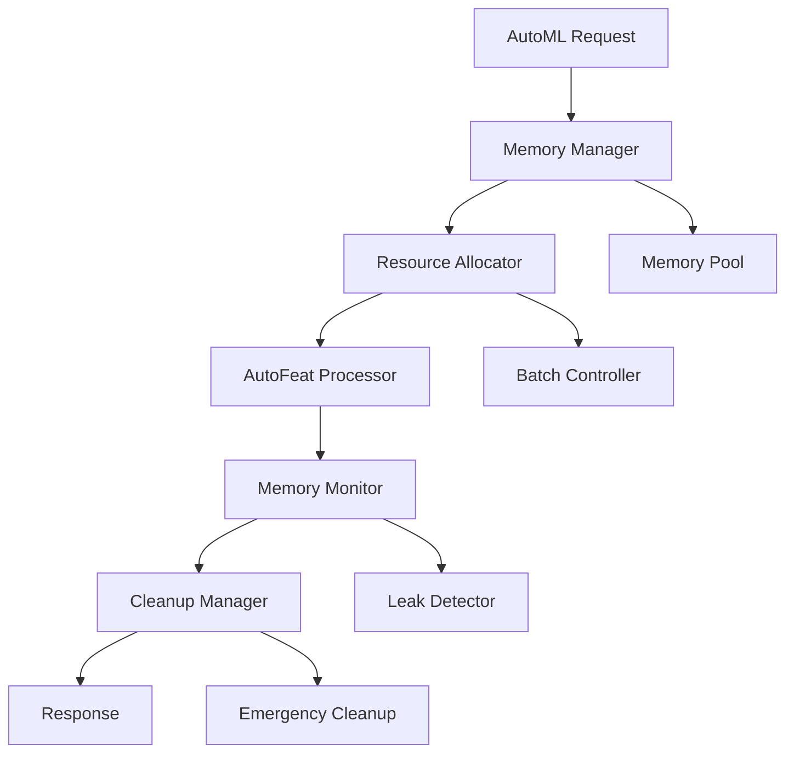

# AutoML メモリ管理最適化 - 設計書

## 概要

AutoML のメモリリーク問題（メモリ使用率 99%超過）を根本的に解決するため、適切なリソース管理、循環参照の解決、効率的なメモリ使用パターンを実装します。

## アーキテクチャ

### 全体アーキテクチャ



### レイヤー構造

1. **Memory Management Layer**: メモリ管理の中核
2. **Resource Control Layer**: リソース制御とモニタリング
3. **Processing Layer**: AutoML 処理の実行
4. **Monitoring Layer**: メモリ監視と診断

## コンポーネント設計

### 1. MemoryManager (メモリマネージャー)

**責任**: AutoML 処理全体のメモリライフサイクル管理

```python
class MemoryManager:
    """AutoML処理のメモリライフサイクルを管理"""

    def __init__(self, max_memory_gb: float = 4.0):
        self.max_memory_gb = max_memory_gb
        self.current_allocations = {}
        self.memory_pool = MemoryPool()
        self.leak_detector = MemoryLeakDetector()

    @contextmanager
    def managed_processing(self, process_id: str):
        """メモリ管理付きの処理実行"""
        # メモリ割り当て
        # 処理実行
        # 確実なクリーンアップ
```

**主要機能**:

- プロセス単位のメモリ追跡
- 自動リソース解放
- メモリリーク検出
- 緊急時のメモリ保護

### 2. ResourceAllocator (リソース割り当て器)

**責任**: メモリリソースの効率的な割り当てと管理

```python
class ResourceAllocator:
    """メモリリソースの動的割り当て管理"""

    def allocate_for_dataset(self, data_size: int) -> AllocationPlan:
        """データサイズに基づく最適なリソース割り当て"""

    def adjust_batch_size(self, available_memory: float) -> int:
        """利用可能メモリに基づくバッチサイズ調整"""

    def reserve_emergency_memory(self) -> None:
        """緊急時用メモリの確保"""
```

**主要機能**:

- 動的メモリ割り当て
- バッチサイズの最適化
- メモリ予約システム
- リソース競合の回避

### 3. AutoFeatProcessor (AutoFeat 処理器)

**責任**: メモリ効率的な AutoFeat 処理の実行

```python
class AutoFeatProcessor:
    """メモリ効率的なAutoFeat処理"""

    def __init__(self, memory_manager: MemoryManager):
        self.memory_manager = memory_manager
        self.model_registry = WeakValueDictionary()

    def process_with_memory_control(self, data: pd.DataFrame) -> ProcessResult:
        """メモリ制御付きの処理実行"""

    def cleanup_model_references(self, model_id: str) -> None:
        """モデル参照の確実なクリーンアップ"""
```

**主要機能**:

- 弱参照によるモデル管理
- 段階的メモリ解放
- 循環参照の防止
- エラー時の安全なクリーンアップ

### 4. MemoryMonitor (メモリ監視器)

**責任**: リアルタイムメモリ監視と異常検知

```python
class MemoryMonitor:
    """リアルタイムメモリ監視システム"""

    def start_monitoring(self, process_id: str) -> None:
        """プロセス監視開始"""

    def detect_memory_leak(self) -> Optional[LeakReport]:
        """メモリリーク検出"""

    def generate_memory_report(self) -> MemoryReport:
        """メモリ使用量レポート生成"""
```

**主要機能**:

- 継続的メモリ監視
- リーク検出アルゴリズム
- パフォーマンス分析
- アラート生成

### 5. CleanupManager (クリーンアップマネージャー)

**責任**: 確実なリソース解放とクリーンアップ

```python
class CleanupManager:
    """リソースクリーンアップの管理"""

    def register_cleanup_handler(self, resource_id: str, handler: Callable) -> None:
        """クリーンアップハンドラーの登録"""

    def emergency_cleanup(self) -> CleanupResult:
        """緊急時のメモリクリーンアップ"""

    def scheduled_cleanup(self) -> None:
        """定期的なクリーンアップ"""
```

**主要機能**:

- 階層的クリーンアップ
- 緊急時対応
- 定期メンテナンス
- リソース追跡

## データモデル

### MemoryAllocation (メモリ割り当て情報)

```python
@dataclass
class MemoryAllocation:
    process_id: str
    allocated_mb: float
    peak_usage_mb: float
    start_time: datetime
    end_time: Optional[datetime]
    status: AllocationStatus
    cleanup_handlers: List[Callable]
```

### MemoryReport (メモリレポート)

```python
@dataclass
class MemoryReport:
    process_id: str
    total_memory_mb: float
    peak_memory_mb: float
    memory_efficiency: float
    leak_detected: bool
    cleanup_time_ms: int
    recommendations: List[str]
```

### LeakReport (リークレポート)

```python
@dataclass
class LeakReport:
    detection_time: datetime
    suspected_objects: List[str]
    memory_growth_rate: float
    stack_trace: Optional[str]
    severity: LeakSeverity
```

## インターフェース設計

### 1. Memory Management API

```python
# メモリ管理付きAutoML処理
async def process_automl_with_memory_management(
    data: pd.DataFrame,
    target: pd.Series,
    config: AutoMLConfig
) -> Tuple[pd.DataFrame, MemoryReport]:
    """メモリ管理付きAutoML処理"""

# メモリ状態の取得
def get_memory_status() -> MemoryStatus:
    """現在のメモリ状態を取得"""

# 緊急クリーンアップの実行
def emergency_memory_cleanup() -> CleanupResult:
    """緊急メモリクリーンアップ"""
```

### 2. Configuration Interface

```python
@dataclass
class MemoryConfig:
    max_memory_gb: float = 4.0
    emergency_threshold: float = 0.95
    cleanup_interval_seconds: int = 300
    enable_leak_detection: bool = True
    batch_size_strategy: BatchSizeStrategy = BatchSizeStrategy.ADAPTIVE
```

## エラーハンドリング

### エラー階層

```python
class MemoryManagementError(Exception):
    """メモリ管理関連エラーの基底クラス"""

class MemoryExhaustionError(MemoryManagementError):
    """メモリ不足エラー"""

class MemoryLeakError(MemoryManagementError):
    """メモリリークエラー"""

class ResourceCleanupError(MemoryManagementError):
    """リソースクリーンアップエラー"""
```

### エラー処理戦略

1. **予防的エラー処理**: メモリ不足の事前検知
2. **段階的回復**: 軽量モードへの自動切り替え
3. **緊急時対応**: システム保護のための強制クリーンアップ
4. **ログ記録**: 詳細なエラー情報の記録

## テスト戦略

### 1. メモリリークテスト

```python
def test_memory_leak_detection():
    """メモリリーク検出のテスト"""
    # 意図的にリークを発生させる
    # リーク検出の確認
    # クリーンアップの検証
```

### 2. ストレステスト

```python
def test_high_memory_usage():
    """高メモリ使用量でのテスト"""
    # 大量データでの処理
    # メモリ使用量の監視
    # 安定性の確認
```

### 3. 並行処理テスト

```python
def test_concurrent_automl_processing():
    """並行AutoML処理のテスト"""
    # 複数プロセスの同時実行
    # リソース競合の確認
    # メモリ分離の検証
```

## パフォーマンス最適化

### 1. メモリプール

- 事前割り当てによる断片化防止
- 再利用可能なメモリブロック
- 効率的なメモリ管理

### 2. 遅延評価

- 必要時のみメモリ割り当て
- ストリーミング処理の活用
- メモリ使用量の最小化

### 3. キャッシュ戦略

- LRU キャッシュの実装
- メモリ効率的なキャッシング
- 自動キャッシュクリーンアップ

## セキュリティ考慮事項

### 1. メモリダンプ保護

- 機密データのメモリクリア
- セキュアなメモリ解放
- ダンプファイルの暗号化

### 2. リソース制限

- プロセス単位のメモリ制限
- 悪意のある処理の防止
- システムリソースの保護

## 運用監視

### 1. メトリクス

- メモリ使用率
- 処理時間
- エラー発生率
- クリーンアップ効率

### 2. アラート

- メモリ使用率 90%超過
- メモリリーク検出
- 処理時間異常
- システム不安定

### 3. ダッシュボード

- リアルタイムメモリ監視
- 処理状況の可視化
- 履歴データの分析
- パフォーマンストレンド
