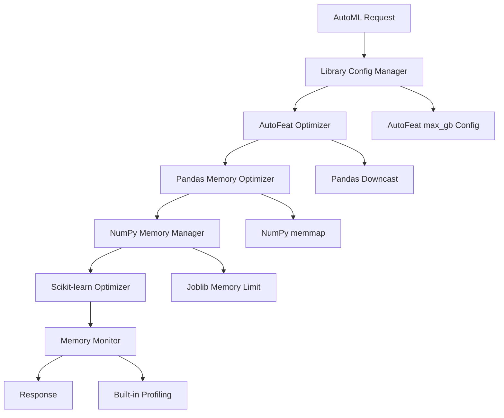

# AutoML メモリ管理最適化 - 設計書（ライブラリ組み込み機能活用版）

## 概要

AutoML のメモリリーク問題（メモリ使用率 99%超過）を既存ライブラリの組み込みメモリ管理機能を活用して解決します。フルスクラッチでの実装を避け、各ライブラリの最適化機能を組み合わせて効率的なメモリ使用を実現します。

## アーキテクチャ

### 全体アーキテクチャ



### レイヤー構造

1. **Configuration Layer**: 各ライブラリのメモリ設定管理
2. **Optimization Layer**: ライブラリ固有の最適化機能活用
3. **Processing Layer**: 最適化された AutoML 処理実行
4. **Monitoring Layer**: 組み込み監視機能の活用

## ライブラリ別最適化戦略

### 1. AutoFeat 最適化

**組み込み機能の活用**:

```python
# AutoFeatの組み込みメモリ制限機能
autofeat_model = AutoFeatRegressor(
    max_gb=2.0,  # メモリ使用量を2GBに制限
    feateng_steps=1,  # 特徴量生成ステップを制限
    featsel_runs=1,  # 特徴量選択実行回数を制限
    verbose=0  # ログ出力を最小化
)
```

**最適化ポイント**:

- `max_gb`パラメータでメモリ使用量を直接制限
- `feateng_steps`を減らして計算量を削減
- `featsel_runs`を最小化してメモリ使用を抑制

### 2. Pandas 最適化

**組み込み機能の活用**:

```python
# データ型の最適化
def optimize_pandas_memory(df: pd.DataFrame) -> pd.DataFrame:
    # 数値型の自動ダウンキャスト
    for col in df.select_dtypes(include=['int']).columns:
        df[col] = pd.to_numeric(df[col], downcast='integer')

    for col in df.select_dtypes(include=['float']).columns:
        df[col] = pd.to_numeric(df[col], downcast='float')

    # カテゴリ型の活用
    for col in df.select_dtypes(include=['object']).columns:
        if df[col].nunique() / len(df) < 0.5:  # 50%未満がユニーク
            df[col] = df[col].astype('category')

    return df

# チャンク読み込み
def read_data_efficiently(file_path: str, chunk_size: int = 10000):
    return pd.read_csv(file_path, chunksize=chunk_size)
```

**最適化ポイント**:

- `pd.to_numeric(downcast=...)`で自動データ型最適化
- `astype('category')`でカテゴリデータの効率化
- `chunksize`パラメータでメモリ効率的な読み込み

### 3. NumPy 最適化

**組み込み機能の活用**:

```python
# メモリマッピングの活用
def create_memory_mapped_array(shape, dtype=np.float32):
    return np.memmap('temp_array.dat', dtype=dtype, mode='w+', shape=shape)

# データ型の最適化
def optimize_numpy_dtype(arr: np.ndarray) -> np.ndarray:
    if arr.dtype == np.float64:
        # float64からfloat32への変換（精度が許容範囲内の場合）
        if np.allclose(arr, arr.astype(np.float32)):
            return arr.astype(np.float32)
    return arr
```

**最適化ポイント**:

- `np.memmap`でディスクベースのメモリ管理
- データ型の自動最適化（float64→float32）
- インプレース操作の活用

### 4. Scikit-learn 最適化

**組み込み機能の活用**:

```python
# Joblibのメモリ制限
from sklearn.ensemble import RandomForestRegressor
from joblib import parallel_backend

def train_with_memory_limit():
    with parallel_backend('threading', n_jobs=2):  # スレッド数制限
        model = RandomForestRegressor(
            n_estimators=50,  # 推定器数を制限
            max_depth=10,     # 深度制限でメモリ使用量削減
            random_state=42
        )
        return model

# モデルの軽量化
def compress_model(model):
    # 不要な属性の削除
    if hasattr(model, 'tree_'):
        # 決定木の圧縮
        pass
    return model
```

**最適化ポイント**:

- `n_jobs`でパラレル処理の制限
- モデルパラメータでメモリ使用量制御
- 不要な属性の削除による軽量化

## コンポーネント設計

### 1. LibraryConfigManager (ライブラリ設定管理)

```python
@dataclass
class MemoryOptimizationConfig:
    """各ライブラリのメモリ最適化設定"""
    autofeat_max_gb: float = 2.0
    pandas_chunk_size: int = 10000
    numpy_use_memmap: bool = True
    sklearn_n_jobs: int = 2
    enable_dtype_optimization: bool = True

class LibraryConfigManager:
    """ライブラリ設定の統合管理"""

    def __init__(self, config: MemoryOptimizationConfig):
        self.config = config

    def get_autofeat_config(self) -> Dict[str, Any]:
        return {
            'max_gb': self.config.autofeat_max_gb,
            'feateng_steps': 1,
            'featsel_runs': 1,
            'verbose': 0
        }

    def get_pandas_config(self) -> Dict[str, Any]:
        return {
            'chunk_size': self.config.pandas_chunk_size,
            'optimize_dtypes': self.config.enable_dtype_optimization
        }
```

### 2. MemoryEfficientAutoFeatProcessor

```python
class MemoryEfficientAutoFeatProcessor:
    """メモリ効率的なAutoFeat処理器"""

    def __init__(self, config_manager: LibraryConfigManager):
        self.config_manager = config_manager
        self.memory_monitor = MemoryMonitor()

    def process_with_optimization(self, df: pd.DataFrame, target: pd.Series):
        # 1. Pandasデータの最適化
        optimized_df = self._optimize_pandas_data(df)

        # 2. AutoFeat設定の適用
        autofeat_config = self.config_manager.get_autofeat_config()

        # 3. メモリ監視付き処理
        with self.memory_monitor.monitor_process():
            model = AutoFeatRegressor(**autofeat_config)
            result = model.fit_transform(optimized_df, target)

        return result

    def _optimize_pandas_data(self, df: pd.DataFrame) -> pd.DataFrame:
        """Pandasデータの最適化"""
        # データ型の最適化
        for col in df.select_dtypes(include=['int']).columns:
            df[col] = pd.to_numeric(df[col], downcast='integer')

        for col in df.select_dtypes(include=['float']).columns:
            df[col] = pd.to_numeric(df[col], downcast='float')

        return df
```

### 3. BuiltinMemoryMonitor

```python
class BuiltinMemoryMonitor:
    """組み込み機能を活用したメモリ監視"""

    def __init__(self):
        self.process = psutil.Process()

    @contextmanager
    def monitor_process(self):
        """プロセス監視コンテキスト"""
        start_memory = self.process.memory_info().rss / 1024 / 1024

        try:
            yield
        finally:
            end_memory = self.process.memory_info().rss / 1024 / 1024
            memory_diff = end_memory - start_memory

            if memory_diff > 100:  # 100MB以上の増加
                logger.warning(f"メモリ使用量増加: {memory_diff:.1f}MB")

    def get_memory_usage(self) -> float:
        """現在のメモリ使用量（MB）"""
        return self.process.memory_info().rss / 1024 / 1024

    def check_memory_threshold(self, threshold: float = 0.9) -> bool:
        """メモリ使用率のしきい値チェック"""
        memory_percent = psutil.virtual_memory().percent / 100
        return memory_percent > threshold
```

## 実装戦略

### 1. 段階的最適化アプローチ

```python
class GradualOptimizationStrategy:
    """段階的最適化戦略"""

    def optimize_by_data_size(self, data_size_mb: float) -> MemoryOptimizationConfig:
        """データサイズに基づく最適化設定"""
        if data_size_mb > 1000:  # 1GB以上
            return MemoryOptimizationConfig(
                autofeat_max_gb=1.0,
                pandas_chunk_size=5000,
                numpy_use_memmap=True,
                sklearn_n_jobs=1
            )
        elif data_size_mb > 500:  # 500MB以上
            return MemoryOptimizationConfig(
                autofeat_max_gb=2.0,
                pandas_chunk_size=10000,
                numpy_use_memmap=True,
                sklearn_n_jobs=2
            )
        else:
            return MemoryOptimizationConfig()  # デフォルト設定
```

### 2. 自動フォールバック機能

```python
class AutoFallbackProcessor:
    """自動フォールバック処理"""

    def process_with_fallback(self, df: pd.DataFrame, target: pd.Series):
        """メモリ不足時の自動フォールバック"""

        # 通常処理を試行
        try:
            return self._process_normal(df, target)
        except MemoryError:
            logger.warning("メモリ不足のため軽量モードに切り替え")
            return self._process_lightweight(df, target)

    def _process_lightweight(self, df: pd.DataFrame, target: pd.Series):
        """軽量モード処理"""
        # より厳しいメモリ制限
        config = MemoryOptimizationConfig(
            autofeat_max_gb=0.5,
            pandas_chunk_size=2000,
            sklearn_n_jobs=1
        )

        processor = MemoryEfficientAutoFeatProcessor(
            LibraryConfigManager(config)
        )
        return processor.process_with_optimization(df, target)
```

## エラーハンドリング

### 組み込み機能ベースのエラー処理

```python
class LibraryBasedErrorHandler:
    """ライブラリ組み込み機能を活用したエラー処理"""

    def handle_memory_error(self, error: MemoryError, context: str):
        """メモリエラーの処理"""
        logger.error(f"メモリエラー発生: {context}")

        # 1. 現在のメモリ状況を確認
        memory_info = psutil.virtual_memory()
        logger.info(f"メモリ使用率: {memory_info.percent}%")

        # 2. 自動的に軽量設定に切り替え
        return self._switch_to_lightweight_mode()

    def _switch_to_lightweight_mode(self):
        """軽量モードへの切り替え"""
        return MemoryOptimizationConfig(
            autofeat_max_gb=0.5,
            pandas_chunk_size=1000,
            numpy_use_memmap=True,
            sklearn_n_jobs=1
        )
```

## テスト戦略

### 組み込み機能のテスト

```python
def test_autofeat_memory_limit():
    """AutoFeatのメモリ制限テスト"""
    config = LibraryConfigManager(MemoryOptimizationConfig(autofeat_max_gb=1.0))
    autofeat_config = config.get_autofeat_config()

    assert autofeat_config['max_gb'] == 1.0

    # 実際のメモリ使用量テスト
    model = AutoFeatRegressor(**autofeat_config)
    # メモリ使用量が制限内に収まることを確認

def test_pandas_optimization():
    """Pandas最適化テスト"""
    df = create_test_dataframe()
    original_memory = df.memory_usage(deep=True).sum()

    optimized_df = optimize_pandas_memory(df)
    optimized_memory = optimized_df.memory_usage(deep=True).sum()

    assert optimized_memory < original_memory
```

## 運用監視

### 組み込み監視機能の活用

```python
class BuiltinMonitoringDashboard:
    """組み込み監視機能ダッシュボード"""

    def get_library_memory_stats(self) -> Dict[str, Any]:
        """各ライブラリのメモリ統計"""
        return {
            'system_memory': psutil.virtual_memory()._asdict(),
            'process_memory': psutil.Process().memory_info()._asdict(),
            'pandas_memory': self._get_pandas_memory_usage(),
            'numpy_memory': self._get_numpy_memory_usage()
        }

    def _get_pandas_memory_usage(self) -> Dict[str, float]:
        """Pandasメモリ使用量"""
        # 現在読み込まれているDataFrameのメモリ使用量を取得
        return {'total_mb': 0}  # 実装詳細

    def _get_numpy_memory_usage(self) -> Dict[str, float]:
        """NumPyメモリ使用量"""
        # NumPy配列のメモリ使用量を取得
        return {'total_mb': 0}  # 実装詳細
```

この設計により、フルスクラッチでの実装を避けながら、各ライブラリの組み込みメモリ管理機能を最大限活用してメモリリーク問題を解決できます。
