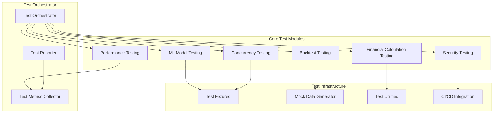
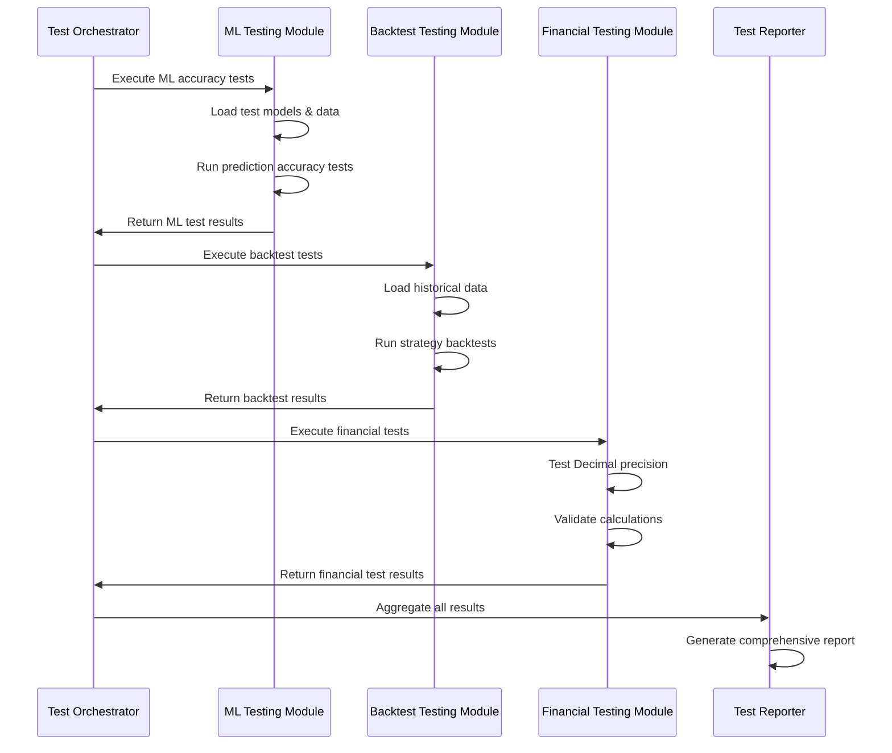

# Design Document

## Overview

この設計は、Trdinger トレーディングプラットフォームの既存テストシステムを完全に刷新し、ML モデルの精度測定、バックテスト機能の包括的検証、システム堅牢性の測定を含む新しいテストフレームワークを構築します。現在のテスト構造（backend/tests、frontend/**tests**）を完全に削除し、より厳密で包括的なテストスイートに置き換えます。

## Architecture

### Test Framework Architecture



### Data Flow Architecture



## Components and Interfaces

### 1. Test Orchestrator (`test_orchestrator.py`)

**責任**: 全テストモジュールの実行調整と結果集約

```python
class TestOrchestrator:
    def __init__(self, config: TestConfig):
        self.config = config
        self.modules = self._initialize_test_modules()
        self.reporter = TestReporter()

    async def run_all_tests(self) -> TestResults:
        """全テストモジュールを実行"""
        pass

    async def run_specific_tests(self, test_types: List[str]) -> TestResults:
        """指定されたテストタイプのみ実行"""
        pass

    def cleanup_existing_tests(self) -> CleanupReport:
        """既存テストファイルの削除"""
        pass
```

### 2. ML Model Testing Module (`ml_testing.py`)

**責任**: ML モデルの精度測定と検証

```python
class MLModelTester:
    def __init__(self, model_manager: ModelManager):
        self.model_manager = model_manager
        self.accuracy_thresholds = {
            'precision': 0.7,
            'recall': 0.6,
            'f1_score': 0.65
        }

    async def test_model_accuracy(self, model_name: str) -> MLTestResults:
        """モデル精度の包括的テスト"""
        pass

    async def test_prediction_consistency(self) -> ConsistencyResults:
        """予測結果の一貫性テスト"""
        pass

    async def test_model_performance_degradation(self) -> DegradationResults:
        """モデル性能劣化の検出"""
        pass

    def validate_prediction_format(self, predictions: Dict) -> ValidationResult:
        """予測結果フォーマットの検証"""
        pass
```

### 3. Backtest Testing Module (`backtest_testing.py`)

**責任**: バックテスト機能の正確性検証

```python
class BacktestTester:
    def __init__(self, backtest_service: BacktestDataService):
        self.backtest_service = backtest_service
        self.known_results = self._load_known_test_cases()

    async def test_backtest_accuracy(self, strategy_config: Dict) -> BacktestResults:
        """バックテスト計算精度のテスト"""
        pass

    async def test_sharpe_ratio_calculation(self) -> MetricsResults:
        """シャープレシオ計算の検証"""
        pass

    async def test_max_drawdown_calculation(self) -> MetricsResults:
        """最大ドローダウン計算の検証"""
        pass

    async def test_extreme_market_conditions(self) -> ExtremeConditionResults:
        """極端な市場状況でのテスト"""
        pass
```

### 4. Financial Calculation Testing Module (`financial_testing.py`)

**責任**: 財務計算の精度と Decimal 型使用の強制

```python
class FinancialCalculationTester:
    def __init__(self):
        self.decimal_precision = Decimal('0.00000001')  # 8桁精度
        self.rounding_mode = ROUND_HALF_UP

    def test_decimal_type_enforcement(self) -> DecimalTestResults:
        """Decimal型使用の強制検証"""
        pass

    def test_price_calculation_precision(self) -> PrecisionResults:
        """価格計算精度のテスト"""
        pass

    def test_portfolio_value_calculation(self) -> PortfolioResults:
        """ポートフォリオ価値計算の検証"""
        pass

    def detect_float_usage(self, code_paths: List[str]) -> FloatUsageReport:
        """float型使用の検出"""
        pass
```

### 5. Concurrency Testing Module (`concurrency_testing.py`)

**責任**: 並行処理と競合状態の検証

```python
class ConcurrencyTester:
    def __init__(self, db_session_factory):
        self.db_factory = db_session_factory
        self.concurrent_operations = 10

    async def test_concurrent_trading_operations(self) -> ConcurrencyResults:
        """同時取引操作のテスト"""
        pass

    async def test_race_conditions(self) -> RaceConditionResults:
        """競合状態の検出"""
        pass

    async def test_deadlock_detection(self) -> DeadlockResults:
        """デッドロック検出テスト"""
        pass

    async def test_circuit_breaker_behavior(self) -> CircuitBreakerResults:
        """サーキットブレーカーの動作テスト"""
        pass
```

### 6. Performance Testing Module (`performance_testing.py`)

**責任**: システムパフォーマンスの測定

```python
class PerformanceTester:
    def __init__(self):
        self.performance_targets = {
            'market_data_processing': 0.1,  # 100ms
            'strategy_signal_generation': 0.5,  # 500ms
            'portfolio_update': 1.0  # 1 second
        }

    async def test_market_data_processing_speed(self) -> PerformanceResults:
        """市場データ処理速度のテスト"""
        pass

    async def test_strategy_signal_generation_speed(self) -> PerformanceResults:
        """戦略シグナル生成速度のテスト"""
        pass

    async def test_portfolio_update_speed(self) -> PerformanceResults:
        """ポートフォリオ更新速度のテスト"""
        pass

    def profile_performance_bottlenecks(self) -> ProfilingResults:
        """パフォーマンスボトルネックの特定"""
        pass
```

### 7. Security Testing Module (`security_testing.py`)

**責任**: セキュリティとデータ保護の検証

```python
class SecurityTester:
    def __init__(self):
        self.sensitive_patterns = [
            r'api[_-]?key',
            r'secret[_-]?key',
            r'password',
            r'token'
        ]

    def test_api_key_exposure(self) -> SecurityResults:
        """APIキー漏洩の検出"""
        pass

    def test_input_validation(self) -> ValidationResults:
        """入力検証のテスト"""
        pass

    def test_data_encryption(self) -> EncryptionResults:
        """データ暗号化のテスト"""
        pass

    def scan_log_files_for_secrets(self) -> LogSecurityResults:
        """ログファイルの機密情報スキャン"""
        pass
```

### 8. Test Reporter (`test_reporter.py`)

**責任**: テスト結果の包括的レポート生成

```python
class TestReporter:
    def __init__(self):
        self.report_formats = ['json', 'html', 'junit']

    def generate_comprehensive_report(self, results: TestResults) -> Report:
        """包括的テストレポートの生成"""
        pass

    def generate_failure_analysis(self, failures: List[TestFailure]) -> FailureAnalysis:
        """失敗分析レポートの生成"""
        pass

    def generate_metrics_dashboard(self, metrics: TestMetrics) -> Dashboard:
        """メトリクスダッシュボードの生成"""
        pass

    def export_ci_results(self, results: TestResults) -> CIResults:
        """CI/CD用結果エクスポート"""
        pass
```

## Data Models

### Test Configuration Model

```python
@dataclass
class TestConfig:
    ml_accuracy_thresholds: Dict[str, float]
    performance_targets: Dict[str, float]
    concurrency_test_count: int
    security_scan_paths: List[str]
    report_formats: List[str]
    cleanup_existing_tests: bool
```

### Test Results Models

```python
@dataclass
class TestResults:
    ml_results: MLTestResults
    backtest_results: BacktestResults
    financial_results: FinancialResults
    concurrency_results: ConcurrencyResults
    performance_results: PerformanceResults
    security_results: SecurityResults
    overall_status: TestStatus
    execution_time: float
    timestamp: datetime

@dataclass
class MLTestResults:
    model_accuracy: Dict[str, float]
    prediction_consistency: float
    performance_degradation: bool
    format_validation: bool
    test_status: TestStatus

@dataclass
class BacktestResults:
    sharpe_ratio_accuracy: float
    max_drawdown_accuracy: float
    win_rate_accuracy: float
    extreme_condition_handling: bool
    test_status: TestStatus
```

## Error Handling

### Test Execution Error Handling

```python
class TestExecutionError(Exception):
    """テスト実行エラー"""
    pass

class TestValidationError(Exception):
    """テスト検証エラー"""
    pass

class TestTimeoutError(Exception):
    """テストタイムアウトエラー"""
    pass
```

### Error Recovery Strategy

1. **Graceful Degradation**: 一部のテストが失敗しても他のテストを継続実行
2. **Retry Mechanism**: 一時的な失敗に対する自動リトライ
3. **Fallback Testing**: 主要テストが失敗した場合の代替テスト実行
4. **Detailed Logging**: 失敗原因の詳細なログ記録

## Testing Strategy

### Test Data Management

```python
class TestDataManager:
    def __init__(self):
        self.synthetic_data_generator = SyntheticDataGenerator()
        self.historical_data_loader = HistoricalDataLoader()

    def generate_ml_test_data(self) -> MLTestData:
        """ML テスト用データ生成"""
        pass

    def load_backtest_reference_data(self) -> BacktestReferenceData:
        """バックテスト参照データの読み込み"""
        pass

    def create_edge_case_scenarios(self) -> EdgeCaseData:
        """エッジケースシナリオの作成"""
        pass
```

### Test Environment Isolation

1. **Database Isolation**: テスト専用データベースの使用
2. **API Mocking**: 外部 API 呼び出しのモック化
3. **Time Mocking**: 時間依存テストの制御
4. **Resource Cleanup**: テスト後のリソース自動クリーンアップ

### Continuous Integration Integration

```python
class CIIntegration:
    def __init__(self):
        self.ci_config = CIConfig()

    def generate_junit_report(self, results: TestResults) -> str:
        """JUnit形式レポート生成"""
        pass

    def set_exit_codes(self, results: TestResults) -> int:
        """適切な終了コード設定"""
        pass

    def upload_test_artifacts(self, artifacts: List[str]) -> bool:
        """テストアーティファクトのアップロード"""
        pass
```

## Implementation Phases

### Phase 1: Infrastructure Setup

- Test orchestrator implementation
- Test data management system
- Basic reporting framework

### Phase 2: Core Testing Modules

- ML model testing module
- Financial calculation testing module
- Backtest testing module

### Phase 3: Advanced Testing

- Concurrency testing module
- Performance testing module
- Security testing module

### Phase 4: Integration & Reporting

- Comprehensive reporting system
- CI/CD integration
- Documentation and deployment
