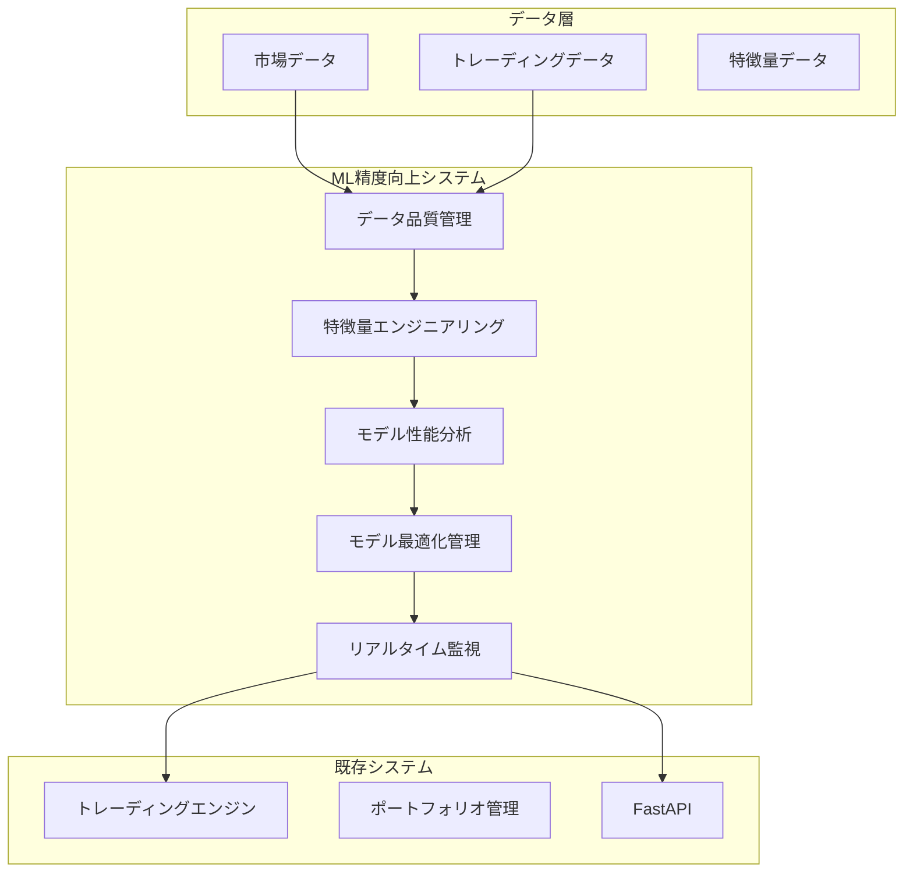

# ML モデル精度向上 - 設計文書

## 概要

Trdinger トレーディングプラットフォームの ML モデル精度向上システムは、既存のトレーディングシステムに統合される包括的な機械学習最適化プラットフォームです。本システムは、モデル性能の診断・分析、データ品質管理、高度な特徴量エンジニアリング、モデル最適化、リアルタイム監視の 5 つの主要コンポーネントから構成されます。

**設計目標:**

- 既存 ML モデルの予測精度を 10-15% 向上
- リアルタイム性能監視とアラート機能の実現
- データ品質の自動管理と継続的改善
- 高度な特徴量エンジニアリングによる予測力向上
- モデルライフサイクル全体の自動化と最適化

## アーキテクチャ

### システム全体構成



### レイヤー構成

**プレゼンテーション層**

- FastAPI エンドポイント
- リアルタイムダッシュボード
- アラート通知システム

**ビジネスロジック層**

- モデル性能分析サービス
- データ品質管理サービス
- 特徴量エンジニアリングサービス
- モデル最適化サービス
- 監視・評価サービス

**データアクセス層**

- Repository パターンによるデータアクセス
- SQLAlchemy ORM
- 時系列データベース最適化

**インフラストラクチャ層**

- 非同期処理 (asyncio)
- キャッシュ機能 (Redis)
- メッセージキュー (Celery)

## コンポーネントと インターフェース

### 1. モデル性能診断・分析システム

**主要コンポーネント:**

- `ModelPerformanceAnalyzer`: 包括的性能指標計算
- `ErrorAnalyzer`: 予測誤差パターン分析
- `ModelComparator`: 複数モデル比較・統計検定
- `FeatureImportanceAnalyzer`: SHAP/LIME による解釈可能性分析

**インターフェース:**

```python
class ModelPerformanceAnalyzer:
    async def analyze_performance(
        self,
        model_id: str,
        test_data: pd.DataFrame
    ) -> PerformanceMetrics

    async def generate_improvement_suggestions(
        self,
        analysis_result: PerformanceMetrics
    ) -> List[ImprovementSuggestion]
```

### 2. データ品質管理システム

**主要コンポーネント:**

- `DataQualityChecker`: 欠損値・異常値・重複検出
- `DataCleaner`: 統計的手法による自動クリーニング
- `LeakageDetector`: データリーケージ検出
- `TimeSeriesValidator`: 時系列分割・クロスバリデーション

**インターフェース:**

```python
class DataQualityManager:
    async def check_data_quality(
        self,
        dataset: pd.DataFrame
    ) -> DataQualityReport

    async def clean_data(
        self,
        dataset: pd.DataFrame,
        quality_report: DataQualityReport
    ) -> pd.DataFrame
```

### 3. 高度な特徴量エンジニアリング

**主要コンポーネント:**

- `MarketMicrostructureFeatures`: オーダーブック・取引量特徴量
- `SentimentAnalyzer`: ニュース・ソーシャルメディア分析
- `TimeSeriesFeatureGenerator`: ラグ・移動統計・季節性特徴量
- `AutoMLFeatureGenerator`: TSfresh・AutoFeat・Featuretools 統合
- `FeatureSelector`: 相互情報量・LASSO・RFE による選択

**インターフェース:**

```python
class FeatureEngineeringPipeline:
    async def generate_features(
        self,
        raw_data: pd.DataFrame,
        feature_config: FeatureConfig
    ) -> pd.DataFrame

    async def select_optimal_features(
        self,
        features: pd.DataFrame,
        target: pd.Series
    ) -> List[str]
```

### 4. モデル最適化・管理システム

**主要コンポーネント:**

- `HyperparameterOptimizer`: Optuna・Hyperopt・Bayesian 最適化
- `EnsembleManager`: スタッキング・ブレンディング・動的重み付け
- `ModelVersionManager`: バージョニング・A/B テスト
- `AutoRetrainer`: 性能劣化検出・自動再学習
- `MetaLearner`: 過去最適化履歴活用

**インターフェース:**

```python
class ModelOptimizationManager:
    async def optimize_hyperparameters(
        self,
        model_type: str,
        train_data: pd.DataFrame,
        optimization_config: OptimizationConfig
    ) -> OptimizedModel

    async def create_ensemble(
        self,
        models: List[Model],
        ensemble_strategy: EnsembleStrategy
    ) -> EnsembleModel
```

### 5. リアルタイム監視・評価システム

**主要コンポーネント:**

- `RealTimeMonitor`: リアルタイム性能監視
- `PredictionQualityScorer`: 予測品質・信頼度計算
- `PerformanceTracker`: 時系列性能追跡
- `AlertManager`: 性能劣化・異常検出アラート
- `DashboardManager`: 可視化・ダッシュボード

**インターフェース:**

```python
class RealTimeMonitoringSystem:
    async def monitor_model_performance(
        self,
        model_id: str,
        prediction_data: PredictionData
    ) -> MonitoringResult

    async def calculate_prediction_quality(
        self,
        predictions: List[Prediction]
    ) -> PredictionQualityScore
```

## データモデル

### 核心エンティティ

**ModelPerformanceMetrics**

```python
@dataclass
class ModelPerformanceMetrics:
    model_id: str
    accuracy: Decimal
    f1_score: Decimal
    sharpe_ratio: Decimal
    max_drawdown: Decimal
    timestamp: datetime
    confidence_interval: Tuple[Decimal, Decimal]
```

**DataQualityReport**

```python
@dataclass
class DataQualityReport:
    dataset_id: str
    missing_values_ratio: Decimal
    outlier_count: int
    duplicate_count: int
    drift_score: Decimal
    quality_score: Decimal
    recommendations: List[str]
```

**FeatureImportance**

```python
@dataclass
class FeatureImportance:
    feature_name: str
    importance_score: Decimal
    stability_score: Decimal
    computation_cost: Decimal
    shap_value: Optional[Decimal]
```

**ModelOptimizationResult**

```python
@dataclass
class ModelOptimizationResult:
    model_id: str
    best_params: Dict[str, Any]
    cv_score: Decimal
    optimization_time: timedelta
    trial_count: int
    improvement_ratio: Decimal
```

### データベーススキーマ設計

**時系列最適化**

- パーティショニング: 日付ベース
- インデックス: model_id + timestamp
- 圧縮: 古いデータの自動圧縮

**財務データ精度**

- すべての価格・金額フィールドに `DECIMAL(20,8)` 使用
- `ROUND_HALF_UP` による一貫した丸め処理

## エラーハンドリング

### エラー分類と対応戦略

**回復可能エラー**

- API レート制限: 指数バックオフ再試行
- 一時的データベース接続エラー: 接続プール再試行
- モデル学習失敗: 代替パラメータで再実行

**致命的エラー**

- データ破損: アラート発生・手動介入要求
- メモリ不足: プロセス再起動・リソース拡張
- セキュリティ違反: 即座にシステム停止

**監視とアラート**

```python
class MLSystemErrorHandler:
    async def handle_model_training_error(
        self,
        error: Exception,
        context: TrainingContext
    ) -> ErrorHandlingResult:
        if isinstance(error, RecoverableError):
            return await self.retry_with_fallback(context)
        else:
            await self.alert_and_escalate(error, context)
            return ErrorHandlingResult.ESCALATED
```

## テスト戦略

### テストレベル

**単体テスト**

- 各コンポーネントの独立テスト
- モック使用による外部依存排除
- 財務計算の既知結果検証

**統合テスト**

- コンポーネント間連携テスト
- データベース統合テスト
- API エンドポイントテスト

**性能テスト**

- 市場データ処理: < 100ms 目標
- モデル推論: < 500ms 目標
- 大量データ処理の負荷テスト

**ML 特化テスト**

```python
class MLModelTestSuite:
    def test_model_determinism(self):
        """同一データ・パラメータで一貫した結果を保証"""

    def test_feature_engineering_stability(self):
        """特徴量生成の安定性検証"""

    def test_data_leakage_prevention(self):
        """データリーケージ防止検証"""

    def test_model_performance_degradation(self):
        """性能劣化検出機能テスト"""
```

### テストデータ管理

**合成データ生成**

- 実市場データパターンを模倣
- プライバシー保護
- 極端ケース・エッジケース含有

**バックテスト検証**

- ウォークフォワード分析
- アウトオブサンプル検証
- 統計的有意性検定
