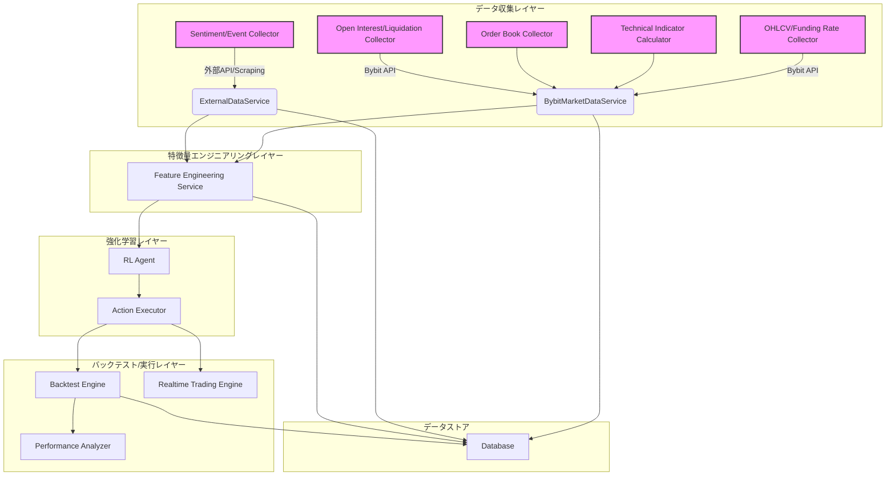

# 強化学習トレーディング BOT 開発計画

## 1. 目的

最終的に強化学習を用いたトレーディング BOT を開発する。

## 2. 現状のシステム概要

- OHLCV データ収集機能
- ファンディングレート収集機能
- 基本的なバックテスト機能

## 3. 追加で収集・利用を検討する情報

1.  **テクニカル指標:**
    - 移動平均線 (SMA, EMA)
    - MACD
    - RSI
    - ボリンジャーバンド
    - 出来高プロファイル
    - VWAP (Volume Weighted Average Price)
    - ATR (Average True Range)
2.  **オーダーブック情報:**
    - 板情報 (買板・売板の価格と数量)
    - スプレッド
    - オーダーフロー (約定履歴から推測)
3.  **市場センチメント:**
    - Fear & Greed Index
    - ニュース記事や SNS の感情分析 (別途外部 API やスクレイピングが必要)
    - 主要な暗号資産の価格変動
4.  **デリバティブ市場データ:**
    - オープンインタレスト (CCXT 経由で取得可能)
    - 精算データ (CCXT 経由で取得可能)
5.  **その他:**
    - 取引所のイベント情報 (メンテナンス、新規上場など)
    - 経済指標 (金利、インフレ率など、マクロ経済の影響を考慮する場合)
    - 他の取引所の価格情報 (アービトラージ戦略などを考慮する場合)

## 4. システム設計案

### 4.1. 概要

- **データ収集レイヤーの拡張:**
  - 既存の `MarketDataService` や `HistoricalDataService` を拡張し、テクニカル指標計算、オーダーブック情報取得、オープンインタレスト収集、精算データ収集機能を追加する。
  - 外部 API 連携やスクレイピングを行うための新しいサービスモジュールを作成する (例: `SentimentAnalysisService`, `ExternalEventService`)。
- **特徴量エンジニアリングレイヤーの導入:**
  - 収集した生データから、強化学習モデルが利用しやすい特徴量を生成するモジュールを作成する。
- **強化学習エージェントの統合:**
  - 強化学習ライブラリ (例: Stable Baselines3, RLlib) を利用してエージェントを学習・実行するモジュールを作成する。
- **バックテストエンジンの強化:**
  - 新しい特徴量や強化学習エージェントに対応できるように、既存のバックテストエンジンを拡張する。
- **データベーススキーマの更新:**
  - 新しいデータを保存するために、データベーススキーマを更新する。

### 4.2. システム構成図 (Mermaid)

## 5. 今後の進め方

この計画に基づき、各機能の実装を進める。
まずは、データ収集レイヤーの拡張から着手し、段階的に特徴量エンジニアリング、強化学習エージェントの統合へと進める。
