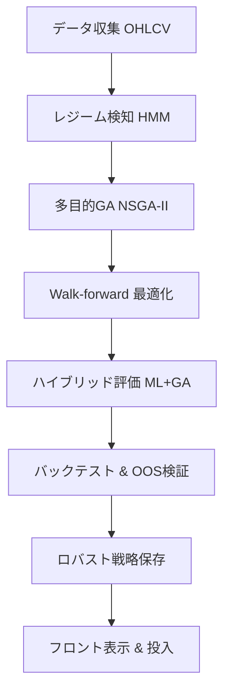

# オートストラテジー強化計画

## 目的

ロバストで実践投入可能な戦略構築を目指し、現在の GA ベースの自動戦略生成を強化。過学習防止、多様性確保、市場適応を焦点に、仮想通貨取引の変動性に対応。

## 現在の構造と限界（分析まとめ）

- **構造**: AutoStrategyService クラス（backend/app/services/auto_strategy/services/auto_strategy_service.py）で GA 初期化（DEAP）、バックテスト統合、実験管理。start_strategy_generation でポピュレーション進化。
- **限界**:
  - 単一目的最適化（主にリターン）でリスク無視。
  - 固定バックテスト環境でレジーム変化未考慮（過学習リスク）。
  - 多様性不足（fitness sharing 未実装）。
  - ハイブリッドなし（ML/GA 分離）。

## 強化案の詳細

### 1. 多目的最適化（NSGA-II 導入）

- **理由**: Sharpe 比率最大化、最大ドローダウン最小化でバランス。
- **実装**: DEAP の tools.selNSGA2 使用。FitnessMulti で weights=(1.0, -1.0)（リターン最大、ドローダウン最小）。
- **利点**: Pareto フロントで多様な戦略生成（Tavily/DEAP ドキュメント参照）。

### 2. 過学習防止とロバスト性向上

- **手法**: Walk-forward 最適化（インサンプル進化、アウトオブサンプル検証）。OOS テストで Sharpe>1.0 閾値。
- **追加**: Fitness 関数にペナルティ（例: ボラティリティ調整）。デコレータで戦略パラメータ下限確保（DEAP checkStrategy）。
- **TDD**: テストでシミュレーションデータ検証（pytest）。

### 3. ハイブリッド統合（ML + GA + レジーム適応）

- **レジーム検知**: HMM (hmmlearn) で状態分類。regime_adaptation_integration.md 参照。
- **統合**: GA の評価関数にレジーム予測スコア追加。Optuna でハイパーパラメータ最適化。
- **多様性**: Fitness sharing (DEAP tools) でニッチ確保。

### 4. 全体アーキテクチャ拡張

- **バックエンド**: AutoStrategyService に multi_objective_ga メソッド追加。PersistenceService で Pareto 戦略保存。
- **フロントエンド**: GAConfigForm.tsx に多目的オプション、レジーム選択 UI。
- **評価**: 総合テスト（comprehensive_test.py）で多レジームシナリオ。

## 実装ステップ (TDD 準拠)

1. **[ ] 多目的 Fitness/評価関数テスト作成**: DEAP NSGA-II ユニットテスト。
2. **[ ] AutoStrategyService 拡張**: \_initialize_ga_engine に NSGA-II 登録。Pydantic バリデーション追加。
3. **[ ] 過学習防止ロジック**: Walk-forward 関数実装、テスト。
4. **[ ] ハイブリッド統合**: RegimeDetector サービス呼び出し、Fitness 関数修正。
5. **[ ] フロント対応**: useAutoStrategy.ts 拡張、UI 更新。
6. **[ ] 評価&デプロイ**: スクリプト更新（strategy_comparison.py）、Bybit 実データ検証。

## 潜在課題と解決

- **計算負荷**: 並列 GA (DEAP multiprocessing)、世代数制限。
- **依存**: 既存ライブラリ使用（DEAP, hmmlearn, Optuna）。
- **スタイル準拠**: Black/isort/mypy/pytest 後コミット。

この計画でロバスト戦略を実現。regime_adaptation_integration.md と連携。フィードバックをお願いします。
