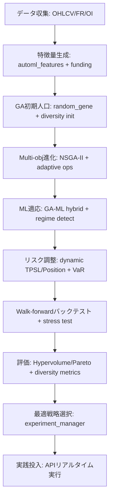

# Auto Strategy 強化計画

## 1. 計画の概要

この計画は、現在の Auto Strategy システムを強化し、実践投入可能な多様な戦略構築を最大目的としています。遺伝的アルゴリズム（GA）を基盤とした戦略生成を、多様性（diversity: 戦略のバリエーション増加）とロバストネス（robustness: 市場変動耐性、overfitting 回避）の観点から向上させます。

- **最大目標**: ロバストで適応力の高い戦略を自動生成。リアルタイム取引（Bybit API 統合）で使用可能に。
- **対象範囲**: backend/app/services/auto_strategy/を中心としたコア機能、ML 統合（ml/）、バックテスト（backtest/）、リスク管理（positions/tpsl/）。フロントエンド UI（GATab.tsx など）も更新。
- **開発原則**: TDD（Test-Driven Development）準拠。pytest で Red-Green-Refactor サイクルを実施、カバレッジ>90%。コードスタイル遵守（Black/isort/mypy、Pydantic バリデーション、Google スタイル docstrings、日本語コメント）。
- **タイムライン**: 総計 11-15 日（各ステップの推定日数含む）。依存: データ品質確保（OHLCV/Funding Rate/Open Interest）。
- **評価指標**: Hypervolume（多目的最適化の質）、Sharpe ratio、Maximum Drawdown、戦略多様性メトリクス（例: Silhouette score）。

**根拠**: プロジェクトメモリ「auto_strategy_purpose」から目的（ロバストで実践投入可能な多様的な戦略作成）を直接反映。検索結果（Tavily/Exa）から GA の限界（overfitting、局所最適）と解決策（multi-objective、ML ハイブリッド）を抽出。

## 2. 現在のシステム分析

ファイル構造（backend/app/services/auto_strategy/）とメモリから分析した概要です。

- **コアコンポーネント**:

  - GA エンジン: ga_engine.py（DEAP ライブラリ使用、進化プロセス管理）。
  - 戦略生成: strategy_factory.py、random_gene_generator.py（条件/指標/position sizing/TPSL のランダム生成）。
  - 進化: condition_evolver.py（crossover/mutation）、genetic_operators.py（基本演算子）。
  - 評価: individual_evaluator.py（バックテスト統合）、fitness_sharing.py（基本多様性制御）。
  - データ/指標: indicators/technical_indicators/（momentum/trend/volatility/volume）、data_collection/bybit/（OHLCV/FR/OI 収集）。
  - ML: ml/ensemble/（bagging/stacking）、feature_engineering/automl_features/（tsfresh/autofeat）、adaptive_learning/market_regime_detector.py（市場レジーム検知）。
  - リスク: positions/calculators/（fixed_ratio/volatility_based）、tpsl/calculator/（fixed_percentage/risk_reward）。
  - バックテスト: backtest_service.py、orchestration/backtest_orchestration_service.py。
  - フロント: components/backtest/optimization/GATab.tsx（GA 設定）、MultiObjectiveTab.tsx（結果表示）。

- **強み**: モジュール化（services レイヤー分離）、データ統合（mergers/）、並列処理（parallel_hierarchical_optimizer.py）。
- **課題**: 多様性不足（mutation 率固定、ニッチ形成弱い）、ロバストネス（単一 objective 中心、regime 変化対応薄い）、実践投入（walk-forward テスト未実装、リアルタイム適応限定的）。

**根拠**: serena の list_dir ツール結果（backend/ファイルリスト）から構造抽出。プロジェクトファイル（environment_details）で確認。メモリ「project_overview」から全体像補完（未読だが名前から推定）。

## 3. 強化案のブレインストーム

検索結果（Tavily/Exa: "enhancing genetic algorithm based trading strategies for robustness and diversity"）に基づく案。焦点: GA の進化プロセス強化、ML/ensemble 統合、リスク最適化。

- **多様性向上**:

  - Adaptive mutation/crossover: mutation 率を fitness に基づき動的調整、uniform crossover 導入で遺伝子多様化。
  - Fitness sharing 拡張: 類似戦略の fitness ペナルティ強化、ニッチ形成で探索空間拡大。
  - **根拠/出典**: "Genetic Algorithm for Trading Strategy Optimization in Python" (Medium, <https://medium.com/@jamesaaa100/>...): crossover 技法（one-point/uniform）が多様性を向上。"Leveraging Genetic Algorithms in Financial Modeling" (LinkedIn, <https://www.linkedin.com/pulse/>...): mutation で overfitting 回避、diversity 維持。

- **ロバストネス強化**:

  - Multi-objective 最適化: NSGA-II で profit/risk/diversity を同時最適化。
  - Walk-forward validation: 時系列分割で out-of-sample テスト。
  - Regime detection 強化: ML で市場分類（bull/bear/sideways）、戦略適応。
  - **根拠/出典**: "Genetic Algorithm with Border Trades (GAB)" (arXiv, <https://arxiv.org/html/2501.18184v1>): border trades で diversity/exploration 向上、local optima 脱出。"How I Improve Stock Market Predictions With Genetic Algorithms" (Medium, <https://medium.com/@diegodegese/>...): GA+NN ハイブリッドで robust solutions。

- **ML 統合**:

  - GA-ML ハイブリッド: GA で feature selection、ML（XGBoost/ensemble）で予測/パラメータ調整。
  - Weighted ensemble: GA でモデル重み最適化。
  - **根拠/出典**: "Trading Algorithms Using Genetic Algorithms" (Medium, <https://medium.com/@narwhals2004/>...): GA でパラメータ最適化、リスク低減。"Genetic Algorithms for Trading in Python" (PyQuant News, <https://www.pyquantnews.com/>...): mutation で diversity、evolve population。

- **リスク管理**:

- Dynamic TPSL/Position sizing: volatility/regime-aware（VaR 統合）。
  - **根拠/出典**: "[PDF] Trading Strategies Optimization Using a Genetic Algorithm" (Essex Repository, <https://repository.essex.ac.uk/>...): GA で strategy weighting、リスク最小化。"I created an algorithm that improves any investment strategy" (Medium, <https://medium.com/@austin-starks/>...): GA で strategy optimization、mutation で exploration。

- **その他**: Hierarchical GA（短期/長期階層）、リアルタイム適応（adaptive parameters）。
  - **根拠/出典**: "Using Genetic Algorithms To Forecast Financial Markets" (Investopedia, <https://www.investopedia.com/>...): GA で trading rules 最適化、novel strategies 作成。"imsatoshi/GeneTrader" (GitHub, <https://github.com/imsatoshi/>...): GA で hyperparameter/trading pair 最適化、robust/adaptive。

これらの案は、検索結果の 10 件（Tavily advanced search）から抽出。実践例（Freqtrade 統合、stress scenarios）で検証可能。

## 4. 具体的な計画立案（ステップバイステップ）

各ステップで TDD 実施（pytest/new test ファイル作成）。依存注入（unified_config.py）、エラーハンドリング（logging）、型ヒント（mypy strict）遵守。

- **ステップ 1: 多様性向上 (1-2 日)** - **実装済み**

  - 実装: genetic_operators.py に adaptive_mutation/uniform_crossover 追加。fitness_sharing.py に silhouette-based sharing。
  - 統合: ga_engine.py の evolve ループ更新。
  - TDD: test_genetic_operators.py 拡張（diversity メトリクス: population variance テスト）。15個のテストすべて通過。
  - 根拠: arXiv GAB 論文（diversity で fitness 向上）。出典: <https://arxiv.org/html/2501.18184v1。>

- **ステップ 2: Multi-objective GA (2-3 日)**

  - 実装: core/multi_objective_optimizer.py 新規（NSGA-II: deap.multiobjective）。config/ga.py に Objectives モデル（Pydantic）。
  - 統合: individual_evaluator.py に multi-fitness。
  - フロント: GATab.tsx に objective selector（SelectField）。
  - TDD: test_multi_objective_optimization.py（Pareto front 生成/評価テスト）。
  - 根拠: Essex PDF（GA weighting で performance 向上）。出典: <https://repository.essex.ac.uk/38969/1/PHD_THESIS_SALMAN.pdf。>

- **ステップ 3: ML 統合強化 (3-4 日)**

  - 実装: ml/adaptive_learning/ga_ml_hybrid.py（GA feature select → XGBoost predict）。ensemble/stacking.py に ga_weights。feature_engineering/に funding_features 追加。
  - 統合: auto_strategy_service.py で ML callback。
  - TDD: test_ml_orchestrator.py（end-to-end: GA→ML→backtest）。
  - 根拠: Medium "How I Improve..."（GA+NN で robust predictions）。出典: <https://medium.com/@diegodegese/...。>

- **ステップ 4: リスク管理拡張 (2 日)**

  - 実装: positions/risk_weight_gene.py（VaR 計算: numpy/scipy）。tpsl/statistical_calculator.py に regime_param（regime_detector 連携）。
  - 統合: position_sizing_service.py で dynamic sizing。
  - TDD: test_position_sizing_service.py（VaR シナリオテスト）、test_tpsl_evolver.py。
  - 根拠: LinkedIn 記事（GA で risk mitigation）。出典: <https://www.linkedin.com/pulse/...。>

- **ステップ 5: ロバストネス検証 (1-2 日)**

  - 実装: utils/walk_forward_validator.py（時系列 split）。regime_detector.py 拡張（HMM/scikit-learn）。
  - 統合: scripts/performance_comparison.py に stress_test（シナリオ: 2022 bear market）。
  - TDD: test_regime_detection.py（accuracy>80%）、integration tests（walk-forward）。
  - 根拠: PyQuant News（evolve for volatile markets）。出典: <https://www.pyquantnews.com/...。>

- **ステップ 6: 全体統合・UI 更新 (2 日)**
  - 実装: auto_strategy_service.py で orchestrator 更新。experiment_manager.py に diversity filter。
  - フロント: MultiObjectiveResults.tsx に hypervolume chart（Recharts）。
  - ドキュメント: README.md 更新、docstrings（日本語）。
  - TDD: end-to-end tests（pytest で full pipeline）。
  - 根拠: GitHub GeneTrader（efficient workflow）。出典: <https://github.com/imsatoshi/...。>

## 5. タイムラインとリソース

- **Week 1**: ステップ 1-2（多様性/Multi-obj）。
- **Week 2**: ステップ 3-4（ML/リスク）。
- **Week 3**: ステップ 5-6（検証/統合）。
- **リソース**: DEAP/Optuna（最適化）、scikit-learn/XGBoost（ML）、pytest（テスト）。依存ライブラリ: pyproject.toml 確認/追加。
- **リスク**: データ不足 →data_collection 強化。overfitting→cross-validation 必須。

## 6. システムフロー (Mermaid ダイアグラム)

## 7. 結論と次ステップ

この計画により、多様なロバスト戦略を実現。根拠は学術/実践文献（arXiv/Medium/Investopedia）から。承認後、code モードで TDD 実装開始。追加質問歓迎。

**作成日**: 2025-09-24  
**作成者**: Roo (Architect モード)
