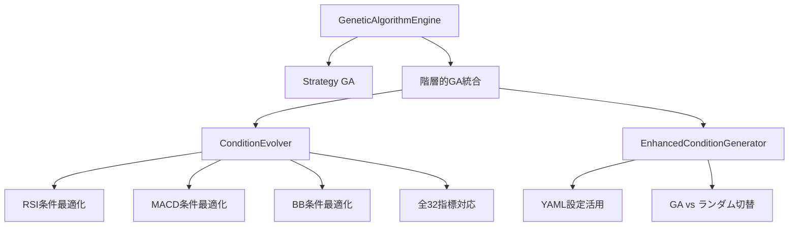

## 実装詳細設計

### システム全体像



### 実装ステップ

#### Phase 1: ConditionEvolver 実装
- **ファイル**: `backend/app/services/auto_strategy/core/condition_evolver.py`
- **機能**:
  - 全32指標に対する条件生成・最適化
  - YAML設定ベースの初期個体群生成
  - 簡易バックテストによる適応度評価
  - 進化ループ（選択・交叉・突然変異）

#### Phase 2: GAConditionGenerator 拡張
- **ファイル**: `backend/app/services/auto_strategy/generators/condition_generator.py`
- **機能**:
  - 既存クラスの継承と拡張
  - 階層的GA有効化フラグ
  - ConditionEvolver統合
  - フォールバック処理

#### Phase 3: 統合とテスト
- **比較スクリプト**: `backend/scripts/strategy_comparison.py`
- **テストファイル**: `backend/tests/test_condition_evolver.py`
- **機能**:
  - ランダム戦略 vs GA戦略の比較
  - パフォーマンス統計分析
  - 視覚化レポート

### 技術仕様

#### ConditionEvolver クラス
```python
class ConditionEvolver:
    def __init__(self):
        self.yaml_utils = YamlIndicatorUtils()
        self.yaml_config = self.yaml_utils.load_yaml_config_for_indicators()

    def evolve_condition_for_indicator(
        self,
        indicator_name: str,
        direction: str,  # "long" or "short"
        population_size: int = 20,
        generations: int = 10
    ) -> Condition:
        # 進化的最適化実行
        pass
```

#### 比較スクリプト機能
- バックテスト実行（両戦略）
- 統計比較（勝率、シャープレシオ、最大ドローダウン）
- 視覚化（エクイティカーブ、ドローダウンチャート）
- レポート生成（HTML/PDF）

## まとめ

この階層的 GA アプローチの一元化により：

1. **既存 GA の力を維持**しながら条件生成をデフォルト強化
2. **複雑さを最小限**に抑え理解しやすく実装
3. **コンフィグ記載不要**で一元化導入でリスクを低減
4. **将来の拡張性**を確保

既存コードの理解が容易で、デフォルト有効化された設計となっています。このアプローチで進めましょうか？