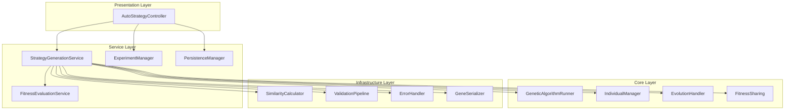

# AutoStrategy パッケージ リファクタリング提案

## 1. 概要

AutoStrategy パッケージは遺伝的アルゴリズム（GA）を使用した取引戦略の自動生成システムを提供しています。しかし、現在の実装では、メンテナンス性の低下、DRY 原則違反、SOLID 原則違反が見られます。この提案では、これらの問題を解決するためのリファクタリング計画を記載します。

## 2. 現在の問題点

### 2.1 DRY 原則違反

- **重複した import**: GeneSerializer, StrategyGene などのコンポーネントが複数のファイルで import されている。
- **共通ロジックの重複**: 検証ロジック、エラーハンドリングが各クラスで繰り返されている。
- **設定管理の重複**: GA 設定や戦略設定が各所でハードコーディングされている。

### 2.2 SOLID 原則違反

- **Single Responsibility Principle (S)**:

  - `AutoStrategyService`: GA 実行、実験管理、バックテスト、結果保存という複数の責任を持っている。
  - `GeneticAlgorithmEngine`: GA 設定、個体生成、評価、ログ管理を一つのクラスで担当。
  - `StrategyGene`: データ構造だけでなく検証、ユーティリティ機能まで含む。
  - `FitnessSharing`: 類似度計算と共有関数適用を担当。
  - `IndividualEvaluator`: 個体評価、フィットネス計算、多目的最適化、ロングショートバランス計算を単一クラスで担当。

- **Open/Closed Principle (O)**:

  - 拡張が複雑で、new concrete class を追加する必要がある場合が多い。

- **Dependency Inversion Principle (D)**:
  - 高レベルモジュールが低レベルモジュールに直接依存。
  - `safe_operation`デコレータが各所でハードコーディングされて使用。

### 2.3 メンテナンス性の問題

- **巨大なクラス**: `strategy_models.py`は 951 行、`ga_engine.py`は 317 行、`FitnessSharing`は 319 行、`GAConfig`は 1,293 行、`genetic_operators.py`は 427 行、`ExperimentPersistenceService`は 486 行、`CommonUtils.py`は 1,065 行、`Constants.py`は 657 行、`IndicatorService.py`は 244 行。
- **長いメソッド**: `run_evolution`メソッドは 200 行以上、単一責任ではない。`IndicatorService`のメソッドが 152 行。
- **弱い凝集度**: 関連性の低い機能が同じクラスに集約されている。
- **追加の問題**: `Constants.py`の循環依存と業務ロジックの混入、`CommonUtils.py`の責任過多、`IndicatorService.py`の複雑な戻り値型とロガー警告の混在。

## 3. アーキテクチャ改善提案

### 3.1 責任分離の提案

#### 3.1.1 Service Layer の分割

**現在の問題**: AutoStrategyService が多すぎる責任を持つ。

**解決策**:

1. **StrategyGenerationService**: GA 実行のみを担当。
2. **ExperimentManager**: 実験管理のみを担当。
3. **PersistenceManager**: データ永続化を担当（`ExperimentPersistenceService`を`StrategyDataRepository`、`BacktestExecutionManager`、`ExperimentLifeCycleManager`に分割）。
4. **ValidationService**: 全ての検証ロジックを集中管理。
5. **FitnessEvaluationService**: フィットネス評価を専門に担当（IndividualEvaluator から移譲）。

#### 3.1.2 Core クラスの分割

**現在の問題**: GeneticAlgorithmEngine が巨大。

**解決策**:

1. **GeneticAlgorithmRunner**: GA メイン実行。
2. **IndividualManager**: 個体管理。
3. **EvolutionHandler**: 世代進化処理。
4. **CrossoverEngine**: 交叉操作のみ専門。
5. **MutationEngine**: 突然変異操作のみ専門。
6. **TypeConversionService**: 型変換専用サービス。

#### 3.1.3 設定とユーティリティの改善

- **GAConfig の分割**: `EvolutionSettings`、`FitnessConfiguration`、`MultiObjectiveConfiguration`、`ExecutionConfiguration`に分離。
- **Constants.py の分離**: 定数と処理を YAML Registry パターンに。
- **IndicatorService.py の分離**: 指標計算と登録ロジックを専門サービスに。

### 3.2 共通コンポーネントの導入

#### 3.2.1 検証パイプライン

```python
class ValidationPipeline:
    def validate(self, data: Any, validators: List[Validator]) -> ValidationResult:
        # 共通検証ロジック
```

#### 3.2.2 エラーハンドリングミドルウェア

```python
@safe_operation()
def execute_operation(self) -> Result:
    # 統一されたエラーハンドリング
```

#### 3.2.3 SimilarityCalculator の導入

```python
class SimilarityCalculator:
    """遺伝子類似度を計算する汎用クラス"""
    def calculate_similarity(self, gene1: StrategyGene, gene2: StrategyGene) -> float:
        # 統合された類似度計算ロジック
```

## 4. 提案アーキテクチャ図



## 5. 実装ステップ

### Phase 1: 信頼性の確保

1. 現在のテストケースを強化。
2. 新機能追加時に TDD 準拠。
3. マイグレーション用スクリプト作成。
4. テストスイートの強化と統合。
5. API 及び外部インターフェースの実装。
6. マイグレーション用の包括的バックアップシステム。

### Phase 2: 構造改善

1. Service クラスを分割。
2. 共通ユーティリティの作成（SimilarityCalculator、ValidationPipeline、ErrorHandler）。
3. 依存関係の注入を実装。
4. 継承構造の最適化。
5. SOLID 原則の段階的導入。
6. ディレクトリ構造の再設計。
7. FitnessSharing と IndividualEvaluator の機能移譲。
8. LongShortBalanceCalculator 等の抽出。

### Phase 3: アーキテクチャ革新

1. パブサブパターン導入。
2. 非同期処理の改善。
3. 結果ストリーミングの実装。
4. 共通インターフェースの定義。
5. ファクトリーパターンの適用。
6. 非同期アーキテクチャの採用。
7. イベント駆動のパターン導入。
8. 依存性注入の完全実装。

### Phase 4: 結果ストリーミング機能

1. リアルタイム処理の可能性検討。
2. データ更新通知システムの実装。
3. より忠実なユーザー体験の提供。

## 6. メリット

- **メンテナンス性向上**: 各クラスが単一責任を持つため変更容易。
- **DRY 遵守**: 共通ロジックの共有。
- **SOLID 遵守**: 拡張性と柔軟性の確保。
- **テスト性向上**: 責任分離により単体テストが容易。

## 7. リスクと緩和策

- **移行期間の複雑さ**: 段階的リファクタリングとテスト。
- **パフォーマンス影響**: ベンチマークテスト実施。
- **学習曲線**: ドキュメント化とチームトレーニング。

## 8. 結論

このリファクタリングにより、AutoStrategy パッケージは以下を実現可能:

- **大幅な保守性向上**: 複雑性の管理されたコードベース。
- **拡張性の確保**: 新機能の迅速な実装。
- **生産性向上**: 効率的かつ持続可能な開発プロセス。
- **先進技術スタック**: 最新のプログラミング原則に基づく最適化。
