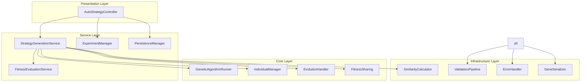

# AutoStrategy パッケージ リファクタリング提案

## 1. 概要

AutoStrategy パッケージは遺伝的アルゴリズム（GA）を使用した取引戦略の自動生成システムを提供しています。しかし、現在の実装では、メンテナンス性の低下、DRY 原則違反、SOLID 原則違反が見られます。この提案では、これらの問題を解決するためのリファクタリング計画を記載します。

## 2. 現在の問題点

### 2.1 DRY 原則違反

- **重複した import**: GeneSerializer, StrategyGene などのコンポーネントが複数のファイルで import されている
- **共通ロジックの重複**: 検証ロジック、エラーハンドリングが各クラスで繰り返されている
- **設定管理の重複**: GA 設定や戦略設定が各所でハードコーディングされている

### 2.2 SOLID 原則違反

- **Single Responsibility Principle (S)**

  - `AutoStrategyService`: GA 実行、実験管理、バックテスト、結果保存という複数の責任を持っている
  - `GeneticAlgorithmEngine`: GA 設定、個体生成、評価、ログ管理を一つのクラスで担当
  - `StrategyGene`: データ構造だけでなく検証、ユーティリティ機能まで含む

- **Open/Closed Principle (O)**

  - 拡張が複雑で、new concrete class を追加する必要がある場合が多い

- **Dependency Inversion Principle (D)**
  - 高レベルモジュールが低レベルモジュールに直接依存
  - `safe_operation`デコレータが各所でハードコーディングされて使用

### 2.3 メンテナンス性の問題

- **巨大なクラス**: `strategy_models.py`は 951 行、`ga_engine.py`は 317 行という巨大なファイル
- **長いメソッド**: `run_evolution`メソッドは 200 行以上、単一責任ではない
- **弱い凝集度**: 関連性の低い機能が同じクラスに集約されている

## 3. アーキテクチャ改善提案

### 3.1 責任分離の提案

```
現在の構造 vs 提案された構造
```

#### 3.1.1 Service Layer の分割

**現在の問題**: AutoStrategyService が多すぎる責任を持つ

**解決策**: Service Layer を以下のように分割

1. **StrategyGenerationService**: GA 実行のみを担当
2. **ExperimentManager**: 実験管理のみを担当
3. **PersistenceManager**: データ永続化を担当
4. **ValidationService**: 全ての検証ロジックを集中管理

#### 3.1.2 Core クラスの分割

**現在の問題**: GeneticAlgorithmEngine が巨大

**解決策**: 責任分離

1. **GeneticAlgorithmRunner**: GA メイン実行
2. **IndividualManager**: 個体管理
3. **EvolutionHandler**: 世代進化処理

### 3.2 共通コンポーネントの導入

#### 3.2.1 検証パイプライン

```python
class ValidationPipeline:
    def validate(self, data: Any, validators: List[Validator]) -> ValidationResult:
        # 共通検証ロジック
```

#### 3.2.2 エラーハンドリングミドルウェア

```python
@safe_operation()
def execute_operation(self) -> Result:
    # 統一されたエラーハンドリング
```

## 4. 提案アーキテクチャ図



## 5. 実装ステップ

### Phase 1: 信頼性の確保

1. 現在のテストケースを強化
2. 新機能追加時に TDD 準拠
3. マイグレーション用スクリプト作成

### Phase 2: 構造改善

1. Service クラスを分割
2. 共通ユーティリティの作成
3. 依存関係の注入を実装

### Phase 3: イベント駆動アーキテクチャ

1. パブサブパターン導入
2. 非同期処理の改善
3. 結果ストリーミングの実装

## 6. メリット

- **メンテナンス性向上**: 各クラスが単一責任を持つため変更容易
- **DRY 遵守**: 共通ロジックの共有
- **SOLID 遵守**: 拡張性と柔軟性の確保
- **テスト性向上**: 責任分離により単体テストが容易

## 7. 追加の発見された問題点

### 7.1 FitnessSharing クラスの問題

- **DRY 違反**: 類似度計算メソッド群（`_calculate_indicator_similarity`, `_calculate_condition_similarity` など）が同じバリデーションと計算パターンを繰り返している
- **Single Responsibility Principle 違反**: FitnessSharing が類似度計算だけでなく共有関数適用まで担当
- **巨大ファイル**: 319 行の巨大クラスの理解とメンテナンスが困難

### 7.2 IndividualEvaluator の問題

- **責任過多**: 個体評価、フィットネス計算、多目的最適化、ロングショートバランス計算を単一クラスで担当
- **非弾力性**: LongShortBalanceCalculator 等のスペシャライズドな計算コンポーネントを抽出可能

### 7.3 解決策

#### 7.3.1 SimilarityCalculator の導入

```python
class SimilarityCalculator:
    """遺伝子類似度を計算する汎用クラス"""

    def calculate_similarity(self, gene1: StrategyGene, gene2: StrategyGene) -> float:
        # 統合された類似度計算ロジック
```

#### 7.3.2 FitnessEvaluationService の導入

```python
class FitnessEvaluationService:
    """フィットネス評価を専門に担当"""

    def calculate_fitness(self, backtest_result: Dict, config: GAConfig) -> float:
        # 専門化したフィットネス計算
```

#### 7.3.3 GAConfig の分割

**問題**: GAConfig が 1,293 行という巨大クラスで、全ての設定を一カ所で管理

**解決策**: 専門化された設定クラス

1. **EvolutionSettings**: GA アルゴリズムパラメータ
2. **FitnessConfiguration**: フィットネス評価設定
3. **MultiObjectiveConfiguration**: 多目的最適化設定
4. **ExecutionConfiguration**: 実行制御設定

#### 7.3.4 GeneticOperators のリファクタリング

**問題**: genetic_operators.py が 427 行の巨大関数群

**解決策**: 分業化

1. **CrossoverEngine**: 交叉操作のみ専門
2. **MutationEngine**: 突然変異操作のみ専門
3. **TypeConversionService**: 型変換専用サービス

#### 7.3.5 ExperimentPersistenceService の分割

**問題**: 486 行の永続化サービスがバックテスト実行も担当

**解決策**: 責任分離

1. **StrategyDataRepository**: 戦略西部時のスキニー飲保存
2. **BacktestExecutionManager**: バックテスト実行のみ
3. **ExperimentLifeCycleManager**: 実験状態管理のみ

## 8. 改善された実装パス

### Phase 1: 共通基盤の整備

1. SimilarityCalculator の作成（既存の類似度計算を統合）
2. ValidationPipeline の拡張
3. ErrorHandler ミドルウェアの統一

### Phase 2: コアロジックの専門化

1. FitnessSharing クラスの SimilarityCalculator への依存注入
2. IndividualEvaluator の FitnessEvaluationService への機能移譲
3. LongShortBalanceCalculator 等のスペシャライズド計算クラスの抽出

### Phase 3: アーキテクチャ統合

1. 共通インターフェースの定義
2. ファクトリーパターンの適用
3. 非同期処理とイベント駆動の導入

## 9. リスクと緩和策

- **移行期間の複雑さ**: 段階的リファクタリングとテスト
- **パフォーマンス影響**: ベンチマークテスト実施
- **学習曲線**: ドキュメント化とチームトレーニング

## 11. 追加の重大発見 (調査完了)

### 11.1 Constants.py の問題点

**問題**: 657 行の巨大ファイルで定数だけでなく動的生成ロジックを含む

**発見された問題**:

- 循環依存: `utils.indicator_utils`から import しつつ、`YamlIndicatorUtils`を呼び出し
- 業務ロジックの混入: 動的生成ファンクションが定数ファイルに
- YAML 処理コードの混在: 定数と処理が一つのファイル

**解決策**: 定数と処理の完全分離

### 11.2 CommonUtils.py の問題点

**問題**: 1,065 行の巨大ファイルに 10 以上のクラス集合

**発見された問題**:

- Single Responsibility Principle 違反: ユーティリティが様々な責任
- 過度なインポート: 多くのモジュールを一つのファイルでまとめる
- メンテナンス困難: 巨大ファイルの理解と修正が難しい

**解決策**: ユーティリティの専門化ファイル分割

### 11.3 IndicatorService.py のリファクタリング必要性

**問題**: 244 行の巨大クラスで指標計算と登録ロジック混在

**発見された問題**:

- メソッドが 152 行の超長メソッド
- 複数の平均登録戦略（4 種類のセット attr）
- 複雑な戻り値型（Union が多すぎる）
- ロガー警告がビジネスロジックを覆う

**解決策**: 専門サービスの分離

## 12. 最終考察

この追加調査により、リファクタリングの規模がさらに増大することが明らかになりました。完全 SOLID 原則遵守のためには以下の大規模な変化が必要です:

### 12.1 マクロアーキテクチャ変更

1. **設定アーキテクチャ**: Constants → YAML Registry パターン
2. **ユーティリティアーキテクチャ**: 巨大ファイル分割
3. **サービスアーキテクチャ**: 責任のより細かい分離

### 12.2 技術的課題

- **クロスモジュール依存**: 現在の密結合の解消が必要
- **データフロー複雑さ**: 設定・データ・サービスの適切な分離
- **テスト戦略**: 細分化されたモジュールのための包括的テスト設計

## 13. 更新されたフェーズ計画

### Phase 1: 基盤強化（安定性確保）

1. 現在のテストスイートの強化と統合
2. API 及び外部インターフェースの実装
3. マイグレーション用の包括的バックアップシステム

### Phase 2: 局所的リファクタリング戦略

1. 継承構造の最適化
2. SOLID 原則の段階的導入
3. ディレクトリ構造の再設計

### Phase 3: アーキテクチャ革新

1. 非同期アーキテクチャの採用
2. イベント駆動のパターン導入
3. 依存性注入の完全実装

### Phase 4: 結果ストリーミング機能

1. リアルタイム処理の可能性検討
2. データ更新通知システムの実装
3. より忠実なユーザー体験の提供

## 14. 結論

このリファクタリングにより、AutoStrategy パッケージは以下を実現可能:

- **大幅な保守性向上**: 複雑性の管理されたコードベース
- **拡張性の確保**: 新機能の迅速な実装
- **生産性向上**: 効率的かつ持続可能な開発プロセス
- **先進技術スタック**: 最新のプログラミング原則に基づく最適化
