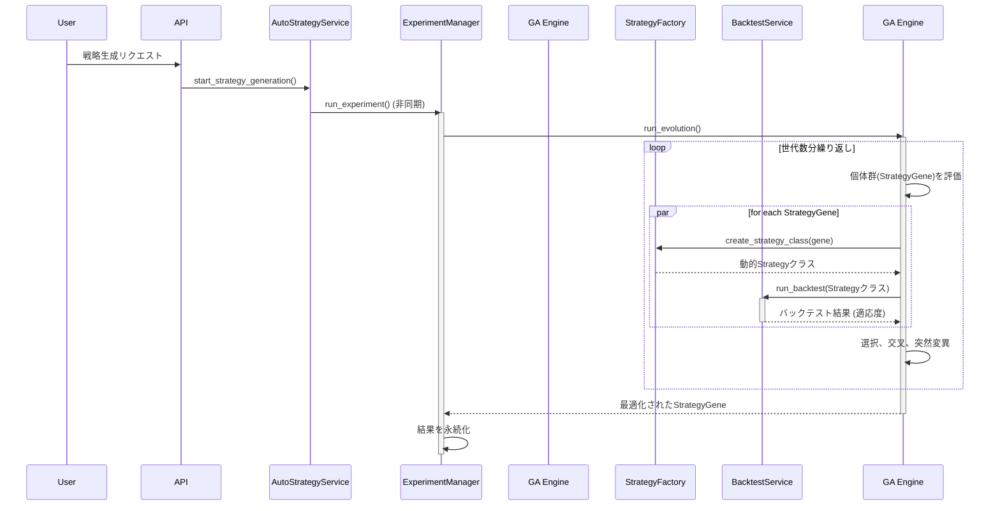

# オートストラテジー超強化プラン【統合版】

## 1. はじめに

### 1.1. 目的

本ドキュメントは、既存のオートストラテジー機能を抜本的に強化し、市場の多様な局面に対応可能な、より高精度かつロバストな取引戦略を自動生成するための包括的な開発計画を定義する。

現在のシステムが持つ遺伝的アルゴリズム（GA）による強力な探索基盤を最大限に活用しつつ、機械学習（ML）の予測能力を段階的かつ安全に統合し、業界最高水準の戦略自動生成エンジンを構築することを目指す。

### 1.2. 現状の強みとアーキテクチャ

#### 1.2.1. 優れた資産

- **堅牢なデータ基盤:** OHLCVに加え、ファンディングレート（FR）、建玉残高（OI）といったユニークなデータを収集・蓄積。
- **柔軟なGAエンジン:** `backtesting.py`と連携した遺伝的アルゴリズム（GA）による戦略探索基盤。
- **詳細な実験管理:** 戦略生成の全プロセスと結果がデータベースに記録され、高い再現性と分析可能性を確保。

#### 1.2.2. 現状アーキテクチャ

現在のシステムの主要コンポーネントと処理フローは以下の通りである。

## 2. 基本方針と強化の3本柱

以下の3つの軸を柱とし、段階的に機能を強化する。

1.  **特徴量エンジニアリングの深化:** 市場の"歪み"や"偏り"を捉える、より洞察に富んだ特徴量を創出する。
2.  **機械学習（ML）モデルの高度化:** 深化した特徴量を用いて高精度な予測モデルを構築し、その結果をGAの探索能力と融合させる。
3.  **探索アルゴリズムの多様化:** GAの探索効率を改善し、ロング・ショートのバランス問題を解決することで、戦略の多様性と質を向上させる。

---

## 3. 軸1：特徴量エンジニアリングの深化

**目的:** `FundingRate`や`OpenInterest`といったユニークなデータを活用し、従来のテクニカル指標だけでは捉えきれない市場の力学をモデルに組み込む。

### ステップ1: `FeatureEngineeringService` の新設

-   **場所:** `backend/app/core/services/feature_engineering/`
-   **責務:** OHLCV、FR、OIデータを受け取り、高度な特徴量を計算してPandas DataFrameとして返すサービスを構築する。
-   **特徴量の例:**
    -   `Price_MA_Ratio`: 価格と移動平均線の乖離率。
    -   `Volatility_Spike`: 短期間でのボラティリティの急上昇。
    -   `FR_OI_Ratio`: ファンディングレートと建玉残高の比率。市場の過熱感を示す。
    -   `Price_FR_Divergence`: 価格とファンディングレートの逆行現象。トレンド転換の先行指標となりうる。
    -   `OI_Surge`: 建玉残高の急増。大きな資金流入を示す。
    -   `Volatility_Adjusted_OI`: ボラティリティで調整した建玉残高の変化。

---

## 4. 軸2：MLモデルの高度化とハイブリッドGAへの統合

**目的:** 深化した特徴量を使い、高精度な予測モデルを構築。その予測結果を「最強のカスタム指標」としてGAに組み込み、戦略の質を飛躍的に向上させる。

### 4.1. ML導入アプローチの選定

複数のアプローチを比較検討した結果、**アプローチ1：ハイブリッドモデル**を本プロジェクトの最適解として推奨する。これは既存資産の活用、リスク管理、実現可能性の観点から最もバランスが取れているためである。

| 評価項目 | アプローチ1：ハイブリッドモデル | アプローチ2：代理モデル | アプローチ3：強化学習 |
| :--- | :--- | :--- | :--- |
| **コンセプト** | ML予測を**新しい指標**としてGAで利用 | MLで**バックテストを高速化** | RLエージェントが**直接取引を学習** |
| **メリット** | ✅ 既存資産を最大限に活用 ✅ 生成ルールの解釈可能性が高い ✅ 段階的な導入が可能 | ✅ GAの探索プロセスを大幅に高速化 ✅ 計算リソースの削減 | ✅ 真に最適なルールを自動発見する可能性 ✅ 市場への高い適応能力が期待できる |
| **デメリット** | ⚠️ MLモデル学習とGA実行の2フェーズ管理が必要 ⚠️ 特徴量エンジニアリングの質が重要 | ⚠️ 代理モデルの精度が低いと探索効率が悪化 ⚠️ 戦略遺伝子のベクトル化が非常に困難 | ⚠️ 既存資産の多くを破棄し、再設計が必要 ⚠️ 学習が不安定でブラックボックス化しやすい |
| **実装難易度** | **中** | **高** | **非常に高い** |
| **推奨度** | **★★★★★** | **★★★☆☆** | **★★☆☆☆** |

### 4.2. 実装計画

#### ステップ1: `MLSignalGenerator` の構築

-   **場所:** `backend/app/core/services/ml/signal_generator.py` に新規作成。
-   **責務:** モデルの学習 (`train`) と予測 (`predict`) を担当。
-   **入力:** `FeatureEngineeringService`が生成した特徴量リッチなDataFrame。
-   **モデル:** LightGBMやXGBoost等を用いた勾配ブースティング木。
-   **タスク:** 未来の価格（例: 24時間後）が「**上昇**」「**下落**」「**レンジ**」のいずれになるかを予測する3クラス分類モデルを構築する。
-   **出力:** 各クラスの予測確率を辞書形式で返す（例: `{"up": 0.7, "down": 0.2, "range": 0.1}`）。
-   **モデル永続化:** 学習済みモデルは `joblib` を用いて `backend/ml_models/` に保存する。

#### ステップ2: GAへの「ML予測確率」指標の統合

-   `IndicatorCalculator` (`indicator_calculator.py`) に、以下の新しい指標タイプを追加する。
    -   `ML_UP_PROB`: 上昇予測確率
    -   `ML_DOWN_PROB`: 下落予測確率
    -   `ML_RANGE_PROB`: レンジ予測確率
-   `SmartConditionGenerator` (`smart_condition_generator.py`) の `INDICATOR_CHARACTERISTICS` 辞書にこれらのML指標の特性（値域: 0-1）を定義する。
-   これにより、GAは以下のような、**MLの予測とテクニカル指標を組み合わせた、非常に高度で説明可能なルール**を自動で発見できるようになる。
    -   **買い条件の例:** `ML_UP_PROB > 0.7` AND `RSI(14) < 30`
    -   **売り条件の例:** `ML_DOWN_PROB > 0.6` AND `Close < SMA(200)`
    -   **手仕舞い条件の例:** `ML_RANGE_PROB > 0.8`

### 4.3. 必要な技術スタック

以下のライブラリを `backend/requirements.txt` に追加する。

| ライブラリ | 用途 |
| :--- | :--- |
| `scikit-learn` | 特徴量エンジニアリング、モデル評価 |
| `lightgbm` | 機械学習モデル（勾配ブースティング） |
| `joblib` | 学習済みモデルの保存・読み込み |

---

## 5. 軸3：探索アルゴリズムの多様化とバランス改善

**目的:** ロング偏重問題を解決し、多様な市場環境で機能する戦略を発見するため、探索アルゴリズム自体を強化・多様化する。

### ステップ1: フィットネス関数の改良とニッチ形成（最優先）

-   **バランス評価指標の導入:** フィットネス関数に、ロング・ショートの「利益バランス」と「取引回数バランス」を評価する項を追加する。
-   **ニッチ形成（Fitness Sharing）:** DEAPの機能を活用し、遺伝的に類似した個体の評価を下げることで、多様な戦略（ロング特化、ショート特化、バランス型など）が共存できるようにする。これは、GAが局所解に陥るのを防ぐ上で極めて重要である。

### ステップ2: ショート戦略専用の遺伝子操作

-   **`SmartConditionGenerator`の拡張:** デスクロスやベアダイバージェンスなど、ショートに有利な条件パターンを拡充する。
-   **カスタム突然変異:** 一定確率でショート条件を強制的に追加・変更する突然変異オペレーターを導入する。

### ステップ3: ベイズ最適化によるパラメータチューニング（将来展望）

-   **ハイブリッドアプローチの検討:**
    1.  GAで有望な戦略構造（インジケーターとロジックの組み合わせ）を探索する。
    2.  GAが発見したトップクラスの戦略群に対し、そのパラメータ（移動平均の期間、RSIの閾値など）を**ベイズ最適化**で効率的に微調整する。
-   これにより、「**広域探索（GA）**」と「**局所的深掘り（ベイズ最適化）**」の長所を組み合わせ、より洗練された戦略を効率的に発見できる可能性がある。

---

## 6. ロードマップ案

| フェーズ | 期間（目安） | 主なタスク | 達成目標 |
| :--- | :--- | :--- | :--- |
| **Phase 1** | 2-3週間 | - **フィットネス関数改良** - **ニッチ形成導入** - `FeatureEngineeringService`の基礎構築 | ロング・ショートのバランスを改善し、多様な戦略を生成する基盤を確立する。 |
| **Phase 2** | 3-4週間 | - `FeatureEngineeringService`の完成 - `MLSignalGenerator`の構築と学習 - GAへのML予測確率指標の統合 | MLの予測能力を組み込んだハイブリッドGAを完成させ、戦略の質を飛躍的に向上させる。 |
| **Phase 3** | 2週間 | - ショート戦略専用の遺伝子操作の実装 - APIとUIの調整（新パラメータ設定など） | ショート戦略の生成能力を強化し、システムの完成度を高める。 |
| **Phase 4** | 継続 | - ベイズ最適化の導入検討 - 新たな特徴量やMLモデルの研究 - パフォーマンスモニタリングと改善 | 持続的な改善サイクルを確立し、システムの陳腐化を防ぐ。 |
