# 特徴量エンジニアリング強化計画案

## 1. はじめに

本ドキュメントは、既存の機械学習モデルの予測精度向上を目的とし、特徴量エンジニアリングの強化方針を提案するものです。現状のコードベースは高度に構造化されていますが、さらなる改善の余地があります。

## 2. 既存の特徴量エンジニアリングの現状分析

### 2.1. 全体構成

- **`FeatureEngineeringService`**: 特徴量生成プロセス全体を統括する中心的なサービス。
- **`PriceFeatureCalculator`**: 価格（OHLCV）データに基づく基本的な特徴量を計算。
- **`TechnicalFeatureCalculator`**: テクニカル指標や市場レジーム、パターン認識に関する特徴量を計算。
- **`MarketDataFeatureCalculator`**: ファンディングレート（FR）や建玉（OI）などの市場データに基づく特徴量を計算。

この設計は、単一責任の原則に基づき、各クラスが特定の役割に専念しており、保守性と拡張性に優れています。

### 2.2. 生成されている特徴量の概要

#### 価格関連 (`PriceFeatureCalculator`)
- **移動平均**: 短期・長期の移動平均と価格との乖離率。
- **モメンタム**: 価格の変化率（Momentum, ROC）。
- **ボラティリティ**: ATR、実現ボラティリティ、ボラティリティスパイク。
- **出来高**: VWAP、出来高移動平均との比率、出来高スパイク。
- **ローソク足**: 実体の大きさ、ヒゲの長さ、高値・安値圏での位置。

#### テクニカル指標関連 (`TechnicalFeatureCalculator`)
- **オシレーター**: RSI, MACD, ストキャスティクス, CCI, Williams %R。
- **市場レジーム**: トレンド強度、レンジ相場判定、ブレイクアウト強度。
- **パターン認識**: RSIダイバージェンス（強気・弱気）、サポート・レジスタンスラインまでの距離、ピボットポイント、フィボナッチリトレースメント。

#### 市場データ関連 (`MarketDataFeatureCalculator`)
- **ファンディングレート(FR)**: 移動平均、変化率、価格との乖離、正規化FR。
- **建玉(OI)**: 変化率、移動平均、価格との相関、正規化OI。
- **複合特徴量**: FR/OI比率、市場ヒートインデックス、市場ストレス指標。

### 2.3. 現状の評価

#### 強み
- **モジュール性**: 機能ごとにクラスが分割されており、新しい特徴量の追加や修正が容易。
- **網羅性**: 価格、テクニカル、市場データという多角的なアプローチで市場を分析。
- **堅牢性**: データ検証やエラーハンドリングが組み込まれており、安定した運用が可能。

#### 改善の方向性
- **時間的特徴量の欠如**: 取引時間帯（例：東京時間、ロンドン時間、NY時間）、曜日、週末といった時間的要素が考慮されていない。
- **特徴量の相互作用**: 既存の特徴量同士を組み合わせた、より複雑な関係性を捉える特徴量が不足している。
- **外部データの活用**: ニュースセンチメントや経済指標など、外部データソースの活用が検討できる。
- **正規化手法の多様化**: 現在はMin-Max正規化が中心だが、Z-score正規化など、特徴量の分布に応じた手法の適用も有効。

## 3. 新しい特徴量カテゴリーの提案

現状の分析を踏まえ、以下の新しい特徴量カテゴリーを追加することを提案します。

### 3.1. 時間的特徴量 (Temporal Features)

市場には特定の時間帯や曜日に見られる周期的なパターン（アノマリー）が存在します。これらのパターンを捉えることで、モデルの予測精度を向上させることが期待できます。

- **取引セッション**: 東京、ロンドン、ニューヨークの各市場のオープン・クローズ時間を基に、市場の流動性やボラティリティが変化する時間帯を特徴量化します。
- **曜日効果**: 特定の曜日に価格が上昇または下落しやすい傾向（例：「月曜効果」）を特徴量として加えます。
- **時間帯**: 1時間ごとの時間帯（0〜23時）を特徴量化し、日中の価格変動パターンを捉えます。
- **週末効果**: 週末を挟むことによる市場心理の変化を捉えるため、金曜日の引けや月曜日の寄り付きに関連する特徴量を追加します。

### 3.2. 特徴量の相互作用 (Interaction Features)

既存の特徴量を組み合わせることで、単独では捉えきれない非線形な関係性をモデルに学習させます。

- **ボラティリティとモメンタムの相互作用**: 高いボラティリティ環境下でのモメンタムの強弱など、市場環境に応じた価格変動の勢いを捉えます。
  - `例：Volatility_Spike * Price_Momentum_14`
- **出来高とトレンド強度の相互作用**: トレンドが発生している際に、出来高が伴っているか（トレンドの信頼性）を評価します。
  - `例：Volume_Ratio * Trend_Strength`
- **FRとRSIの相互作用**: ファンディングレートが極端に高い（低い）状態でのRSIの買われすぎ・売られすぎシグナルの信頼性を評価します。
  - `例：FR_Extreme_High * (RSI - 70)`
- **OIと価格変動の相互作用**: 建玉の増減と価格変動の方向性を組み合わせ、市場参加者のポジション動向をより詳細に分析します。
  - `例：OI_Change_Rate * Price_Change_5`

## 4. 実装方針と期待される効果

### 4.1. 時間的特徴量の実装

#### 実装方針
1. **`TemporalFeatureCalculator` クラスの新規作成**:
   - `backend/app/core/services/ml/feature_engineering/` ディレクトリに `temporal_features.py` を新規作成します。
   - このクラスは、タイムスタンプ情報を受け取り、時間に関連する特徴量を計算する責務を負います。
2. **`FeatureEngineeringService` への統合**:
   - `FeatureEngineeringService` に `TemporalFeatureCalculator` を組み込み、`calculate_advanced_features` メソッド内で呼び出すように修正します。
   - タイムスタンプ列（例：`df.index`）を `TemporalFeatureCalculator` に渡します。
3. **具体的な特徴量の計算ロジック**:
   - **取引セッション**: UTCタイムスタンプを基に、各取引セッション（Asia, Europe, US）に該当するかを判定するフラグ（0 or 1）を立てます。
   - **曜日・時間帯**: `pandas` の `dt` アクセサ（`dt.dayofweek`, `dt.hour`）を利用して簡単に特徴量化します。

#### 期待される効果
- **予測精度の向上**: 市場の周期性をモデルが学習することで、特定の時間帯に発生しやすい価格変動パターンを捉え、予測精度が向上します。
- **モデルの汎用性向上**: 特定の市場環境だけでなく、時間的要因も考慮することで、より多様な状況に対応できる汎用性の高いモデルを構築できます。

### 4.2. 特徴量相互作用の実装

#### 実装方針
1. **`InteractionFeatureCalculator` クラスの新規作成**:
   - `backend/app/core/services/ml/feature_engineering/` ディレクトリに `interaction_features.py` を新規作成します。
   - このクラスは、既存の特徴量が計算された後のDataFrameを受け取り、特徴量同士を組み合わせて新しい特徴量を生成します。
2. **`FeatureEngineeringService` での呼び出し順序**:
   - `FeatureEngineeringService` の `calculate_advanced_features` メソッドの**最後**で `InteractionFeatureCalculator` を呼び出します。これにより、すべての基本特徴量が計算された状態で相互作用を計算できます。
3. **計算ロジック**:
   - 事前に定義された組み合わせ（例：`Volatility_Spike * Price_Momentum_14`）に基づき、単純な算術演算（乗算、除算など）で新しい特徴量列を追加します。
   - `DataValidator` を活用し、ゼロ除算や欠損値が発生しないように安全な計算を徹底します。

#### 期待される効果
- **非線形な関係性の捕捉**: 単独の特徴量では捉えきれない、市場の複雑な関係性（例：「ボラティリティが高い状況でのみモメンタムが有効」など）をモデルが学習できるようになります。
- **特徴量の表現力向上**: 特徴量の組み合わせにより、より nuanced（ニュアンスのある）な市場の状態を表現でき、モデルの解釈性向上にも寄与する可能性があります。

## 5. 提案の全体像

```mermaid
graph TD
    A[入力データ: OHLCV, FR, OI] --> B{FeatureEngineeringService};
    B --> C[PriceFeatureCalculator];
    B --> D[TechnicalFeatureCalculator];
    B --> E[MarketDataFeatureCalculator];
    B --> F_new["TemporalFeatureCalculator (新規)"];

    C --> G[価格・出来高・ボラティリティ];
    D --> H[テクニカル指標・パターン];
    E --> I[FR・OI・複合特徴量];
    F_new --> J_new[時間的特徴量];

    G --> K{DataFrame: 全特徴量};
    H --> K;
    I --> K;
    J_new --> K;
    
    K --> L_new["InteractionFeatureCalculator (新規)"];
    L_new --> M_new[特徴量相互作用];
    M_new --> N[最終的な特徴量セット];
    N --> O[機械学習モデル];

    style F_new fill:#d4edda,stroke:#c3e6cb
    style J_new fill:#d4edda,stroke:#c3e6cb
    style L_new fill:#d4edda,stroke:#c3e6cb
    style M_new fill:#d4edda,stroke:#c3e6cb
```

## 6. 推奨される次のステップ

1. **計画のレビュー**: 本計画案を開発チームおよび関係者でレビューし、フィードバックを収集します。
2. **実装タスクの分割**: 承認後、`TemporalFeatureCalculator` と `InteractionFeatureCalculator` の実装を個別のタスクとしてバックログに追加します。
3. **効果測定**: 新しい特徴量を追加したモデルと既存のモデルでA/Bテストを実施し、予測精度の向上を定量的に評価します。
4. **継続的な改善**: テスト結果に基づき、有効な特徴量の組み合わせをさらに探求し、継続的なモデル改善サイクルを構築します。
