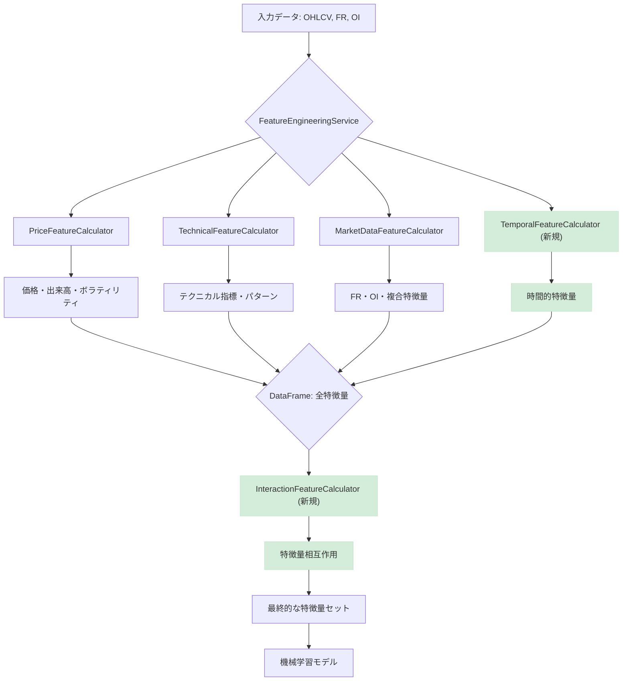

# 特徴量エンジニアリング強化計画案

## 1. はじめに

本ドキュメントは、既存の機械学習モデルの予測精度向上を目的とし、特徴量エンジニアリングの強化方針を提案するものです。現状のコードベースは高度に構造化されていますが、さらなる改善の余地があります。

## 2. 既存の特徴量エンジニアリングの現状分析

### 2.1. 全体構成

- **`FeatureEngineeringService`**: 特徴量生成プロセス全体を統括する中心的なサービス。
- **`PriceFeatureCalculator`**: 価格（OHLCV）データに基づく基本的な特徴量を計算。
- **`TechnicalFeatureCalculator`**: テクニカル指標や市場レジーム、パターン認識に関する特徴量を計算。
- **`MarketDataFeatureCalculator`**: ファンディングレート（FR）や建玉（OI）などの市場データに基づく特徴量を計算。
- **`TemporalFeatureCalculator`**: 時間的要素（取引セッション、曜日、時間帯など）に基づく特徴量を計算。**（実装済み）**
- **`InteractionFeatureCalculator`**: 既存の特徴量間の相互作用を捉える特徴量を計算。**（実装済み）**

この設計は、単一責任の原則に基づき、各クラスが特定の役割に専念しており、保守性と拡張性に優れています。

### 2.2. 生成されている特徴量の概要

#### 価格関連 (`PriceFeatureCalculator`)

- **移動平均**: 短期・長期の移動平均と価格との乖離率。
- **モメンタム**: 価格の変化率（Momentum, ROC）。
- **ボラティリティ**: ATR、実現ボラティリティ、ボラティリティスパイク、ボラティリティレジーム、ボラティリティ変化率。
- **出来高**: VWAP、出来高移動平均との比率、出来高スパイク、価格・出来高トレンド、出来高トレンド。
- **ローソク足**: 実体の大きさ、ヒゲの長さ、高値・安値圏での位置、価格レンジ、ギャップ。

#### テクニカル指標関連 (`TechnicalFeatureCalculator`)

- **オシレーター**: RSI, MACD, ストキャスティクス, CCI, Williams %R。
- **市場レジーム**: トレンド強度、レンジ相場判定、ブレイクアウト強度、市場効率性。
- **パターン認識**: RSI ダイバージェンス（強気・弱気）、サポート・レジスタンスラインまでの距離、ピボットポイント、フィボナッチリトレースメント、ギャップ分析（Gap_Up, Gap_Down, Gap_Size）。

#### 市場データ関連 (`MarketDataFeatureCalculator`)

- **ファンディングレート(FR)**: 移動平均（24h, 168h）、変化率、価格との乖離、正規化 FR、極値（高値・安値）、トレンド、ボラティリティ。
- **建玉(OI)**: 変化率（1h, 24h）、急増、ボラティリティ調整 OI、移動平均（24h, 168h）、トレンド、価格との相関、正規化 OI。
- **複合特徴量**: FR/OI 比率、市場ヒートインデックス、市場ストレス指標、市場バランス指標。

#### 時間的特徴量 (`TemporalFeatureCalculator`) **（新規追加済み）**

- **取引セッション**: Asia, Europe, US セッションのフラグ。
- **曜日効果**: 曜日（0-6）、週末フラグ、月曜・金曜フラグ。
- **時間帯**: 1 時間ごとの時間帯（0〜23 時）。
- **周期的エンコーディング**: 時間と曜日の sin/cos 変換。
- **セッション重複**: Asia-Europe, Europe-US セッションの重複フラグ。

#### 特徴量の相互作用 (`InteractionFeatureCalculator`) **（新規追加済み）**

- **ボラティリティとモメンタムの相互作用**: `ATR * Price_Momentum_14`, `Volatility_Spike * Price_Change_5`。
- **出来高とトレンド強度の相互作用**: `Volume_Ratio * Trend_Strength`, `Volume_Spike * Breakout_Strength`。
- **FR と RSI の相互作用**: `FR_Normalized * (RSI - 50)`, `FR_Extreme_High * (RSI > 70)`, `FR_Extreme_Low * (RSI < 30)`。
- **OI と価格変動の相互作用**: `OI_Change_Rate * Price_Change_5`, `OI_Trend * Price_Momentum_14`。

### 2.3. 現状の評価

#### 強み

- **モジュール性**: 機能ごとにクラスが分割されており、新しい特徴量の追加や修正が容易。
- **網羅性**: 価格、テクニカル、市場データ、時間的要素、相互作用という多角的なアプローチで市場を分析。
- **堅牢性**: データ検証やエラーハンドリングが組み込まれており、安定した運用が可能。
- **拡張性**: 新しい特徴量カテゴリーや計算ロジックの追加が容易な設計。

#### 改善の方向性

- **外部データの活用**: ニュースセンチメント、経済指標、ソーシャルメディアセンチメントなど、市場に影響を与える可能性のある外部データソースを統合し、より包括的な特徴量セットを構築します。API 連携やスクレイピングによるデータ収集、自然言語処理（NLP）を用いたセンチメント分析などが考えられます。
- **正規化手法の多様化**: 現在の Min-Max 正規化に加え、Z-score 正規化、ロバストスケーリング、Quantile 変換など、特徴量の分布特性やモデルの要件に応じた多様な正規化手法を導入します。これにより、外れ値の影響を軽減し、モデルの学習効率と性能を向上させます。
- **特徴量選択と次元削減**: 生成される特徴量が増加するにつれて、モデルの過学習リスクや計算コストが増大します。Permutation Importance、SHAP 値、Lasso 回帰などの特徴量選択手法を用いて、予測に寄与度の高い特徴量を特定します。また、PCA（主成分分析）や t-SNE などの次元削減手法を検討し、特徴量空間の最適化を図ります。
- **動的な特徴量生成**: 市場環境は常に変化するため、固定された特徴量セットでは対応しきれない場合があります。市場のボラティリティ、トレンド、流動性などのレジームに応じて、動的に特徴量の計算期間（例: 適応型移動平均）や組み合わせを調整するメカニズムを導入します。強化学習を用いた特徴量生成の自動化も長期的な視点で検討します。
- **特徴量ストアの導入**: 特徴量の再利用性、一貫性、管理を向上させるために、特徴量ストア（例: Feast, Hopsworks）の導入を検討します。これにより、オフライン学習とオンライン推論間での特徴量の整合性を保ち、特徴量エンジニアリングのパイプラインを効率化します。

## 3. 新しい特徴量カテゴリーの提案

現状の分析を踏まえ、以下の新しい特徴量カテゴリーを追加することを提案します。**（これらのカテゴリーは既に実装済みです）**

### 3.1. 時間的特徴量 (Temporal Features)

市場には特定の時間帯や曜日に見られる周期的なパターン（アノマリー）が存在します。これらのパターンを捉えることで、モデルの予測精度を向上させることが期待できます。

- **取引セッション**: 東京、ロンドン、ニューヨークの各市場のオープン・クローズ時間を基に、市場の流動性やボラティリティが変化する時間帯を特徴量化します。
- **曜日効果**: 特定の曜日に価格が上昇または下落しやすい傾向（例：「月曜効果」）を特徴量として加えます。
- **時間帯**: 1 時間ごとの時間帯（0〜23 時）を特徴量化し、日中の価格変動パターンを捉えます。
- **週末効果**: 週末を挟むことによる市場心理の変化を捉えるため、金曜日の引けや月曜日の寄り付きに関連する特徴量を追加します。
- **祝日・イベント効果**: 主要な祝日や経済指標発表日などのイベントが市場に与える影響を特徴量として組み込みます。

### 3.2. 特徴量の相互作用 (Interaction Features)

既存の特徴量を組み合わせることで、単独では捉えきれない非線形な関係性をモデルに学習させます。

- **ボラティリティとモメンタムの相互作用**: 高いボラティリティ環境下でのモメンタムの強弱など、市場環境に応じた価格変動の勢いを捉えます。
  - `例：Volatility_Spike * Price_Momentum_14`
- **出来高とトレンド強度の相互作用**: トレンドが発生している際に、出来高が伴っているか（トレンドの信頼性）を評価します。
  - `例：Volume_Ratio * Trend_Strength`
- **FR と RSI の相互作用**: ファンディングレートが極端に高い（低い）状態での RSI の買われすぎ・売られすぎシグナルの信頼性を評価します。
  - `例：FR_Extreme_High * (RSI - 70)`
- **OI と価格変動の相互作用**: 建玉の増減と価格変動の方向性を組み合わせ、市場参加者のポジション動向をより詳細に分析します。
  - `例：OI_Change_Rate * Price_Change_5`
- **テクニカル指標の複合**: 複数のテクニカル指標を組み合わせた新しいシグナル（例: MACD と RSI のクロスオーバー）を特徴量化します。

## 4. 実装方針と期待される効果

### 4.1. 時間的特徴量の実装

#### 実装方針

1. **`TemporalFeatureCalculator` クラスの新規作成**:
   - `backend/app/core/services/ml/feature_engineering/` ディレクトリに `temporal_features.py` を新規作成します。
   - このクラスは、タイムスタンプ情報を受け取り、時間に関連する特徴量を計算する責務を負います。
2. **`FeatureEngineeringService` への統合**:
   - `FeatureEngineeringService` に `TemporalFeatureCalculator` を組み込み、`calculate_advanced_features` メソッド内で呼び出すように修正します。
   - タイムスタンプ列（例：`df.index`）を `TemporalFeatureCalculator` に渡します。
3. **具体的な特徴量の計算ロジック**:
   - **取引セッション**: UTC タイムスタンプを基に、各取引セッション（Asia, Europe, US）に該当するかを判定するフラグ（0 or 1）を立てます。
   - **曜日・時間帯**: `pandas` の `dt` アクセサ（`dt.dayofweek`, `dt.hour`）を利用して簡単に特徴量化します。
   - **祝日・イベント**: 外部 API や静的データを用いて祝日情報を取得し、フラグ特徴量として追加します。

#### 期待される効果

- **予測精度の向上**: 市場の周期性をモデルが学習することで、特定の時間帯に発生しやすい価格変動パターンを捉え、予測精度が向上します。
- **モデルの汎用性向上**: 特定の市場環境だけでなく、時間的要因も考慮することで、より多様な状況に対応できる汎用性の高いモデルを構築できます。

### 4.2. 特徴量相互作用の実装

#### 実装方針

1. **`InteractionFeatureCalculator` クラスの新規作成**:
   - `backend/app/core/services/ml/feature_engineering/` ディレクトリに `interaction_features.py` を新規作成します。
   - このクラスは、既存の特徴量が計算された後の DataFrame を受け取り、特徴量同士を組み合わせて新しい特徴量を生成します。
2. **`FeatureEngineeringService` での呼び出し順序**:
   - `FeatureEngineeringService` の `calculate_advanced_features` メソッドの**最後**で `InteractionFeatureCalculator` を呼び出します。これにより、すべての基本特徴量が計算された状態で相互作用を計算できます。
3. **計算ロジック**:
   - 事前に定義された組み合わせ（例：`Volatility_Spike * Price_Momentum_14`）に基づき、単純な算術演算（乗算、除算など）で新しい特徴量列を追加します。
   - `DataValidator` を活用し、ゼロ除算や欠損値が発生しないように安全な計算を徹底します。
   - **複合テクニカルシグナル**: 複数のテクニカル指標の条件を組み合わせたブール特徴量（例: RSI が買われすぎで MACD がデッドクロス）を追加します。

#### 期待される効果

- **非線形な関係性の捕捉**: 単独の特徴量では捉えきれない、市場の複雑な関係性（例：「ボラティリティが高い状況でのみモメンタムが有効」など）をモデルが学習できるようになります。
- **特徴量の表現力向上**: 特徴量の組み合わせにより、より nuanced（ニュアンスのある）な市場の状態を表現でき、モデルの解釈性向上にも寄与する可能性があります。

## 5. 提案の全体像

## 6. 推奨される次のステップ

1. **計画のレビュー**: 本計画案を開発チームおよび関係者でレビューし、フィードバックを収集します。
2. **実装タスクの分割**: 承認後、`TemporalFeatureCalculator` と `InteractionFeatureCalculator` の実装を個別のタスクとしてバックログに追加します。**（これらの実装は既に完了しています）**
3. **効果測定**: 新しい特徴量を追加したモデルと既存のモデルで A/B テストを実施し、予測精度の向上を定量的に評価します。
4. **継続的な改善**: テスト結果に基づき、有効な特徴量の組み合わせをさらに探求し、継続的なモデル改善サイクルを構築します。
5. **特徴量ストアの検討**: 大規模な特徴量管理と再利用のために、特徴量ストアの導入を具体的に検討します。
6. **動的特徴量生成の研究**: 市場環境の変化に自動的に適応する特徴量生成手法について研究開発を進めます。
