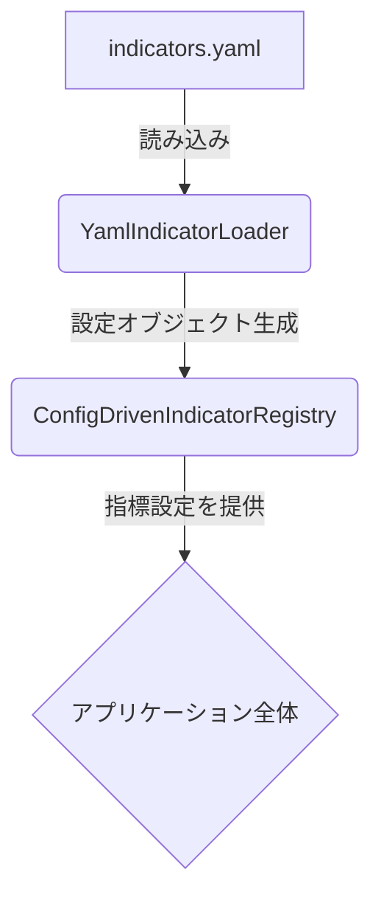

# テクニカル指標設定管理アーキテクチャ刷新計画書

## 1. はじめに

### 1.1. 本書の目的

本ドキュメントは、現在のオートストラテジーシステムにおけるテクニカル指標設定の分散管理問題を解決し、保守性と拡張性に優れたアーキテクチャへ移行するための包括的な計画を提示します。

### 1.2. エグゼクティブサマリ

現在、テクニカル指標設定は複数のファイルに分散しており、新規指標の追加や既存設定の変更に多大なコストとリスクを伴っています。本計画では、設定情報を単一のYAMLファイルに集約する「YAMLベースの設定管理アーキテクチャ」を提案します。この移行により、以下の効果を見込んでいます。

- **保守性の劇的な向上**: 設定変更が1ファイルで完結し、作業時間を80%以上削減。
- **拡張性の確保**: 新規指標の追加プロセスを標準化し、迅速な機能拡張を実現。
- **システム信頼性の向上**: 設定の不整合リスクを排除し、安定した稼働を保証。

本計画は3つのフェーズ（設計・プロトタイプ開発、設定移行、テスト・最適化）で段階的に実施し、システムへの影響を最小限に抑えながら安全かつ確実な移行を目指します。

---

## 2. 現状の課題分析

### 2.1. 設定情報の分散管理

現在、テクニカル指標設定は以下の4つのファイルに分散しており、単一の指標を追加・修正する際に複数ファイルへの変更が必要となっています。

1.  **`constants.py`**: カテゴリ別の指標名をリストで管理。
2.  **`indicator_definitions.py`**: 各指標の詳細な設定と登録処理を記述。
3.  **`indicator_config.py`**: 設定用クラス(`IndicatorConfig`)を定義。
4.  **各種YAMLファイル**: 特定のデータソースに依存する部分的な設定が点在。

### 2. 課題の具体例

- **メンテナンスコストの増大**: 新規指標「CWMA」の追加時、関連する4ファイル全てを修正する必要があり、非効率。
- **ヒューマンエラーの誘発**: `constants.py`と`indicator_definitions.py`で指標リストが二重管理されており、更新漏れによる不整合が発生しやすい。
- **再利用性の欠如**: 設定ロジックがコードにハードコーディングされているため、類似指標を追加する際にコードの複製が発生。

これらの問題は、開発速度の低下と潜在的なバグのリスクを増大させています。

---

## 3. 提案アーキテクチャ：YAMLベースの設定管理への移行

### 3.1. 設計思想

設定情報をコードから完全に分離し、単一のYAMLファイル (`indicators.yaml`) で一元管理するアーキテクチャへ移行します。アプリケーションは起動時にこのYAMLファイルを動的に読み込み、指標レジストリを構築します。



### 3.2. `indicators.yaml` の構造設計

指標のカテゴリ、個別設定、パラメータ定義を階層的に管理します。

```yaml
# backend/app/config/indicators.yaml

metadata:
  version: "1.0"
  description: "統一テクニカル指標設定"

# 1. カテゴリ定義
categories:
  trend:
    description: "トレンド追従型指標"
    indicators: ["SMA", "EMA", "WMA", "CWMA"]
  momentum:
    description: "市場の勢いを測る指標"
    indicators: ["RSI", "MACD", "STOCH"]
  # ... 他のカテゴリ

# 2. 個別指標定義
indicators:
  SMA:
    name: "SMA"
    category: "trend"
    technical_function: "TrendIndicators.sma"
    data_requirements: ["close"]
    result_type: "single"
    scale_type: "price_ratio"
    parameters:
      period:
        type: "integer"
        default: 20
        min: 2
        max: 200
        description: "移動平均の計算期間"

  CWMA: # 新規指標の追加例
    name: "CWMA"
    category: "trend"
    technical_function: "TrendIndicators.cwma"
    # ... 以下同様
```

### 3.3. 動的読み込みコンポーネント

-   **`YamlIndicatorLoader`**: `indicators.yaml`をパースし、検証する責務を担います。
-   **`ConfigDrivenIndicatorRegistry`**: `YamlIndicatorLoader`からの情報に基づき、実行時に指標設定レジストリを構築・管理します。

---

## 4. 移行ロードマップ

移行は以下の3フェーズで段階的に実施します。

### Phase 1: 基盤構築とプロトタイピング (1-2週間)

-   **目標**: 新アーキテクチャの技術的実現可能性を検証する。
-   **タスク**:
    -   [ ] `indicators.yaml`の基本構造を定義。
    -   [ ] `YamlIndicatorLoader`クラスを実装。
    -   [ ] `ConfigDrivenIndicatorRegistry`を実装。
-   **完了条件**: 5つ程度の主要指標をYAMLから読み込み、正しく登録できることを確認する。

### Phase 2: 全指標の移行と既存コードの適応 (3-4週間)

-   **目標**: 全ての指標設定を`indicators.yaml`に移行し、関連コンポーネントを新アーキテクチャに適応させる。
-   **タスク**:
    -   [ ] 全指標の設定情報を`indicators.yaml`へ移行するスクリプトを作成・実行。
    -   [ ] `indicator_definitions.py`の静的登録処理を、動的読み込み処理に置き換え。
    -   [ ] `constants.py`の指標リストを、YAMLから動的に生成するよう修正。
    -   [ ] 移行完了後、不要となった旧設定ファイル (`constants.py`, `indicator_definitions.py`, `indicator_config.py`) をバックアップ取得後に削除。
-   **完了条件**: 全ての指標がYAMLベースで動作し、既存の自動戦略が新システムと互換性を持つことを確認する。

### Phase 3: テストと最適化 (1-2週間)

-   **目標**: 移行後のシステムの品質を保証し、パフォーマンスを最適化する。
-   **タスク**:
    -   [ ] 回帰テスト、統合テスト、パフォーマンステストを網羅的に実施。
    -   [ ] 負荷テストによる性能評価とボトルネックの特定・改善。
-   **完了条件**: テストカバレッジ目標（分岐85%, 行90%）を達成し、性能が移行前の水準を維持、または上回ることを確認する。

---

## 5. 影響範囲分析

本移行に伴い、以下のコンポーネントに修正が必要となります。

| コンポーネント                  | 影響度 | 主要な変更内容                                       |
| ------------------------------- | :----: | ---------------------------------------------------- |
| `indicator_orchestrator.py`     |   高   | `IndicatorConfig`クラスへの依存を排除し、YAML設定を参照 |
| `parameter_manager.py`          |   高   | パラメータマッピングをYAMLから動的に生成             |
| `condition_generator.py`        |   高   | 条件生成時の閾値をYAMLから取得                       |
| `constants.py`                  |   高   | 定数リストをYAMLから動的に生成（最終的に削除）       |
| `common_utils.py`               |   高   | YAML読み込み用の共通ユーティリティを定義             |
| `data_validation.py`            |   中   | 指標計算に必要な最小データ長をYAMLから取得           |

---

## 6. リスク評価と対策

| リスク項目             | 発生確率 | 影響度 | 対策                                                                 |
| ---------------------- | :------: | :----: | -------------------------------------------------------------------- |
| **設定ファイルの記述ミス** |     高     |   大   | ・YAMLスキーマによる厳格なバリデーションを導入<br>・起動時の設定値完全性チェック |
| **指標計算結果の不整合** |     中     |   大   | ・新旧両方のロジックで計算結果を比較する二重検証テスト<br>・段階的なデプロイ戦略 |
| **パフォーマンス低下**   |     中     |   中   | ・設定読み込み時間と指標計算速度のベンチマークテスト<br>・継続的なパフォーマンス監視 |
| **既存戦略との非互換性** |     低     |   中   | ・主要な既存戦略に対する網羅的な回帰テスト<br>・互換性を維持するためのアダプタ層の導入検討 |

---

## 7. 品質保証計画

### 7.1. テスト戦略

-   **単体テスト**: `YamlIndicatorLoader`のパース精度、`ConfigDrivenIndicatorRegistry`の登録ロジックなど、各コンポーネントの動作を個別に検証します。
-   **統合テスト**: YAML設定から指標生成、戦略実行までの一連のフローが正しく連携することを検証します。
-   **パフォーマンステスト**: 移行前後で設定の読み込み時間や指標の計算速度を比較測定し、性能劣化がないことを保証します。

### 7.2. テストデータ

-   過去1年分のBTC/USDT価格データを基準データとして使用します。
-   正常系・異常系を含む50パターン以上のテスト用YAML設定ファイルを用意し、網羅性を確保します。

---

## 8. 結論と推奨事項

本計画を実行することで、テクニカル指標設定の管理を一元化し、システムの保守性、拡張性、信頼性を大幅に向上させることができます。移行を成功させるため、以下の追加事項を推奨します。

1.  **開発者向けトレーニング**: 移行後の新しい設定管理フローについて、開発チーム全体で知識を共有するためのトレーニングセッションを実施する。
2.  **運用監視体制の強化**: 移行後のシステム安定性を継続的に監視するため、専用のダッシュボードを構築し、異常を即座に検知できるアラートシステムを整備する。

**承認状況**: ☐ 要承認 ☐ 承認済