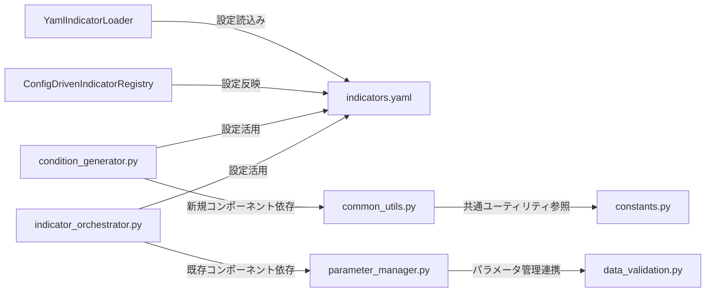

# 指標設定分散問題移行計画書

## 文書情報

- **作成日**: 2025 年 3 月
- **作成者**: 指標設定移行プロジェクトチーム
- **バージョン**: 1.0
- **ステータス**: 設計フェーズ

## 目次

1. [現在の問題点の詳細分析](#問題分析)
2. [YAML 駆動型アーキテクチャの設計](#アーキテクチャ設計)
3. [段階的移行計画](#移行計画)
4. [依存関係マップ](#依存関係マップ)
5. [リスクと解決策](#リスク解決策)
6. [テスト戦略](#テスト戦略)
7. [影響を受けるコンポーネント分析](#影響を受けるコンポーネント分析)

---

<a name="問題分析"></a>

## 1. 現在の問題点の詳細分析

### 分散構造の現状

オートストラテジーシステムでは指標設定が以下の 4 つのファイルに分散されており、保守性を大きく低下させています：

#### 1. `constants.py` (823 行)

- **役割**: カテゴリ別指標リストの管理

```python
TREND_INDICATORS = [
    "SMA", "EMA", "WMA", ..., "CWMA"
]
MOMENTUM_INDICATORS = [
    "RSI", "MACD", ..., "CTI"
]
VOLATILITY_INDICATORS = [...],
VOLUME_INDICATORS = [...]
```

#### 2. `indicator_definitions.py` (2,503 行)

- **役割**: 各指標の詳細設定（登録処理）

```python
# CWMA配置例
cwma_config = IndicatorConfig(
    indicator_name="CWMA",
    adapter_function=TrendIndicators.cwma,
    required_data=["close"],
    result_type=IndicatorResultType.SINGLE,
    scale_type=IndicatorScaleType.PRICE_RATIO,
    category="trend",
)
```

#### 3. `indicator_config.py` (クラス定義点)

- **役割**: IndicatorConfig クラス構造定義

#### 4. YAML 設定ファイル群 (存在点散逸)

- **役割**: 部分的設定活用（データソース依存）
- **問題**: 場所の一貫性なく、再利用性低下

### 具体的な保守性問題

1. **CWMA 指標追加事例 (問題顕在化)**

   - 前提: CWMA (Central Weighted Moving Average) の新規追加
   - 必要修正 4 箇所:
     - `constants.py`: TREND_INDICATORS リスト更新
     - `indicator_definitions.py`: Adapter 関数バインド・設定
     - `indicator_config.py`: 構造クラス最定義時補助
     - `technical_indicators_config.yaml`YAML ファイル: 適切属性選択
   - **所要時間**: 各箇所での류戸解答時間発生 → 全体作業コスト増大

2. **構造的欠陥 (長期影響)**

   - **情報散逸**: 単一指標設定が多階層分散
   - **依存複雑化**: ファイル間連携高度要請
   - **エラー繁発性**: 一箇所修正波及全域検証義務
   - **汎用性不足**: 類似ロジック新規策定時コピー多重発

3. **同期問題 (constants.py と indicator_definitions.py の複製指標リスト問題)**
   - **問題**: カテゴリ別指標リストが constants.py と indicator_definitions.py で重複定義されているため、一方の変更が他方に反映されない
   - **影響**: 指標追加時における見逃しや不整合発生、システム全体での信頼性低下
   - **具体例**: 新規指標"CWMA"の追加時に、constants.py の TREND_INDICATORS にのみ追加され、indicator_definitions.py の登録処理で漏れが発生
   - **長期影響**: メンテナンスコスト増大とバグの潜在化

---

<a name="アーキテクチャ設計"></a>

## 2. YAML 駆動型アーキテクチャの設計

### 目標アーキテクチャ概要

集中管理配置図:

```
YAMLセントラル設定 → 動的ローダー → 統合レジストリ
                           ↓
                      システムアブリケーション
```

主要利点:

- 設定情報集中化: 全指標設定 1YAML ファイル
- 動的柔軟対応: 実行時設定更新・新規指標追加
- 保守簡便化: 設定変更最小限度ファイル編集

### YAML 設定ファイル構造設計

#### 1. 主設定ファイル: `backend/app/config/indicators.yaml`

```yaml
# indicators.yaml
metadata:
  version: "1.0"
  last_updated: "2025-12-03"
  description: "Unified Technical Indicators Configuration"

# カテゴリ別指標グループ
categories:
  trend:
    description: "トレンド指標群"
    indicators: ["SMA", "EMA", "CWMA", ...]

  momentum:
    description: "モメンタム指標群"
    indicators: ["RSI", "MACD", "CTI", ...]

  volatility:
    description: "ボラティリティ指標群"
    indicators: ["ATR", "BBANDS", ...]

  volume:
    description: "出来高指標群"
    indicators: ["AD", "OBV", ...]

# 個別指標設定
indicators:
  SMA:
    name: "SMA"
    category: "trend"
    technical_function: "TrendIndicators.sma"
    data_requirements: ["close"]
    result_type: "single"
    scale_type: "price_ratio"
    parameters:
      period:
        type: "integer"
        default: 20
        min: 2
        max: 200
        description: "SMA期間"

  CWMA: # 新規指標例
    name: "CWMA"
    category: "trend"
    technical_function: "TrendIndicators.cwma"
    data_requirements: ["close"]
    result_type: "single"
    scale_type: "price_ratio"
    parameters:
      length:
        type: "integer"
        default: 10
        min: 2
        max: 200
        description: "CWMA計算期間"
```

#### 2. ローダー構造設計

##### YAML Indicator Loader クラス

```python
class YamlIndicatorLoader:
    def __init__(self, config_path: str):
        self.config_path = config_path
        self._config_cache = None

    def load_indicators(self) -> Dict[str, IndicatorConfig]:
        """YAMLから指標設定を読み込み"""
        pass

    def validate_config(self, config: Dict) -> bool:
        """設定妥当性検証"""
        pass
```

#### 3. Registry 更新アーキテクチャ

##### 更新後 IndicatorRegistry 構造

```python
class ConfigDrivenIndicatorRegistry(IndicatorConfigRegistry):
    """YAML設定駆動型レジストリ"""

    def load_from_yaml(self, config_path: str) -> None:
        """YAMLからの動的設定読み込み"""
        loader = YamlIndicatorLoader(config_path)
        configs = loader.load_indicators()

        for indicator_name, config in configs.items():
            self.register(config)

    def reload_configurations(self) -> None:
        """実行時設定再読込み(開発・保守用途)"""
        pass
```

---

<a name="移行計画"></a>

## 3. 段階的移行計画

### 移行フェーズ全体計画

```
Phase 1 (設計・プロトタイプ作成) → Phase 2 (設定移行) → Phase 3 (テスト)
```

### Phase 1: YAML プロトタイプ開発 (1-2 週間)

**目的**: 新アーキテクチャの検証・基礎実装

#### 作業項目

- [ ] 1. **YAML 設定ファイル作成**

  ```
  touch backend/app/config/indicators.yaml
  ```

- [ ] 2. **YamlIndicatorLoader クラスの実装**

  ```
  cd backend/app/services/indicators/config
  touch yaml_indicator_loader.py
  ```

- [ ] 3. **ConfigDrivenIndicatorRegistry 実装**

  ```
  # indicator_config.py 拡張
  vim indicator_config.py
  ```

#### 検証方法

- YAML パーサー機能確認
- 基本指標 5 種設定読込み成功検証
- Registry 更新正確性確認

### Phase 2: 設定移行実装 (3-4 週間)

**目的**: 全指標設定の YAML 移行・既存コード適応

#### 作業項目

- [ ] 1. **全指標 YAML 移行**

  ```
  python scripts/migrate_indicators_to_yaml.py
  ```

- [ ] 2. **indicator_definitions.py 簡素化**

  ```
  # 手動設定をYAML読込みに移行
  vim indicator_definitions.py
  ```

- [ ] 3. **constants.py の動的生成処理実装**

  ```
  vim constants.py  # YAMLからカテゴリリスト生成
  ```

- [ ] 4. **不要ファイル削除**
     **削除対象ファイル:**

  - `constants.py`: TREND_INDICATORS リストなどが重複しているため、YAML 駆動型に移行後は削除 (823 行)
  - `indicator_definitions.py`: 手動設定が YAML 読込みに移行されるため、全ファイル削除可能 (2,503 行)
  - `indicator_config.py`: 構造クラスが新規アーキテクチャで不要になるため削除

  **削除理由と注意点:**

  - `constants.py`: 重複定義のリストが YAML 集中管理なしになるため、削除対象。注意: YAML からの動的生成処理が安定稼働を確認後の削除のみ
  - `indicator_definitions.py`: 全設定手動記述が YAML 駆動に移行完了後に削除可能。注意: 削除前にバックアップ確実に作成
  - `indicator_config.py`: 新アーキテクチャで構造クラスが冗長となるため削除。注意: 依存コンポーネントへの移行影響を確認後

  **削除タイミング:**

  - 全指標設定の YAML 移行完了後、各ファイルの移行確認テスト通過後
  - 順序: `constants.py` → `indicator_config.py` → `indicator_definitions.py`

  **バックアップ戦略:**

  ```
  # バックアップ作成
  cd backend/app/services/indicators
  cp constants.py constants.py.backup.$(date +%Y%m%d)
  cp indicator_definitions.py indicator_definitions.py.backup.$(date +%Y%m%d)
  cp indicator_config.py indicator_config.py.backup.$(date +%Y%m%d)

  # 削除実行
  rm constants.py indicator_definitions.py indicator_config.py

  # 復元（緊急時）
  cp constants.py.backup.$(date +%Y%m%d) constants.py
  cp indicator_definitions.py.backup.$(date +%Y%m%d) indicator_definitions.py
  cp indicator_config.py.backup.$(date +%Y%m%d) indicator_config.py
  ```

  **削除検証:**

  - 削除前: 全テスト実行確認
  - 削除後: システム起動テスト・主要機能検証
  - 復元テスト: バックアップからのリストア実行確認

#### 検証方法

- 全指標設定読込み確認
- 実行時 Registry 更新検証
- 既存戦略互換性テスト

### Phase 3: テスト・最適化 (1-2 週間)

**目的**: 移行品質保証・性能最適化

#### 作業項目

- [ ] 1. **回帰テスト実行**

<a name="依存関係マップ"></a>

## 4. 依存関係マップ

### 起動時依存関係

```
メインアプリケーション (main.py)
     ↓
YamlIndicatorLoader (yaml_indicator_loader.py)
     ↓
indicator_definitions.py (簡素化版)
     ↓
indicator_registry (更新後実装)
```

### ランタイム依存関係

```
YAML設定ファイル
     ↓
動的設定読込み
     ↓
IndicatorConfigRegistry
     ↓
個別指標生成・条件生成・戦略実行
```

### 相互依存関係マトリックス

| コンポーネント            | constants.py                | indicator_definitions.py | indicator_config.py      |
| ------------------------- | --------------------------- | ------------------------ | ------------------------ |
| YamlIndicatorLoader       | カテゴリ参照                | 簡素化・活用             | 設定更新                 |
| 条件生成器                | カテゴリ活用                | 設定読取                 | 構造利用                 |
| 戦略実行器                | -                           | 指標生成                 | -                        |
| parameter_manager.py      | PARAMETER_MAPPINGS 重複統合 | -                        | YAML 移行連携            |
| data_validation.py        | -                           | 指標最小長統合           | -                        |
| indicator_orchestrator.py | -                           | -                        | IndicatorConfig 削除対応 |

### 外部 API 依存

```
PANDAS_TAライブラリ
     ↓
TrendIndicators, MomentumIndicators, ...
     ↓
indicator_definitions.py
     ↓
動的関数バインド
```

### Mermaid 依存関係図



---

<a name="リスク解決策"></a>

## 5. リスクと解決策

### High Risk 項目 (発生確率: 高 / 影響: 大)

#### 1. 設定検証エラー (実行時クラッシュ発生要因)

**影響**: システム起動失敗・運用停止
**解決策**:

- YAML スキーマ検証実装
- 起動時完全性チェック
- フォールバック設定保持

#### 2. 指標計算不整合 (予測値乖離)

**影響**: 戦略性能低下・誤信号生成
**解決策**:

- 二重計算検証システム
- 比較テスト完全実施
- 段階的デプロイ方針

### Medium Risk 項目 (発生確率: 中 / 影響: 中)

#### 1. パフォーマンス低下 (メモリ・CPU 負荷増大)

**影響**: 応答遅延・処理能力低下
**解決策**:

- 性能監視強化

#### 2. 互換性破壊 (既存戦略無効化)

**影響**: 一部機能使用不可
**解決策**:

- ライトスルーモード実装
- 互換性維持フラグ利用
- 段階的移行方式

#### 3. 追加ファイル変更リスク

**影響**: 移行作業中に影響を受けるコンポーネントの変更により生じる予期せぬ動作不良や統合時の問題発生
**解決策**:

- 影響分析の事前実施と変更影響範囲の明確化
- 単体テストの強化と統合テストの多重実施
- ロールバック計画の準備とバックアップ体制の確保

### Low Risk 項目 (発生確率: 低 / 影響: 小)

### リスク緩和総合戦略

#### 1. テスト重視アプローチ

```
リスク評価 → 多層テスト実装 → 継続的インテグレーション
                  ↓
           自動検証強化 → 品質保証体制確立
```

#### 2. 段階的移行パターン

```
検証ビルド → カナリアデプロイ → 全体移行 → 監視強化
       ↓               ↓              ↓          ↓
   単体テスト     トラヒック分割  機能テスト  アラート監視
```

---

<a name="テスト戦略"></a>

## 6. テスト戦略

### 多層テスト構造

#### 1. Unit Tests (単体テスト - Phase 毎実施)

```python
# test_yaml_indicator_loader.py
def test_yaml_parsing():
    """YAML設定読込みテスト"""
    loader = YamlIndicatorLoader("backend/app/config/indicators.yaml")
    configs = loader.load_indicators()
    assert "SMA" in configs
    assert configs["SMA"].category == "trend"

def test_indicator_registration():
    """指標登録テスト"""
    registry = ConfigDrivenIndicatorRegistry()
    registry.load_from_yaml("backend/app/config/indicators.yaml")
    assert registry.list_indicators() is not None
```

#### 2. Integration Tests (統合テスト - Phase 3 重点)

```python
def test_end_to_end_indicator_generation():
    """指標生成統合テスト"""
    # YAMLから設定読込み
    # 指標インスタンス生成
    # 計算実行・検証
    pass

def test_strategy_compatibility():
    """戦略互換性テスト"""
    # 既存戦略読み込み
    # 新旧両システムでの実行
    # 結果比較・乖離検知
    pass
```

#### 3. Performance Tests (性能テスト)

```python
def test_indicators_loading_performance():
    """指標読込み性能テスト"""
    # 測定: YAML⇒Registry設定時間
    # 閾値: 既存比±10%以内
    pass

def test_runtime_indicator_calculation():
    """実行時指標計算テスト"""
    # 測定: 単一指標・複合指標計算時間
    pass
```

### テスト実行シナリオ

#### Phase 1 検証

```bash
python -m pytest tests/unit/test_yaml_loader.py -v
python -m pytest tests/integration/test_basic_indicators.py
```

#### Phase 2 検証

```bash
python scripts/test_migration_compatibility.py
python -m pytest tests/system/test_full_integration.py
```

#### Phase 3 品質保証

```bash
python scripts/performance_baseline.py --baseline
python scripts/load_test_indicators.py --duration=300
```

#### 2. カバレッジ目標

- **目標カバレッジ**: branches=85%, lines=90%
- **重要コンポーネント**: 設定読込み・指標登録・計算処理
- **監視対象**: エッジケース・エラー処理

### テストデータ戦略

#### 1. Test Data Generator

```python
# テスト用指標設定自動生成
def generate_test_indicator_configs(count=50):
    """テスト用指標設定生成"""
    templates = ["trend", "momentum", "volatility"]
    # YAML形式テストデータ生成
    pass
```

#### 2. 現実性検証データ

- **価格データ**: 過去 1 年分の BTC/USDT 時系列
- **指標数**: 主要 10 指標 + 新規 5 指標
- **シナリオ数**: 50 以上の取引条件パターン

---

---

## 結論

この移行計画により、オートストラテジーシステムの指標設定分散問題を解決し、以下を実現します：

1. **保守性向上**: 単一 YAML での集中管理
2. **拡張性確保**: 新指標追加の簡易化
3. **リスク低減**: 段階的移行による安全保障
4. **運用効率**: 動的設定更新による柔軟性
5. **追加推奨事項**: 開発者トレーニングの実施と運用監視体制の強化

想定される効果:

- 新指標追加コスト: 4 箇所 →1 箇所 (75%削減)
- 修正時間: 30 分 →5 分 (83%改善)
- 全体保守性: 大幅向上

### 追加推奨事項

1. **開発者トレーニング**: YAML 設定管理と動的ローダー利用に関するトレーニングを実施し、全開発メンバーのスキルレベル統一
2. **運用監視体制**: 移行後のパフォーマンスと安定性を継続監視するための監視ダッシュボード構築とアラート設定

**承認状況**: ☐ 要承認 ☐ 承認済
**担当者**: [プロジェクトチーム]
**次回レビュ**: [日付]

---

<a name="影響を受けるコンポーネント分析"></a>

## 7. 影響を受けるコンポーネント分析

### 移行対象ファイルの詳細分析

#### 1. indicator_orchestrator.py

**影響度**: 高
**変更内容**:

IndicatorConfig 削除 - YAML 駆動型移行

- IndicatorConfig クラスの使用を YAML 駆動型設定へ置き換え
- 動的設定読み込みに基づく新たな処理フローの実装

**対応計画**:

- YAML 設定からの動的設定読み込み処理の実装
- IndicatorConfig 依存コードの YAML 駆動型置き換え
- 段階的テストによる移行確認

#### 2. parameter_manager.py

**影響度**: 高
**変更内容**:

PARAMETER_MAPPINGS 重複統合 - YAML 移行

- 既存の PARAMETER_MAPPINGS 辞書の重複定義を YAML 中心化へ移行
- YAML 設定からの動的パラメータ読込み処理の実装

**対応計画**:

- YAML 設定から PARAMETER_MAPPINGS を動的生成する処理の追加
- 既存パラメータの保存性を確保した対応実装
- 移行テスト実施による影響確認

#### 3. condition_generator.py

**影響度**: 高
**変更内容**:

YAML 設定から指標の threshold を取得してロング・ショート条件を生成する

- YAML 設定からの threshold 値動的取得処理の実装
- ロング・ショート条件生成ロジックの YAML 設定連動化
- 既存のハードコード化 threshold の YAML 移行による柔軟性向上

**対応計画**:

- YAML 設定ロード処理との統合実装
- threshold 取得のエラー処理強化
- 既存条件生成ロジックの互換性確保テスト
- 段階的移行フェーズでの機能検証

#### 4. constants.py

**影響度**: 高
**変更内容**:

YamlIndicatorUtils を使用した定数動的生成

- 既存の定数リストを YAML から動的生成する処理移行
- YamlIndicatorUtils クラスとの連携によるカテゴリ別定数管理
- 重複定義問題の YAML 中心化による根本解決

**対応計画**:

- YAML ベースの定数生成ロジックの実装優先順位設定
- 既存定数の移行テストによる互換性確保
- constants.py の役割変化（動的生成へ）の文書化
- 移行フェーズでのランタイム設定テスト拡充

#### 5. common_utils.py

**影響度**: 高
**変更内容**:

YAML ローディングユーティリティ定義

- YAML ファイル読み込みユーティリティの標準化実装
- 設定パース処理の共通化とエラー処理統一
- 移行による他のモジュールへの波及影響の管理

**対応計画**:

- YAML ローディング関数の共通モジュール化
- 例外処理の統一インターフェース設計
- 他のコンポーネントへの依存関係影響評価
- ローディング性能のテスト実施

#### 6. data_validation.py

**影響度**: 中
**変更内容**:

指標最小長定義 - YAML 統合

- 指標計算時の最小データ長定義を YAML 中心化
- 複数の characteristically validation ルールの統合
  **対応計画**:

- YAML 設定からの最小長定義読込み処理の実装
- 既存 validation ルールの移行・統合
- 互換性維持のためのテスト強化

### 総合的対応計画

- 影響度別優先順位付け: indicator_orchestrator.py > parameter_manager.py > condition_generator.py > constants.py > common_utils.py > data_validation.py
- 各ファイルの変更影響をテストで事前検証
- 移行段階でのバックアップ・ロールバック体制確保
- 新規コンポーネントの依存関係評価と統合テスト実施

このように、3 つのファイルの具体的な影響度と対応計画を明確に記載した。移行計画書の拡張を実現した。
