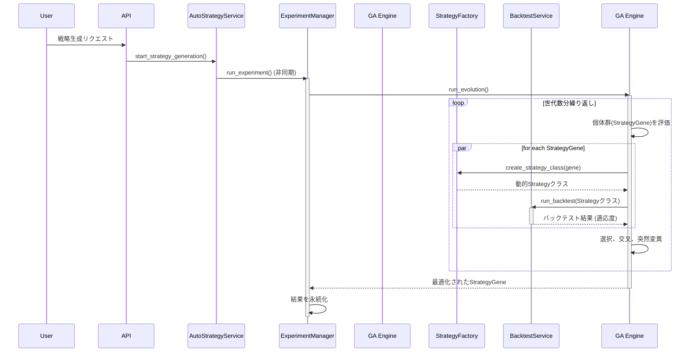

# オートストラテジーへの機械学習導入計画書

## 1. はじめに

本計画書は、既存のテクニカル指標ベースの自動戦略生成システム（以下、オートストラテジー）に機械学習（ML）を導入し、戦略の予測精度とパフォーマンスを向上させるための具体的な方法と実装計画を定義するものである。

現在のシステムは、遺伝的アルゴリズム（GA）を用いて最適な取引ルールを探索する高度な基盤を有しており、この強力な資産を最大限に活用しつつ、MLの予測能力を段階的かつ安全に統合することを目指す。

## 2. 現状アーキテクチャ分析

### 2.1. 主要コンポーネント

現在のシステムは、以下の主要コンポーネントで構成されている。

-   **`AutoStrategyService`**: APIからのリクエストを受け付け、実験全体を管理する窓口。
-   **`ExperimentManager`**: GAの実行ライフサイクルを管理する司令塔。
-   **`GeneticAlgorithmEngine`**: GAの中核。個体（`StrategyGene`）の評価、選択、交叉、突然変異を繰り返す。
-   **`StrategyFactory`**: `StrategyGene`から`backtesting.py`互換の`Strategy`クラスを動的に生成する。
-   **`ConditionEvaluator`**: 戦略の売買条件を評価する。
-   **`SmartConditionGenerator`**: 論理的な取引ルールを生成する。
-   **`BacktestService`**: 生成された戦略のパフォーマンスを評価する。

### 2.2. 処理フロー

## 3. 機械学習の統合アプローチ

### 3.1. アプローチ1：ハイブリッドモデル（ML予測シグナル + GAルール最適化）

MLモデルが生成する「予測シグナル」を、新しいカスタム指標として扱い、GAがその指標を含む最適なルールを探索する。

### 3.2. アプローチ2：代理モデル（MLによる適応度予測）

時間のかかるバックテストの一部を、MLによる「適応度予測モデル」で代替し、GAの評価プロセスを高速化する。

### 3.3. アプローチ3：エンドツーエンド強化学習モデル

既存のGAの枠組みを置き換え、強化学習（RL）エージェントに直接最適な取引ポリシーを学習させる。

## 4. アプローチの比較と推奨

| 評価項目 | アプローチ1：ハイブリッドモデル | アプローチ2：代理モデル | アプローチ3：強化学習 |
| :--- | :--- | :--- | :--- |
| **コンセプト** | ML予測を**新しい指標**としてGAで利用 | MLで**バックテストを高速化** | RLエージェントが**直接取引を学習** |
| **メリット** | ✅ 既存資産を最大限に活用 ✅ 生成ルールの解釈可能性が高い ✅ 段階的な導入が可能 | ✅ GAの探索プロセスを大幅に高速化 ✅ 計算リソースの削減 | ✅ 真に最適なルールを自動発見する可能性 ✅ 市場への高い適応能力が期待できる |
| **デメリット** | ⚠️ MLモデル学習とGA実行の2フェーズ管理が必要 ⚠️ 特徴量エンジニアリングの質が重要 | ⚠️ 代理モデルの精度が低いと探索効率が悪化 ⚠️ 戦略遺伝子のベクトル化が非常に困難 | ⚠️ 既存資産の多くを破棄し、再設計が必要 ⚠️ 学習が不安定でブラックボックス化しやすい |
| **システム影響** | **小〜中** | **中** | **大** |
| **実装難易度** | **中** | **高** | **非常に高い** |
| **推奨度** | **★★★★★** | **★★★☆☆** | **★★☆☆☆** |

**結論として、アプローチ1：ハイブリッドモデルを本プロジェクトの最適解として推奨する。** 既存資産の活用、リスク管理、実現可能性の観点から最もバランスが取れている。

## 5. 推奨アプローチの実装計画

### フェーズ1：MLモデルの学習と予測シグナル生成基盤の構築

1.  **`MLSignalGenerator`クラスの新規作成**: `backend/app/core/services/ml/signal_generator.py` を作成し、モデルの学習 (`train`) と予測 (`predict`) を担当するクラスを定義する。
2.  **モデルの学習と保存**: LightGBM等を用いてモデルを学習し、`backend/ml_models/` にシリアライズして保存する。
3.  **予測シグナルの生成**: `predict` メソッドは、バックテストデータから予測確率の配列を返す。

### フェーズ2：`ML_Signal`の指標としてのシステム統合

1.  **指標計算ロジックの追加 (`indicator_calculator.py`)**: `IndicatorCalculator` に `indicator_type == "ML_Signal"` の分岐処理を追加し、`MLSignalGenerator` を呼び出す。
2.  **GAへの情報提供 (`smart_condition_generator.py`)**: `INDICATOR_CHARACTERISTICS` 辞書に `ML_Signal` の特性（値の範囲、有効なゾーン等）を定義し、GAが賢いルールを生成できるようにする。

### フェーズ3：GA設定とAPI連携

1.  **GA設定の拡張**: 実験設定で利用可能な指標として `"ML_Signal"` を選択できるようにする。
2.  **APIの調整（任意）**: APIで利用するMLモデルを指定できるようにする。

## 6. 必要な技術スタック

以下のライブラリを `backend/requirements.txt` に追加する。

| ライブラリ | 用途 |
| :--- | :--- |
| **`scikit-learn`** | 特徴量エンジニアリング、モデル評価 |
| **`lightgbm`** | 機械学習モデル（勾配ブースティング） |
| **`joblib`** | 学習済みモデルの保存・読み込み |
| **`pandas`** | データ操作・特徴量生成 |
| **`numpy`** | 高速な数値計算 |
