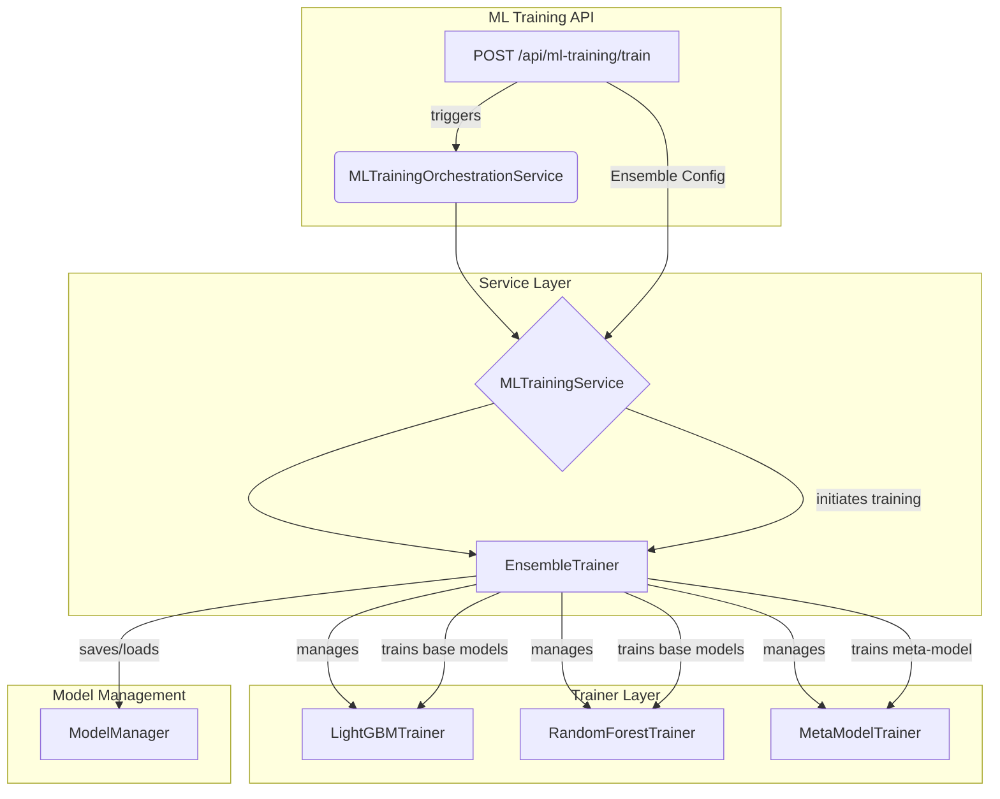

# アンサンブル学習導入 計画書

## 1. 目的

本計画は、既存の機械学習（ML）モデルの予測精度と頑健性を向上させるため、アンサンブル学習の手法を導入することを目的とします。具体的には、複数の異なるモデルの予測を組み合わせることで、単一モデルの弱点を補い、より安定したパフォーマンスを目指します。

## 2. 背景

現在のMLシステムは、単一のLightGBMモデルに依存しています。これは多くの場面で良好な性能を発揮しますが、特定の市場状況やデータパターンに対して過学習（オーバーフィッティング）するリスクを内包しています。アンサンブル学習は、このリスクを軽減するための効果的なアプローチです。

## 3. スコープ

- **対象**: `MLTrainingService` および `LightGBMTrainer` を中心としたML学習パイプライン。
- **導入する手法**:
    - **バギング (Bagging)**: 同じアルゴリズムのモデルを、異なるデータサブセットで学習させ、予測を平均化する。
    - **スタッキング (Stacking)**: 複数の異なるアルゴリズム（例: LightGBM, RandomForest, ロジスティック回帰）の予測を、メタモデル（最終的な予測を行うモデル）への入力として使用する。
- **スコープ外**:
    - 新しいMLアルゴリズムの追加（既存のLightGBM等を活用）。
    - リアルタイム予測パイプラインの大幅な変更。

## 4. 設計方針

### 4.1. アーキテクチャ

既存の `BaseMLTrainer` を拡張し、アンサンブル学習のロジックを組み込みます。

### 4.2. データフロー

1.  **APIリクエスト**: ユーザーは、新しい `ensemble_config` を含む学習リクエストを送信します。
2.  **`MLTrainingService`**: リクエストを受け取り、`EnsembleTrainer` を初期化します。
3.  **`EnsembleTrainer`**:
    a. **ベースモデルの学習**:
        - **バギング**: 学習データをブートストラップサンプリングし、複数のLightGBMモデルを並行して学習させます。
        - **スタッキング**: LightGBM、RandomForestなど、複数の異なるモデルを学習データ全体で学習させます。
    b. **メタ特徴量の生成**:
        - 学習済みベースモデルを使用して、アウトオブフォールド（学習に使用しなかったデータ）に対する予測値を生成します。これがメタモデルの学習データ（メタ特徴量）となります。
    c. **メタモデルの学習**:
        - メタ特徴量と実際のラベルを使用して、最終的な予測を行うメタモデル（例: ロジスティック回帰）を学習させます。
4.  **モデル保存**: `ModelManager` を通じて、学習済みのベースモデル群とメタモデルを一つのアンサンブルモデルとして保存します。

### 4.3. モデルと設定の変更

- **`MLTrainingConfig` (`ml_training.py`)**:
    - `ensemble_config: Optional[EnsembleConfig]` を追加します。
- **`EnsembleConfig` (新規モデル)**:
    - `enabled: bool`
    - `method: str` ("bagging" or "stacking")
    - `bagging_params`: `n_estimators: int`
    - `stacking_params`: `base_models: List[str]`, `meta_model: str`
- **`ModelManager`**:
    - アンサンブルモデル（複数のモデルファイルと設定ファイルを含むディレクトリ）を保存・読み込みできるように拡張します。

## 5. 実装ステップ

### Step 1: アンサンブル学習コアロジックの実装 (3日)

1.  **`backend/app/core/services/ml/ensemble/` ディレクトリを新規作成します。**
2.  **`base_ensemble.py`**: アンサンブル手法の基底クラスを定義します。
3.  **`bagging.py`**: バギングを実装します。
4.  **`stacking.py`**: スタッキングを実装します。
5.  **`ensemble_trainer.py`**: `BaseMLTrainer` を継承し、アンサンブル学習のオーケストレーションを行います。

### Step 2: 既存サービスの拡張 (2日)

1.  **`MLTrainingService` の修正**:
    - `ensemble_config` を受け取り、`EnsembleTrainer` を呼び出すロジックを追加します。
2.  **`MLTrainingOrchestrationService` の修正**:
    - APIからのリクエストを `MLTrainingService` に正しく渡すようにします。
3.  **`ModelManager` の拡張**:
    - アンサンブルモデル（ディレクトリ構造）の保存・読み込みに対応します。

### Step 3: APIと設定モデルの変更 (1日)

1.  **`ml_training.py` の修正**:
    - `MLTrainingConfig` に `EnsembleConfig` を追加します。
    - 新しい `EnsembleConfig` モデルを定義します。
2.  **APIドキュメントの更新**:
    - 新しい設定についてAPIドキュメントを更新します。

### Step 4: テストの実装 (2日)

1.  **単体テスト**: `bagging.py`, `stacking.py` の各コンポーネントをテストします。
2.  **統合テスト**: `EnsembleTrainer` と `MLTrainingService` の連携をテストします。
3.  **E2Eテスト**: APIエンドポイントからアンサンブル学習を実行し、モデルが正しく保存されることを確認します。

## 6. タイムラインとリスク

- **合計見積もり工数**: 8日
- **リスク**:
    - **計算コストの増大**: 複数のモデルを学習するため、学習時間が長くなります。 -> **対策**: 並列処理の導入、テストではモデル数やデータサイズを制限する。
    - **モデル管理の複雑化**: 複数のモデルファイルを管理する必要が出てきます。 -> **対策**: `ModelManager` でアンサンブルモデルを一つの単位として扱えるように設計する。
    - **過学習のリスク**: メタモデルが過学習する可能性があります。 -> **対策**: クロスバリデーションを慎重に行い、メタモデルにはシンプルなモデル（ロジスティック回帰など）を使用する。
