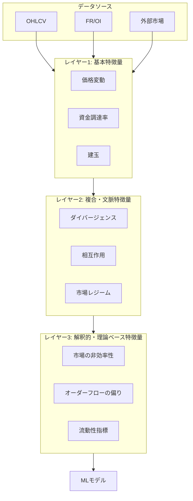

# 特徴量エンジニアリング改善計画書

## 1. 背景と目的

### 1.1. 現状の課題

- **モデル精度の低迷**: 現行モデルの精度は 0.46 であり、実用的な予測性能に達していない。
- **特徴量のノイズ化**: 生成された 122 個の特徴量のうち、約 64%（78 個）がノイズとして判定されており、モデルの過学習と汎化性能の低下を招いている。
- **特徴量の冗長性**: 多くの特徴量が互いに相関が高いか、モデルへの寄与がゼロまたは負であり、計算コストの増大とモデル解釈性の低下を招いている。

- **外部市場データの解像度不足**: 外部市場（S&P 500, NASDAQ 等）のデータが日足でのみ取得されており、より短期的な市場の相関を捉えるための特徴量生成が困難。

### 1.2. 目的

本計画の目的は、特徴量の「量」から「質」へと方針を転換し、以下の状態を達成することである。

- **高精度化**: 市場の本質的な動きを捉える特徴量セットを構築し、モデルの予測精度を大幅に向上させる。
- **頑健性**: ノイズや冗長な情報を排除し、未知のデータに対しても安定した性能を発揮する頑健なモデルを構築する。
- **解釈性**: 各特徴量の役割を明確にし、モデルの判断根拠を理解しやすくする。

## 2. 基本方針：特徴量の階層化

特徴量生成プロセスを以下の 3 つの階層に分け、論理的で構造化されたアプローチを取る。

- **レイヤー 1 (基本特徴量)**: 市場の一次情報をノイズ少なく抽出する。
- **レイヤー 2 (複合・文脈特徴量)**: 基本特徴量を組み合わせ、市場の文脈を捉える。
- **レイヤー 3 (解釈的・理論ベース特徴量)**: 金融理論に基づき、より抽象的で強力な予測力を持つ特徴量を導入する。

## 3. 設計詳細

### 3.1. レイヤー 1: 基本特徴量の厳選

`permutation_importance` の結果に基づき、以下の特徴量に絞り込む。

- **価格変動**: `Price_Change_1`, `TR` (True Range)
- **資金調達率 (FR)**: `FR_Volatility`
- **建玉 (OI)**: `OI_Change_Rate`
- **時間**: `Hour_Sin`, `Day_Cos`

### 3.2. レイヤー 2: 既存特徴量の高度化

- **ダイバージェンスの再定義**: 価格と他指標（FR, OI）の N 期間変化率を正規化した上で比較し、本質的な乖離を捉える。
- **市場レジームの高度化**: ATR を用いてボラティリティレジームを判定し、レジームに応じて `Market_Stress` の計算における FR と OI の重み付けを動的に変更する。

### 3.3. レイヤー 3: 新規特徴量（理論ベース）の設計

- **オーダーフローの偏り (Order Flow Imbalance)**:
  - **理論**: 市場の買い圧力と売り圧力の不均衡は、短期的な価格変動の主要因である。
  - **実装**: 1 時間足データから擬似的な CVD (Cumulative Volume Delta) を計算し、オーダーフローの偏りを特徴量化する。
- **市場の非効率性 (Market Inefficiency)**:
  - **理論**: Hurst 指数は、時系列がトレンド性を持つか、平均回帰性を持つかを示す。
  - **実装**: `Hurst_Exponent` を計算し、市場が予測可能な状態（トレンド or 平均回帰）にあるかをモデルが学習できるようにする。
- **流動性の引力 (Liquidity Gravity)**:
  - **理論**: 価格は主要な流動性プール（サポート/レジスタンス、フィボナッチレベル）に引き寄せられる、あるいは反発する傾向がある。
  - **実装**: 直近のスイングハイ/ローに基づき、最も近い主要な流動性レベルまでの距離と、そのレベルの強度（過去の反発回数など）を組み合わせた特徴量 `Liquidity_Pool_Gravity` を設計する。

## 4. 実装計画

- **中心的な改修対象**: `backend/app/core/services/ml/feature_engineering/feature_engineering_service.py`
- **各特徴量クラスの改修**:
  - `price_features.py`: レイヤー 1 の厳選、CVD の追加。
  - `market_data_features.py`: レイヤー 1 の厳選、ダイバージェンスの高度化。
  - `technical_features.py`: レイヤー 1 の厳選、市場レジームの高度化、Hurst 指数、流動性指標の追加。
- **既存特徴量の削除**: 上記で選択されなかった特徴量に関する計算ロジックは、コードから削除またはコメントアウトする。

## 5. データセットに関する変更

- **トレーニングデータ量**: モデルのトレーニングに使用する OHLCV データ量を **10,000 件** に統一する。これは `feature_noise_analysis_sqlite.py` や関連する学習スクリプトのデータ読み込み部分で設定する。

- **外部市場データの高解像度化**: 外部市場のデータ取得を、現在の日足から **1 時間足** に変更する。これにより、短期的な市場間ダイナミクスを捉えた特徴量の生成を可能にする。

## 6. 期待される効果

- **精度向上**: モデルの予測精度が 0.55 以上に向上することを目指す。
- **過学習の抑制**: 特徴量数を約 40〜60 個に絞り込むことで、モデルの汎化性能を向上させる。
- **モデルの解釈性向上**: 各特徴量の役割が明確になることで、予測結果の根拠を説明しやすくなる。
