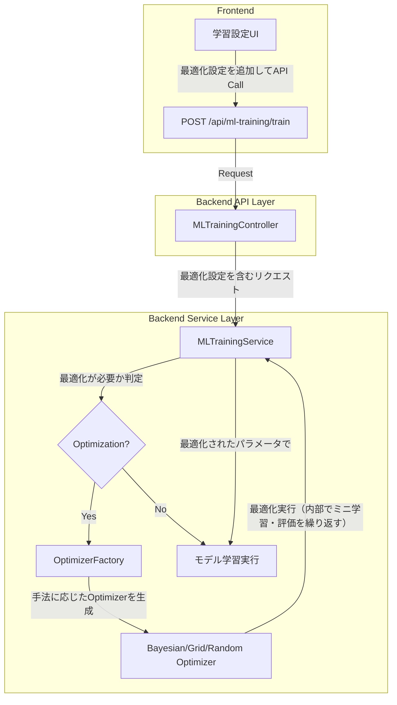

# ハイパーパラメータ最適化のシームレス化と DB 依存削減計画

## 1. はじめに

### 1.1. 目的

本計画は、ML ハイパーパラメータ最適化機能からデータベース（DB）への依存を完全に排除し、ユーザーがより迅速かつ手軽に最適化とモデル学習を実行できる、シームレスなワークフローを構築することを目的とします。

現状のシステムは、最適化結果を「プロファイル」として都度 DB に保存・読み込みする必要があり、迅速な試行錯誤の妨げとなっています。この DB 依存を根本から見直し、機能をよりシンプルで直感的なものへと刷新します。

本計画では、以下のゴールを達成します。

1.  **DB 依存の完全撤廃**: 最適化結果のプロファイル保存・読み込み機能を廃止し、DB との連携をなくします。
2.  **シームレスな最適化と学習の連携**: フロントエンドでチェックを入れるだけで、その場で最適化されたハイパーパラメータを直接モデル学習に利用できるワークフローを実現します。
3.  **最適化手法の拡張**: ベイジアン最適化に加え、グリッドサーチやランダムサーチなどの基本的な探索手法を導入し、ユーザーが目的に応じて選択できるようにします。

### 1.2. スコープ

- **API の拡張**: 既存の ML トレーニング API を拡張し、最適化設定を受け取れるようにします。
- **バックエンドワークフローの変更**: 最適化とトレーニングを連携させるサービスロジックを構築します。**プロファイル保存ロジックは完全に削除します。**
- **オプティマイザーの追加**: グリッドサーチ、ランダムサーチを実装します。
- **フロントエンドの改修**: 最適化設定を行うための UI コンポーネントを追加します。

---

## 2. 設計方針

### 2.1. 全体アーキテクチャ

ML トレーニング API (`/api/ml-training/train`) を単一のエンドポイントとし、リクエスト内の `optimization_settings` の有無によって、通常のトレーニングと「最適化＋トレーニング」のワークフローを切り替えます。**データベースへの保存処理は行いません。**



### 2.2. API の変更点

既存の ML トレーニング API (`/api/ml-training/train`) のリクエストボディを拡張します。

**変更後のリクエストボディ (`MLTrainingConfig`)**:

```json
{
  "symbol": "BTC/USDT:USDT",
  "timeframe": "1h",
  "start_date": "2023-01-01",
  "end_date": "2023-12-31",
  "save_model": true,
  "hyperparameters": {
    "n_estimators": 100,
    "learning_rate": 0.1
  },
  "optimization_settings": {
    "enabled": true,
    "method": "bayesian",
    "n_calls": 50,
    "parameter_space": {
      "n_estimators": { "type": "integer", "low": 50, "high": 500 },
      "learning_rate": { "type": "real", "low": 0.01, "high": 0.2 },
      "max_depth": { "type": "integer", "low": 3, "high": 15 }
    }
  }
}
```

**主な変更点:**

- `hyperparameters`: 従来の固定パラメータ指定フィールド。`optimization_settings.enabled` が `false` の場合に利用されます。
- `optimization_settings`: (オプション) 最適化設定を格納する新しいオブジェクト。
  - `enabled`: `true` の場合、最適化ワークフローが実行されます。
  - `method`: `"bayesian"`, `"grid"`, `"random"` から選択します。
  - `n_calls` / `n_iter`: 最適化の試行回数。
  - `parameter_space`: 探索するパラメータの範囲を定義します。
  - **`save_as_profile` と `profile_name` は削除されました。**

### 2.3. バックエンドワークフロー

1.  **`MLTrainingService`**:
    - リクエストを受け取り、`optimization_settings.enabled` を確認します。
2.  **`true` の場合（最適化実行）**:
    - `OptimizerFactory` を通じて、`method` に応じたオプティマイザークラス（`BayesianOptimizer`など）のインスタンスを生成します。
    - **目的関数を定義**: この目的関数は、与えられたハイパーパラメータで**実際にモデルのミニトレーニングと評価を行い、評価スコア（例: F1 スコア）を返す**関数となります。これが最適化とトレーニングの連携の核となります。
    - オプティマイザーの `optimize` メソッドを呼び出し、目的関数とパラメータ空間を渡して最適化を実行します。
    - 最適化の結果、最も良かったハイパーパラメータ (`best_params`) を取得します。
    - 取得した `best_params` を使用して、**データ全体で最終的なモデルトレーニング**を実行します。
    - **プロファイル保存ロジックは完全に削除されます。**
3.  **`false` の場合（通常トレーニング）**:
    - 従来通り、リクエストの `hyperparameters` で指定された固定値を使用してモデルトレーニングを実行します。

### 2.4. オプティマイザーの拡張

- **`BaseOptimizer` 抽象クラス**:
  - `optimize(objective_function, parameter_space, **kwargs)` という共通メソッドを定義します。
- **`GridSearchOptimizer`, `RandomSearchOptimizer`**:
  - `scikit-learn` の `GridSearchCV`, `RandomizedSearchCV` を内部的に利用して実装します。
  - `BaseOptimizer` を継承します。
- **`OptimizerFactory`**:
  - `method` 文字列に応じて適切なオプティマイザークラスを返すファクトリクラスです。

---

## 3. 実装ステップ

1.  **バックエンド - オプティマイザー拡張 (2 日)**

    - `BaseOptimizer` 抽象クラスを `backend/app/core/services/optimization/base_optimizer.py` に定義します。
    - `GridSearchOptimizer` と `RandomSearchOptimizer` を `backend/app/core/services/optimization/` 以下に実装します。
    - `OptimizerFactory` を実装します。

2.  **バックエンド - サービス層の改修 (3 日)**

    - `MLTrainingService` (`ml_training.py`) をリファクタリングし、最適化ワークフローを組み込みます。
    - `optimization_settings` を解釈し、`OptimizerFactory` を呼び出すロジックを追加します。
    - 最適化のための「目的関数」を `MLTrainingService` 内に実装します。これには、データ分割、ミニトレーニング、評価スコア計算のロジックが含まれます。
    - **`BayesianOptimizationRepository` への依存と、プロファイル保存に関連する全てのコードを削除します。**

3.  **バックエンド - API 層の改修 (1 日)**

    - `MLTrainingConfig` Pydantic モデル (`ml_training.py`) を更新し、`optimization_settings` から `save_as_profile` と `profile_name` を削除します。
    - `/api/ml-training/train` エンドポイントが新しいリクエスト形式に対応できるようにします。

4.  **フロントエンドの実装 (2 日)**
    - `frontend/app/ml/training/page.tsx` に、最適化設定用の UI コンポーネントを追加します。
      - 「ハイパーパラメータを自動最適化する」チェックボックス。
      - 最適化手法を選択するドロップダウン。
      - パラメータ空間を動的に設定するための UI（テーブル形式など）。
    - `useMLTraining` フックを修正し、最適化設定を API リクエストに含めるようにします。
    - **プロファイル保存に関する UI（チェックボックスや名前入力欄）を削除します。**

---

## 4. ユーザー体験（UX）の向上

- **究極のシンプルさ**: ユーザーは最適化を有効にするだけで、DB の状態を意識することなく、常に最新の最適化結果に基づいたモデル学習を行えます。
- **再現性の確保**: 最適化に使用した設定（リクエストボディ全体）をユーザーが保存・管理することで、結果の再現性が担保されます。
- **柔軟性の向上**: 最適化手法を選択できるため、網羅的に探索したい場合はグリッドサーチ、効率的に探索したい場合はベイジアン最適化、というように目的に応じた使い分けが可能になります。

---

## 5. タイムラインとリスク

- **見積もり工数**: 約 8 日
- **リスク**:
  - **計算時間の増大**: 最適化プロセスは内部で何度もモデル学習を行うため、全体の実行時間が長くなります。
    - **対策**: フロントエンドで「この処理は時間がかかる可能性があります」と明記します。バックエンドでは、非同期タスクとして実行し、進捗をポーリングできる仕組みの導入を将来的に検討します。
