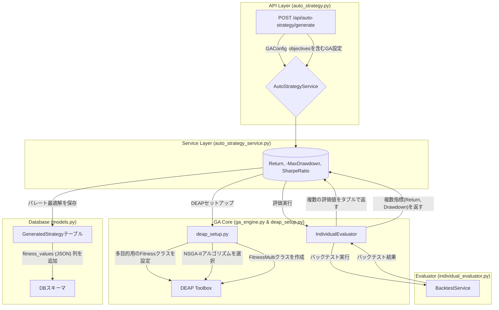

# GA 多目的最適化 導入計画書

## 1. はじめに

### 1.1. 目的

本計画は、既存の遺伝的アルゴリズム（GA）エンジンを、単一目的最適化から**多目的最適化（Multi-Objective Optimization, MOO）** へと進化させるための実装方針を定義します。これにより、単にリターンを最大化するだけでなく、リスク（例: 最大ドローダウン）を最小化するなど、複数の相反する目的を同時に満たす、より実践的で多様な戦略群（パレート最適解）の発見を目指します。

### 1.2. スコープ

- **対象**: `ga_engine.py`, `deap_setup.py`, `individual_evaluator.py` を中心とした GA コアロジック。
- **主な機能**:
  1.  DEAP の多目的最適化アルゴリズム（例: `NSGA-II`）への切り替え。
  2.  複数の評価指標（リターン、ドローダウン、シャープレシオ等）を返す評価関数の実装。
  3.  多目的最適化用の設定項目を `GAConfig` と API に追加。
  4.  結果として得られるパレート最適解の保存と可視化のための API 拡張。

---

## 2. 設計方針

### 2.1. アーキテクチャの変更点

中核となる `ga_engine.py` とその周辺モジュールに手を加えます。特に、DEAP のセットアップと評価ロジックが主要な変更点となります。

### 2.2. DEAP ライブラリの活用

- **アルゴリズム**: 現在の `algorithms.eaSimple` から、多目的最適化で最も標準的かつ高性能な `algorithms.selNSGA2` (NSGA-II) に変更します。
- **Fitness クラス**: `creator.create("FitnessMax", base.Fitness, weights=(1.0,))` となっている部分を、`creator.create("FitnessMulti", base.Fitness, weights=(1.0, -1.0, 1.0))` のように、複数の目的（とそれぞれの最大化/最小化の方向）を定義できるクラスに変更します。

---

## 3. 実装ステップ

### Step 1: GA 設定と DB モデルの拡張

1.  **`backend/app/core/services/auto_strategy/models/ga_config.py` の修正**:

    - `GAConfig` モデルに `objectives: List[str] = Field(default_factory=lambda: ["total_return"])` のようなフィールドを追加します。これにより、API から最適化したい目的（例: `["total_return", "max_drawdown"]`）を指定できるようになります。
    - `weights: List[float] = Field(default_factory=lambda: [1.0])` を追加し、各目的の最大化・最小化（1.0 or -1.0）を指定できるようにします。

2.  **`backend/database/models.py` の修正**:
    - `GeneratedStrategy` モデルに `fitness_values = Column(JSON, nullable=True)` という列を追加します。単一の `fitness_score` ではなく、`[150.5, -15.2]` のような複数の評価値を保存できるようにするためです。

### Step 2: DEAP セットアップの多目的化 (`deap_setup.py`)

1.  **`backend/app/core/services/auto_strategy/engines/deap_setup.py` の修正**:
    - `setup_deap` メソッドを修正します。
    - `ga_config.objectives` の内容に基づき、`creator.create("FitnessMulti", base.Fitness, weights=tuple(ga_config.weights))` を動的に呼び出すように変更します。
    - `toolbox.register("select", tools.selNSGA2)` のように、選択アルゴリズムを NSGA-II に登録します。

### Step 3: 評価関数の多目的化 (`individual_evaluator.py`)

1.  **`backend/app/core/services/auto_strategy/engines/individual_evaluator.py` の修正**:
    - `evaluate_individual` メソッドを修正します。
    - バックテスト実行後、返された `stats` オブジェクトから、`ga_config.objectives` で指定された複数のパフォーマンス指標（例: `stats['Return [%]']`, `stats['Max. Drawdown [%]']`）を抽出します。
    - **重要**: DEAP はすべての目的を最大化しようとするため、最小化したい指標（例: ドローダウン）は符号を反転させます。
    - 最終的に、評価値のタプル `(150.5, -15.2)` を返すように変更します。

### Step 4: GA エンジンのアルゴリズム変更 (`ga_engine.py`)

1.  **`backend/app/core/services/auto_strategy/engines/ga_engine.py` の修正**:
    - `run_evolution` メソッド内の `algorithms.eaSimple` を呼び出している箇所を、`algorithms.eaMuPlusLambda` や `eaGenerateUpdate` といった、NSGA-II で一般的に使われる進化ロジックのカスタム実装に置き換えます。（DEAP の `selNSGA2` は選択のみを行うため、進化ループ自体は手動で記述する必要があります）
    - 進化の最後に、`tools.selBest` ではなく、パレート最適解の集合である `tools.ParetoFront` を使って最終的な解の集合を取得するように変更します。

### Step 5: API とフロントエンドの対応

1.  **`backend/app/api/auto_strategy.py` の修正**:
    - `GAGenerationRequest` が新しい `objectives` と `weights` を受け入れられるようにします。
2.  **フロントエンドの改修**:
    - GA 設定モーダルで、複数の目的を選択できる UI（チェックボックスなど）を追加します。
    - 結果表示画面で、パレート最適解を 2D 散布図（例: X 軸: ドローダウン, Y 軸: リターン）で表示できるようにします。これにより、ユーザーはリスクとリターンのトレードオフを視覚的に理解し、好みの戦略を選択できます。

---

## 4. タイムラインとリスク

- **タイムライン**: 約 7 日
  - Step 1 (設定/DB 拡張): 1 日
  - Step 2 (DEAP セットアップ): 1 日
  - Step 3 (評価関数): 1 日
  - Step 4 (GA エンジン): 2 日
  - Step 5 (API/UI): 2 日
- **リスク**:
  - **DEAP の複雑性**: `eaSimple` からカスタムの進化ループへの変更は、DEAP の知識が必要となり、実装の難易度が上がります。公式ドキュメントやサンプルコードを十分に参照する必要があります。
  - **計算コストの増大**: 多目的最適化は一般的により多くの計算量を必要とします。世代数や個体数の調整が必要になる可能性があります。
  - **結果の解釈**: パレートフロンティアという概念をユーザーにどう分かりやすく提示するかが、UI/UX デザインの課題となります。
