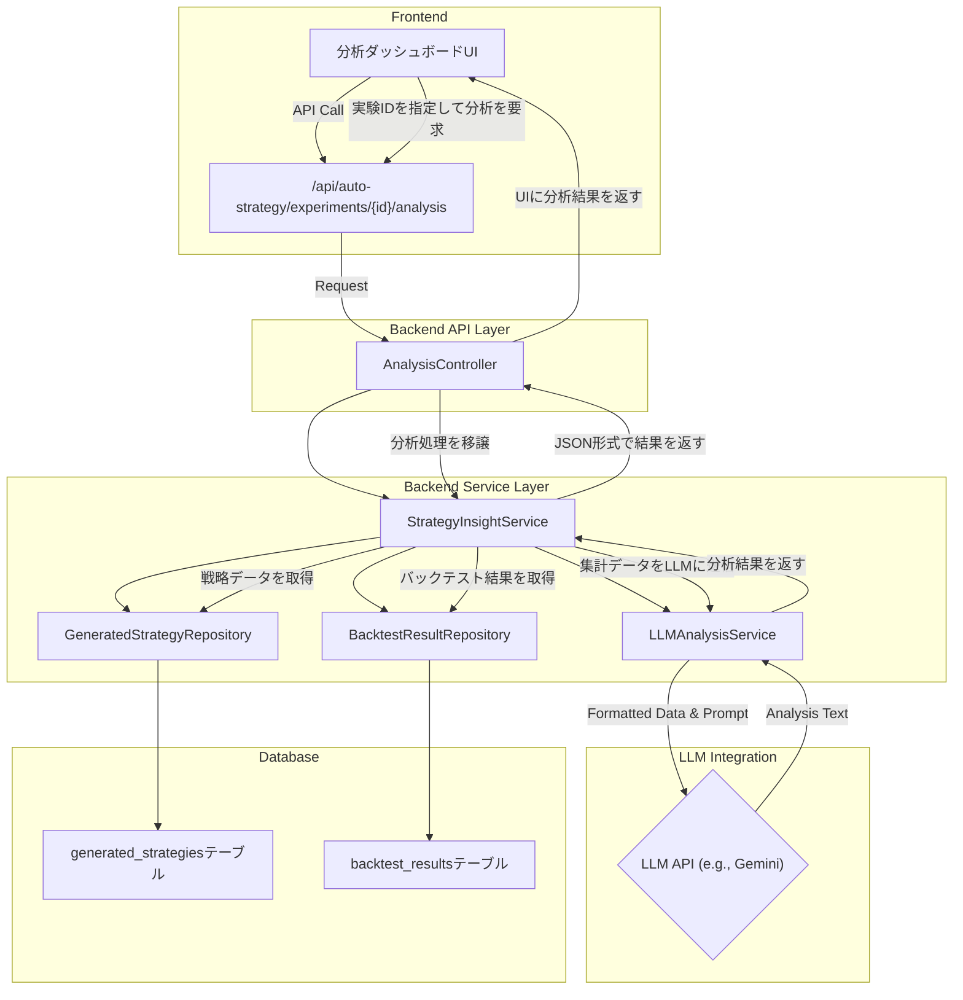

# 戦略インサイト分析機能 導入計画書

## 1. はじめに

### 1.1. 目的

本機能は、遺伝的アルゴリズム（GA）によって生成された多数の優良な取引戦略を多角的に分析し、「なぜ勝てるのか？」という知見を可視化・抽出することを目的とします。さらに、大規模言語モデル（LLM）を活用して、分析結果に対する定性的な解説や改善提案を自動生成し、ユーザーの戦略理解と改善サイクルを加速させます。

### 1.2. スコープ

- **対象**: GA 実験（`GAExperiment`）によって生成された戦略群（`GeneratedStrategy`）。
- **主な機能**:
  1.  **データ集計・分析**: 特定の GA 実験に紐づく全戦略の遺伝子情報とバックテスト結果を集計・分析する。
  2.  **可視化**: 分析結果をフロントエンドで直感的に理解できるグラフやテーブルとして表示する。
  3.  **LLM による解説**: 集計されたデータに基づき、戦略群の「特徴」「強み」「弱み」「改善のヒント」を LLM が自然言語で解説する。

---

## 2. 設計方針

### 2.1. 全体アーキテクチャ

既存の `auto_strategy` API を拡張し、新たに分析用のエンドポイントとサービスを追加します。LLM との連携は、専用のサービスクラスに責務を分離します。



### 2.2. データフロー

1.  **ユーザー**: フロントエンドの UI から分析したい GA 実験を選択します。
2.  **フロントエンド**: 実験 ID を付けて、バックエンドの分析 API (`/api/auto-strategy/experiments/{id}/analysis`) を呼び出します。
3.  **バックエンド (`StrategyInsightService`)**:
    a. DB から、指定された実験 ID に紐づく全ての `GeneratedStrategy` と、それに関連する `BacktestResult` を取得します。
    b. **定量的分析**: - **特徴量（インジケーター）の集計**: 全戦略の遺伝子 (`gene_data`) を解析し、使用されているインジケーター、パラメータの分布、条件（`>`, `<`）の傾向などを集計します。 - **パフォーマンス相関分析**: 特定のインジケーターやパラメータを持つ戦略のパフォーマンス（利益、勝率など）を計算し、優位性を分析します。 - **パフォーマンス分布**: 利益、勝率、ドローダウンなどの主要なパフォーマンス指標の分布（ヒストグラム）を作成します。
    c. **LLM による定性分析 (`LLMAnalysisService`)**: - 上記の定量的分析結果を、LLM への入力（プロンプト）用に整形します。（例: JSON 形式のサマリーデータ） - 「このデータから、この戦略群の勝ちパターン、負けパターン、そして改善点を洞察してください」といったプロンプトを付与して LLM API を呼び出します。 - LLM から返却されたテキスト解説を受け取ります。
4.  **API レスポンス**: 定量的データ（グラフ用 JSON）と定性的データ（LLM によるテキスト）をまとめてフロントエンドに返します。

---

## 3. 実装ステップ

### Step 1: バックエンドの実装

1.  **`backend/app/core/services/strategy_insight_service.py` の新規作成**:

    - `StrategyInsightService` クラスを作成します。
    - `analyze_experiment(self, experiment_id: int)` メソッドを実装し、上記のデータフローにおけるバックエンド処理を記述します。
    - `pandas` や `numpy` を活用して効率的に集計処理を行います。

2.  **`backend/app/core/services/llm_analysis_service.py` の新規作成**:

    - `LLMAnalysisService` クラスを作成します。
    - `get_insights_from_data(self, analysis_data: dict) -> str` メソッドを実装します。
    - 内部で `google-generativeai` などのライブラリを使用し、LLM との通信をカプセル化します。プロンプトのテンプレート管理もこのクラスが責務を持ちます。

3.  **`backend/app/api/auto_strategy.py` の修正**:
    - 新しいエンドポイント `GET /experiments/{experiment_id}/analysis` を追加します。
    - `StrategyInsightService` を呼び出し、結果を JSON で返す処理を記述します。
    - Pydantic モデル `StrategyAnalysisResponse` を定義し、レスポンスの型を明確にします。

### Step 2: フロントエンドの実装

1.  **`frontend/hooks/useStrategyAnalysis.ts` の新規作成**:

    - 指定された実験 ID の分析データを取得するためのカスタムフックを作成します。
    - データのローディング状態、エラーハンドリングを管理します。

2.  **`frontend/app/analysis/[experimentId]/page.tsx` の新規作成**:
    - 分析結果を表示するための新しいページコンポーネントを作成します。
    - `shadcn/ui` の `Card` や `Table`、グラフ描画ライブラリ（例: `Recharts`）を使用して、以下のセクションを持つダッシュボードを構築します。
      - **サマリーセクション**: LLM による総合解説を表示する。
      - **特徴量インサイト**:
        - 使用頻度の高いインジケーターの棒グラフ。
        - インジケーターパラメータの分布を示すヒストグラム。
      - **パフォーマンス分析**:
        - 利益や勝率の分布を示すヒストグラム。
        - 特定のインジケーターを持つ戦略と持たない戦略のパフォーマンス比較テーブル。
      - **改善のヒント**: LLM による具体的な改善提案を表示する。

---

## 4. LLM プロンプトの設計例

`LLMAnalysisService` で使用するプロンプトの基本構造です。

```text
あなたはプロのクオンツアナリストです。
以下のデータは、遺伝的アルゴリズムによって生成された暗号資産取引戦略群の分析結果です。

# 分析データ
{
  "total_strategies": 500,
  "best_strategy_profit": 150.5,
  "average_profit": 25.8,
  "indicator_usage": {
    "RSI": 350,
    "SMA": 280,
    "MACD": 150,
    ...
  },
  "rsi_params": {
    "period": { "mean": 14.2, "std": 3.5 },
    "buy_threshold": { "mean": 28.5, "std": 5.2 }
  },
  "performance_correlations": {
    "with_RSI": { "average_profit": 45.2 },
    "without_RSI": { "average_profit": 10.1 }
  }
}

# あなたのタスク
このデータを基に、以下の観点から洞察を日本語で提供してください。

1.  **戦略群の全体的な特徴**: この実験で生成された戦略は、どのような傾向を持っていますか？
2.  **勝利の鍵 (Edge)**: どのようなインジケーターやパラメータの組み合わせが、高い利益に繋がっていると考えられますか？
3.  **潜在的な弱点**: 分析データから読み取れる、この戦略群が苦手とする可能性のある状況や、注意すべき点は何ですか？
4.  **次なる一手 (改善案)**: この結果を踏まえ、さらに優れた戦略を生み出すために、次に試すべき具体的なアクションを3つ提案してください。
```

---

## 5. タイムラインとリスク

- **タイムライン**: 約 8 日
  - バックエンド実装 (Service, Repository, API): 4 日
  - フロントエンド実装 (Hook, Component, UI): 3 日
  - 統合テストと LLM プロンプト調整: 1 日
- **リスク**:
  - **LLM の出力の不安定さ**: 同じ入力でも出力が変わる可能性があります。`temperature` パラメータの調整や、プロンプトの改善で対応します。
  - **パフォーマンス**: 大量の戦略データを集計する処理が重くなる可能性があります。クエリの最適化や、必要に応じて非同期での事前集計処理を検討します。
