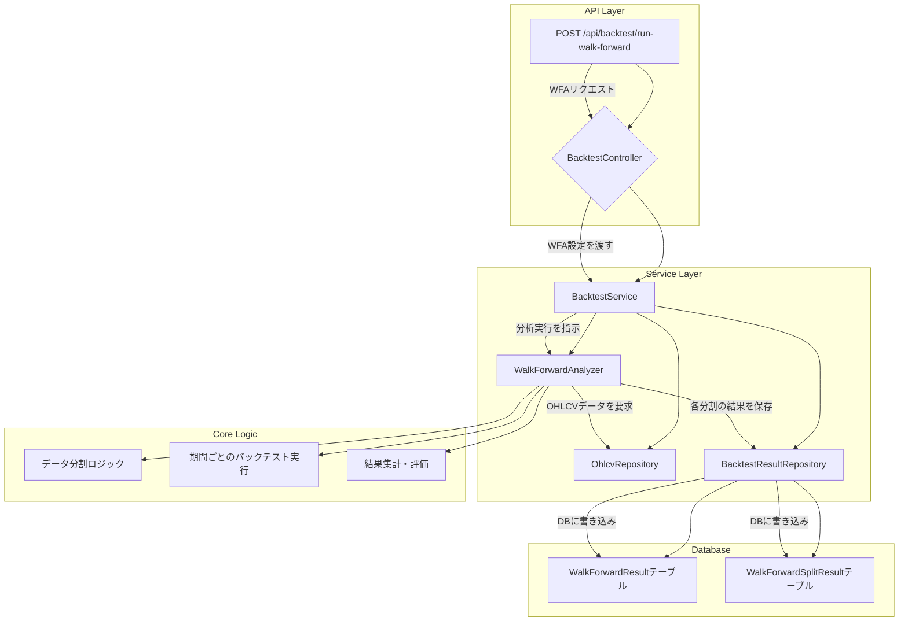

# ウォークフォワード分析 導入計画書

## 1. はじめに

本ドキュメントは、既存のバックテストシステムにウォークフォワード分析（Walk-Forward Analysis, WFA）機能を統合するための実装計画を定義するものです。

### 1.1. 目的

- **過剰適合（カーブフィッティング）のリスク低減**: 過去データ全体で最適化された戦略が、未来の未知のデータに対して機能しないリスクを軽減します。
- **戦略の頑健性（ロバストネス）評価**: 異なる市場期間においても安定したパフォーマンスを発揮できるか、戦略の真の実力を評価します。
- **より現実に即したパフォーマンス予測**: インサンプル（学習）とアウトオブサンプル（検証）を繰り返すことで、実運用環境に近いパフォーマンスをシミュレーションします。

### 1.2. スコープ

- **対象**: `BacktestService` および関連する API エンドポイント。
- **主な機能**:
  - ウォークフォワード分析の実行ロジックの実装。
  - 分析設定（分割数、学習/検証期間など）を行う API の提供。
  - 分析結果（各期間のパフォーマンス、集計レポート）のデータモデル定義と永続化。
  - 分析結果を取得・表示するための API エンドポイントの追加。

---

## 2. 設計方針

### 2.1. 全体アーキテクチャ

### 2.2. データモデル

新たに 2 つのデータベースモデルを追加します。

1. **`WalkForwardResult` (walk_forward_results テーブル)**: ウォークフォワード分析全体の実行結果と集計サマリーを保存します。

| カラム名        | データ型   | 説明                           |
| :-------------- | :--------- | :----------------------------- |
| `id`            | `Integer`  | 主キー                         |
| `strategy_name` | `String`   | 戦略名                         |
| `symbol`        | `String`   | 通貨ペア                       |
| `timeframe`     | `String`   | 時間軸                         |
| `start_date`    | `DateTime` | 分析全体の開始日               |
| `end_date`      | `DateTime` | 分析全体の終了日               |
| `total_splits`  | `Integer`  | 分割数                         |
| `total_profit`  | `Float`    | 全期間の合計損益               |
| `total_trades`  | `Integer`  | 全期間の合計トレード数         |
| `win_rate`      | `Float`    | 全期間の勝率                   |
| `profit_factor` | `Float`    | 全期間のプロフィットファクター |
| `max_drawdown`  | `Float`    | 全期間の最大ドローダウン       |
| `sharpe_ratio`  | `Float`    | 全期間のシャープレシオ         |
| `created_at`    | `DateTime` | 作成日時                       |

1. **`WalkForwardSplitResult` (walk_forward_split_results テーブル)**: 各分割（スプリット）の詳細な結果を保存します。

| カラム名                      | データ型   | 説明                                   |
| :---------------------------- | :--------- | :------------------------------------- |
| `id`                          | `Integer`  | 主キー                                 |
| `walk_forward_result_id`      | `Integer`  | `walk_forward_results.id`への外部キー  |
| `split_number`                | `Integer`  | 分割番号 (1, 2, 3...)                  |
| `in_sample_start`             | `DateTime` | インサンプル（学習）期間の開始日       |
| `in_sample_end`               | `DateTime` | インサンプル（学習）期間の終了日       |
| `out_of_sample_start`         | `DateTime` | アウトオブサンプル（検証）期間の開始日 |
| `out_of_sample_end`           | `DateTime` | アウトオブサンプル（検証）期間の終了日 |
| `out_of_sample_profit`        | `Float`    | アウトオブサンプル期間の損益           |
| `out_of_sample_trades`        | `Integer`  | アウトオブサンプル期間のトレード数     |
| `out_of_sample_win_rate`      | `Float`    | アウトオブサンプル期間の勝率           |
| `...（その他詳細メトリクス）` | `...`      |                                        |

---

## 3. 実装ステップ

### Step 1: コアロジックの実装 (`WalkForwardAnalyzer`)

- **ファイル**: `backend/app/core/services/walk_forward_analyzer.py` を新規作成します。
- **クラス**: `WalkForwardAnalyzer`
- **メソッド**:
- `__init__(self, db_session, backtest_service)`: 依存性を注入します。
- `run(self, config)`: ウォークフォワード分析のメインロジック。
  1. `_split_data(self, data, num_splits, in_sample_len, out_of_sample_len)`:
     - 期間全体を、指定された分割数または期間長に基づいて、インサンプル期間とアウトオブサンプル期間のペアに分割します。
     - `[ (in_sample_df_1, out_of_sample_df_1), (in_sample_df_2, out_of_sample_df_2), ... ]` のようなリストを返します。
  2. ループ処理で各分割を処理:
     - **（オプション）インサンプル期間で戦略パラメータを最適化**: `backtest_service.optimize_strategy()` を呼び出します。
     - **アウトオブサンプル期間でバックテスト**: 最適化された（または固定の）パラメータを使い、`backtest_service.run_backtest()` を呼び出してパフォーマンスを評価します。
  3. `_aggregate_results(self, split_results)`:
     - 全アウトオブサンプル期間の結果を結合し、全体的なパフォーマンス指標（合計損益、ドローダウンなど）を計算します。
- **依存関係**: `BacktestService` を利用して、各期間のバックテストを実行します。

### Step 2: サービスレイヤーの拡張 (`BacktestService`)

- **ファイル**: `backend/app/core/services/backtest_service.py` を修正します。
- **メソッド**:
- `run_walk_forward_analysis(self, config)` を新設します。
- `WalkForwardAnalyzer` をインスタンス化し、`run()` メソッドを呼び出します。
- 返された結果を `BacktestResultRepository` を使ってデータベースに保存します。

### Step 3: データモデルとリポジトリの作成

- **ファイル**: `backend/database/models.py` に `WalkForwardResult` と `WalkForwardSplitResult` の SQLAlchemy モデルを追加します。
- **ファイル**: `backend/database/repositories/` に `walk_forward_result_repository.py` を新規作成します。
- 分析結果を保存・取得するための CRUD 操作を実装します。

### Step 4: API エンドポイントの追加

- **ファイル**: `backend/app/api/backtest.py` を修正します。
- **Pydantic モデル**:
- `WalkForwardRequest` モデルを新設します。
- `base_config`: 既存の `BacktestRequest`
- `num_splits`: 分割数
- `in_sample_period`: インサンプル期間（例: "12M"）
- `out_of_sample_period`: アウトオブサンプル期間（例: "3M"）
- `enable_optimization`: 期間ごとに最適化を行うかどうかのフラグ
- **エンドポイント**:
- `POST /api/backtest/run-walk-forward`:
- `WalkForwardRequest` を受け取ります。
- `backtest_service.run_walk_forward_analysis()` を非同期タスクとして呼び出します（処理に時間がかかるため）。
- タスク ID や分析 ID を即時返却します。
- `GET /api/backtest/walk-forward/results`:
- 過去のウォークフォワード分析結果の一覧を取得します。
- `GET /api/backtest/walk-forward/results/{result_id}`:
- 指定された ID の分析結果（集計サマリーと各分割の詳細）を取得します。

---

## 4. タイムライン（見積もり）

| ステップ | タスク                                   | 担当       | 見積もり工数 |
| :------- | :--------------------------------------- | :--------- | :----------- |
| 1        | `WalkForwardAnalyzer` の実装             | (担当者名) | 2 日         |
| 2        | `BacktestService` の拡張                 | (担当者名) | 0.5 日       |
| 3        | DB モデルとリポジトリ作成                | (担当者名) | 1 日         |
| 4        | API エンドポイントと Pydantic モデル作成 | (担当者名) | 1 日         |
| 5        | 統合テストとデバッグ                     | (担当者名) | 1.5 日       |
| **合計** |                                          |            | **6 日**     |

---

## 5. リスクと対策

- **リスク**: 計算処理の長時間化。
- **対策**:
- API では非同期タスク（BackgroundTasks）として実行し、ユーザーを待たせない。
- 進捗状況を確認できる API エンドポイントの追加を検討する。
- 計算ロジックのプロファイリングと最適化を行う。
- **リスク**: 複雑なロジックによるバグの混入。
- **対策**:
- `WalkForwardAnalyzer` の各メソッド（特にデータ分割）に対して単体テストを徹底する。
- サービス全体を通した統合テストを入念に行う。
