# オートストラテジー アーキテクチャ概要

## 概要

このドキュメントは、自動戦略生成システムのアーキテクチャを Mermaid 図を用いて視覚的に表現します。システムは、遺伝的アルゴリズム（GA）を用いて取引戦略を自動生成・最適化し、バックテストを通じてそのパフォーマンスを評価します。

## オートストラテジーのアーキテクチャの概要

オートストラテジーは、遺伝的アルゴリズム（GA）を用いて取引戦略を自動生成・最適化するシステムです。主要なコンポーネントはモジュール化されており、戦略の生成、評価、進化、および結果の管理を分担しています。

## 主要コンポーネントと役割

```mermaid
graph TD;
    subgraph Services
        AS_Service[AutoStrategyService];
        BT_Service[BacktestService];
        BT_Data_Service[BacktestDataService];
    end

    subgraph GA_Engine
        GA_Engine_Main[GeneticAlgorithmEngine];
        DEAP_Config[DEAPConfigurator];
        Fitness_Calc[FitnessCalculator];
        Evo_Ops[EvolutionOperators];
        TF_Manager[TimeframeManager];
        Prog_Manager[ProgressManager];
        RGG[RandomGeneGenerator];
    end

    subgraph Factories
        Strat_Factory[StrategyFactory];
        Ind_Init[IndicatorInitializer];
        Cond_Eval[ConditionEvaluator];
        Data_Conv[DataConverter];
    end

    subgraph Models
        Strat_Gene[StrategyGene];
        GA_Config_Model[GAConfig];
        Gene_Validator[GeneValidator];
    end

    subgraph Repositories
        OHLCV_Repo[OHLCVRepository];
        OI_Repo[OpenInterestRepository];
        FR_Repo[FundingRateRepository];
        GA_Exp_Repo[GAExperimentRepository];
        Gen_Strat_Repo[GeneratedStrategyRepository];
        BT_Res_Repo[BacktestResultRepository];
    end

    %% サービス間の関係
    AS_Service --> GA_Engine_Main
    AS_Service --> BT_Service
    AS_Service --> Strat_Factory

    BT_Service --> BT_Data_Service
    BT_Data_Service --> OHLCV_Repo
    BT_Data_Service --> OI_Repo
    BT_Data_Service --> FR_Repo

    %% GA Engine内部の関係
    GA_Engine_Main --> DEAP_Config
    GA_Engine_Main --> Fitness_Calc
    GA_Engine_Main --> Evo_Ops
    GA_Engine_Main --> TF_Manager
    GA_Engine_Main --> Prog_Manager
    GA_Engine_Main --> RGG

    GA_Engine_Main --> Strat_Gene
    GA_Engine_Main --> GA_Config_Model

    Fitness_Calc --> BT_Service
    Fitness_Calc --> Strat_Factory
    Fitness_Calc --> Strat_Gene

    DEAP_Config --> RGG

    %% ファクトリーとモデル、その他
    Strat_Factory --> Ind_Init
    Strat_Factory --> Cond_Eval
    Strat_Factory --> Data_Conv
    Strat_Factory --> Strat_Gene

    Ind_Init --> Data_Conv
    Cond_Eval --> Data_Conv

    RGG --> Strat_Gene
    RGG --> Gene_Validator

    %% Strat_Gene -- uses --> Models; %% StrategyGeneは他のモデルに依存 (サブグラフへの直接リンクはエラーの原因になるためコメントアウト)
    %% GA_Config_Model -- uses --> Models; %% GAConfigは他のモデルに依存 (サブグラフへの直接リンクはエラーの原因になるためコメントアウト)
    Gene_Validator --> Strat_Gene

    %% リポジトリとサービスの関係 (詳細)
    AS_Service --> GA_Exp_Repo
    AS_Service --> Gen_Strat_Repo
    AS_Service --> BT_Res_Repo

    Prog_Manager --> GA_Exp_Repo
```

### コンポーネントの説明

1.  **`AutoStrategyService` (`backend/app/core/services/auto_strategy/services/auto_strategy_service.py`)**:

    - システムの中核サービス。GA の実行、進捗管理、結果保存、戦略のテスト実行など、オートストラテジー全体のフローを統括します。
    - `ExperimentManager`、`ProgressTracker`、`StrategyFactory`、`BacktestService`、`GeneticAlgorithmEngine` などの他のコンポーネントと連携します。

2.  **`BacktestService`**: 戦略のパフォーマンスを評価するためのバックテストを実行します。
3.  **`BacktestDataService`**: バックテストに必要な OHLCV、Open Interest (OI)、Funding Rate (FR) などの市場データをデータベースから取得し、整形します。

4.  **`ConditionEvaluator`**: 戦略のエントリー条件とイグジット条件を評価します。

5.  **`DataConverter`**: `backtesting.py`のデータ形式と Pandas データフレーム間の変換を行います。

    - **データ変換の例**: `backtesting.py` が要求する特定のカラム名（`Open`, `High`, `Low`, `Close`, `Volume`）を持つ Pandas DataFrame への変換や、時間足データの整合性チェックなどを行います。これにより、異なるデータソースや形式から取得された市場データが、バックテストエンジンで利用可能な統一された形式に変換されます。

6.  **`DEAPConfigurator`**: DEAP ライブラリの環境設定（フィットネスクラス、個体クラス、ツールボックス）を行います。

7.  **`EnhancedFitnessCalculator` (`backend/app/core/services/auto_strategy/evaluators/enhanced_fitness_calculator.py`)**:

    - `FitnessCalculator` の機能を拡張し、より高度なフィットネス指標の計算や、複雑な制約条件の評価を行います。これにより、GA がより洗練された戦略を探索できるようになります。

8.  **`EvolutionOperators`**: 交叉、突然変異、選択、エリート保存など、GA の進化演算をカプセル化します。

9.  **`FitnessCalculator` (`backend/app/core/services/auto_strategy/engines/fitness_calculator.py`)**:

    - GA における個体（戦略遺伝子）の適応度（フィットネス）を計算します。
    - 戦略遺伝子をバックテスト可能な戦略クラスに変換し、`BacktestService` を用いてバックテストを実行します。
    - バックテスト結果（リターン、ドローダウン、シャープレシオなど）に基づいてフィットネス値を算出し、定義された制約条件（最小取引数、最大ドローダウン、最小シャープレシオなど）をチェックします。

10. **`GAConfig`**: 遺伝的アルゴリズムの実行パラメータ（個体数、世代数、交叉率、突然変異率など）を定義するデータモデルです。

11. **`GeneEncoding` (`backend/app/core/services/auto_strategy/models/gene_encoding.py`)**:

    - `StrategyGene` オブジェクトの複雑な構造を、GA が操作しやすい数値表現にエンコードし、またその逆のデコードを行います。これにより、遺伝的アルゴリズムが戦略の各要素を効率的に進化させることが可能になります。

12. **`GeneSerialization` (`backend/app/core/services/auto_strategy/models/gene_serialization.py`)**:

    - `StrategyGene` オブジェクトを永続化（ファイル保存やデータベース格納）やネットワーク転送のためにシリアライズし、またその逆のデシリアライズを行います。これにより、GA の実験状態の保存や、生成された戦略の共有が容易になります。

13. **`GeneValidator` (`backend/app/core/services/auto_strategy/models/gene_validation.py`)**:

    - `StrategyGene` オブジェクトの構造と内容の妥当性を検証します。
    - 指標、条件、リスク管理設定の各要素が有効な形式と値を持っているかを確認します。

14. **`GeneticAlgorithmEngine` (`backend/app/core/services/auto_strategy/engines/ga_engine.py`)**:

    - 遺伝的アルゴリズム（GA）の主要な実装。DEAP ライブラリを使用し、戦略の進化プロセス（選択、交叉、突然変異）を管理します。
    - `RandomGeneGenerator` から個体群を受け取り、`FitnessCalculator` に評価を委譲します。

15. **`IndicatorInitializer`**: 戦略で使用されるテクニカル指標を初期化し、計算します。

16. **`MemoryOptimizer` (`backend/app/core/services/auto_strategy/utils/memory_optimizer.py`)**:

    - 大量の市場データや生成された戦略遺伝子を扱う際に、メモリ使用量を最適化するためのユーティリティを提供します。これにより、システムのスケーラビリティと効率が向上します。

17. **`ParallelProcessor` (`backend/app/core/services/auto_strategy/utils/parallel_processor.py`)**:

    - バックテストや戦略生成など、計算負荷の高いタスクを並列で実行するためのユーティリティです。マルチコア CPU を最大限に活用し、処理時間を大幅に短縮することで、システム全体のパフォーマンスを向上させます。

18. **`ProgressManager`**: GA の実行進捗（現在の世代、フィットネス、残り時間など）を管理し、通知します。

19. **`RandomGeneGenerator` (`backend/app/core/services/auto_strategy/generators/random_gene_generator.py`)**:

    - ランダムな戦略遺伝子 (`StrategyGene`) を生成する役割を担います。
    - 指標、エントリー/イグジット条件、および基本的なリスク管理パラメータ（ストップロス、テイクプロフィット、ポジションサイズ）をランダムに組み合わせます。

20. **`RiskManagementGenerator` (`backend/app/core/services/auto_strategy/utils/risk_management_generator.py`)**:

    - `RandomGeneGenerator` と連携し、戦略遺伝子に組み込むためのリスク管理設定（例: ストップロス、テイクプロフィット、ポジションサイジングルール）を自動的に生成します。これにより、生成される戦略が最初からリスク管理の考慮を含んだものとなります。

21. **`[各種]Repository`**: データベースとの相互作用を担当し、OHLCV、Open Interest、Funding Rate、GA 実験結果、生成された戦略、バックテスト結果などのデータを永続化します。

22. **`StrategyFactory` (`backend/app/core/services/auto_strategy/factories/strategy_factory.py`)**:

    - `StrategyGene` オブジェクトから、`backtesting.py` フレームワークで実行可能な動的な取引戦略クラスを生成します。
    - 生成された戦略クラスは、指標の初期化、エントリー/イグジット条件の評価、およびリスク管理の適用ロジックを含みます。

23. **`StrategyGene` (`backend/app/core/services/auto_strategy/models/strategy_gene.py`)**:

    - 取引戦略の遺伝子表現を定義するデータモデル。
    - テクニカル指標、エントリー条件、イグジット条件、リスク管理設定、およびメタデータなどの要素で構成されます。

24. **`StrategySimilarityChecker` (`backend/app/core/services/auto_strategy/utils/strategy_similarity_checker.py`)**:

    - 生成された戦略間の類似性を評価し、重複する戦略や非常に似た戦略を特定するのに役立ちます。これにより、GA の探索効率が向上し、多様な戦略の生成を促進します。

25. **`TimeframeManager`**: 利用可能な時間足データを管理し、バックテスト期間の設定を支援します。

## 動作原理（フロー）

1.  **戦略生成 (Strategy Generation)**:

    - `RandomGeneGenerator` が、GA の初期個体群として複数のランダムな `StrategyGene` オブジェクトを生成します。各 `StrategyGene` は、独自の指標、条件、リスク管理設定を持ちます。
    - `StrategyGene` は、テクニカル指標のパラメータ（例: SMA の期間）、エントリー/イグジット条件のロジック（例: クロスオーバー、閾値）、リスク管理設定（例: ストップロス率、テイクプロフィット率、ポジションサイズ計算方法）などの情報を含みます。
    - 生成された `StrategyGene` は、`GeneValidator` によって構造と内容の妥当性が検証されます。
    - `GeneEncoding` は、`StrategyGene` を GA が操作しやすい数値表現にエンコードします。

2.  **評価 (Evaluation)**:

    - `GeneticAlgorithmEngine` は、エンコードされた `StrategyGene` を `FitnessCalculator` に渡し、その適応度を評価させます。
    - `FitnessCalculator` は、`StrategyGene` を `StrategyFactory` に渡し、実行可能な戦略クラスを動的に生成させます。
    - `BacktestDataService` は、`OHLCVRepository` などから OHLCV データ、Open Interest (OI) データ、Funding Rate (FR) データなどの市場データを取得します。これらのデータは、`DataConverter` によって `backtesting.py` が要求する Pandas DataFrame 形式に変換されます。
    - `BacktestService` は、変換された市場データと生成された戦略クラスを用いてバックテストを実行し、バックテスト結果（`TradeStats` オブジェクトなど）を返します。
    - `FitnessCalculator` は、バックテスト結果からリターン、ドローダウン、シャープレシオなどのパフォーマンス指標を抽出し、フィットネス値を計算します。この際、`EnhancedFitnessCalculator` がより高度な指標計算や制約評価を行う場合があります。

3.  **最適化 (Optimization)**:
    - `GeneticAlgorithmEngine` は、評価されたフィットネス値に基づいて、最も適応度の高い戦略（個体）を選択し、`EvolutionOperators` を用いて交叉（遺伝子組み換え）や突然変異（ランダムな変更）といった遺伝的アルゴリズムの操作を適用して、次世代の戦略個体群を生成します。
    - `GeneSerialization` は、生成された `StrategyGene` や実験結果を永続化のためにシリアライズします。
    - `ParallelProcessor` は、複数のバックテストや戦略生成タスクを並列で実行し、全体の処理時間を短縮します。
    - `MemoryOptimizer` は、大量のデータ処理中にメモリ使用量を管理し、効率的な運用をサポートします。
    - `StrategySimilarityChecker` は、生成された戦略の多様性を確保するために、類似戦略の排除や調整に利用されることがあります。
    - 現在のコードベースでは、リスク管理パラメータの生成は `RandomGeneGenerator` によるランダムな初期設定と、`FitnessCalculator` による制約ベースの評価が主であり、`dynamic_risk_manager.py` のような高度なリスク最適化アルゴリズムは直接実装されていないようです。
    - `backend/app/core/services/auto_strategy/risk_optimization/` ディレクトリは現在空ですが、これは将来的な拡張性を見越して予約されています。このディレクトリには、高度なリスク最適化アルゴリズム（例: ポートフォリオ最適化、動的なポジションサイジング、リスクパリティ戦略など）や、強化学習を用いたリスク管理モデルを導入する計画があります。これにより、生成される戦略は、市場環境の変化に動的に適応し、より洗練されたリスク管理を行うことが可能になります。

このアーキテクチャは、各コンポーネントが明確な役割を持ち、疎結合になるように設計されています。これにより、システムの保守性、拡張性、テスト容易性が向上しています。

## エラーハンドリング

本システムは、堅牢性と信頼性を確保するために、コードベース全体で包括的なエラーハンドリング戦略を採用しています。主なアプローチは以下の通りです。

- **`try-except` ブロック**: 潜在的にエラーが発生しうる操作（例: 外部 API 呼び出し、データベース操作、データ変換、複雑な計算）には、適切な `try-except` ブロックが実装されています。これにより、予期せぬ例外が発生した場合でも、システムがクラッシュすることなく、適切にエラーを捕捉し、処理を継続できます。
- **ロギング**: エラーが発生した際には、詳細なエラーメッセージ、スタックトレース、関連するコンテキスト情報がロギングシステムを通じて記録されます。これにより、問題の診断とデバッグが容易になります。ロギングレベル（DEBUG, INFO, WARNING, ERROR, CRITICAL）を適切に使い分けることで、運用時の監視と問題特定を効率化しています。
- **主要なエラーケースと処理**:
  - **データ取得エラー**: 外部 API からのデータ取得失敗や、データベース接続エラーなど。これらの場合、再試行メカニズムを導入したり、デフォルト値を返す、またはエラーを上位層に伝播させてユーザーに通知するなどの処理を行います。
  - **データ変換/検証エラー**: 不正なデータ形式、欠損データ、`StrategyGene` の無効な構造など。`GeneValidator` のようなコンポーネントがこれらのエラーを早期に検出し、無効なデータを処理フローから除外します。
  - **バックテスト実行エラー**: `backtesting.py` エンジンでの予期せぬ問題や、戦略ロジック内のエラー。これらのエラーは、バックテスト結果に影響を与え、フィットネス計算が不可能になる可能性があるため、詳細なログを記録し、該当する戦略の評価をスキップするなどの対応を行います。
  - **リソース不足エラー**: メモリ不足や CPU リソースの枯渇など。`MemoryOptimizer` や `ParallelProcessor` の適切な利用により、これらのリスクを軽減しますが、発生した場合はロギングとアラートにより管理者に通知します。

このエラーハンドリング戦略により、システムは予期せぬ状況下でも安定して動作し、問題発生時には迅速な特定と解決が可能となっています。
