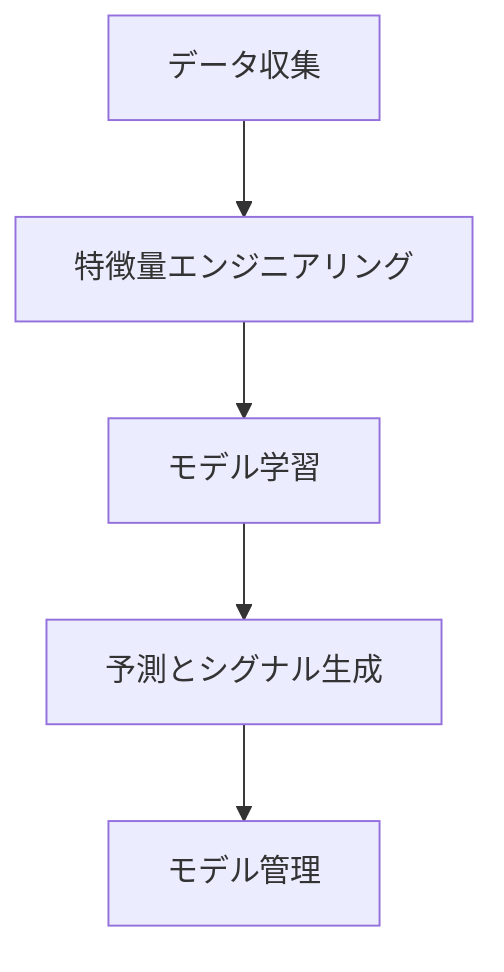

# 機械学習パイプラインの全体像

このドキュメントは、本システムに搭載されている機械学習機能の全体像を解説します。主な目的は、様々な市場データから未来の価格変動（上昇・下落・レンジ）を予測する AI モデルを構築し、自動取引戦略に活用することです。

## 1. 全体フロー

この機械学習システムは、大きく分けて以下のステップで動作します。

1.  **データ収集**: 取引所の価格データや市場心理データなど、予測の元となる情報を集めます。
2.  **特徴量エンジニアリング**: 収集した生データから、予測の「手がかり」となる**特徴量**を大量に作成します。ここがシステムの最も重要な部分です。
3.  **モデル学習**: 作成した特徴量を使って、価格の未来を予測する AI モデル（LightGBM）を学習させます。
4.  **予測とシグナル生成**: 学習済みモデルを使って、未来の価格動向を予測し、取引のシグナルを生成します。
5.  **モデル管理**: 学習済みのモデルをバージョン管理し、いつでも最高のモデルを呼び出せるようにします。

---

## 2. 入力データ

モデルは、以下の多様なデータソースを入力として利用し、市場を多角的に分析します。

- **OHLCV データ**:
  - `Open` (始値), `High` (高値), `Low` (安値), `Close` (終値), `Volume` (出来高)
  - 最も基本的な価格情報です。
- **ファンディングレート (Funding Rate / FR)**:
  - 先物市場のポジション保有コスト。市場のロング/ショートの偏りを示します。
- **建玉残高 (Open Interest / OI)**:
  - 未決済の契約総数。市場への資金流入・流出や関心度を示します。
- **Fear & Greed Index**:
  - 市場参加者の心理状態（恐怖/強欲）を数値化した指標です。

---

## 3. 特徴量エンジニアリング (Feature Engineering)

生データから予測の精度を高めるための「手がかり」を作り出す、非常に重要なプロセスです。当システムでは、**手動特徴量**と**自動特徴量（AutoML）**の 2 つのアプローチを組み合わせています。

これは、`EnhancedFeatureEngineeringService`クラスが中心となって実行されます。

### 3.1. 手動特徴量 (Manual Features)

専門家の知見に基づき、効果的とされる様々な指標を計算します。各計算は専門のクラスが担当しています。

| 計算クラス                     | 役割                                                 | 生成する特徴量の例                                                             |
| :----------------------------- | :--------------------------------------------------- | :----------------------------------------------------------------------------- |
| `PriceFeatureCalculator`       | 価格データから基本的な指標を計算                     | 移動平均線、価格モメンタム、ボラティリティ(ATR)、VWAP                          |
| `MarketDataFeatureCalculator`  | FR/OI データから市場の過熱感を分析                   | FR/OI の移動平均、変化率、FR と価格の乖離、市場ヒートインデックス              |
| `FearGreedFeatureCalculator`   | Fear & Greed Index から市場心理を分析                | F&G レベル、トレンド、極端な恐怖/強欲の検出                                    |
| `TechnicalFeatureCalculator`   | テクニカル指標を計算                                 | RSI, MACD, ストキャスティクス、ダイバージェンス、サポート/レジスタンスとの距離 |
| `TemporalFeatureCalculator`    | 時間的要因を分析                                     | 曜日、時間帯、取引セッション（アジア、欧州、米国）、週末効果                   |
| `InteractionFeatureCalculator` | 既存の特徴量を組み合わせて、より複雑な関係性を捉える | 「ボラティリティ × モメンタム」や「出来高 × トレンド強度」など                 |

### 3.2. 自動特徴量 (AutoML Features)

人間の専門家だけでは見つけられないような複雑なパターンを、コンピュータ自身に発見させる仕組みです。

| 計算クラス                 | 手法                       | 役割                                                                                         |
| :------------------------- | :------------------------- | :------------------------------------------------------------------------------------------- |
| `TSFreshFeatureCalculator` | **TSFresh**                | 時系列データから考えられる多種多様な統計的特徴量（100 種類以上）を自動で大量に生成します。   |
| `FeaturetoolsCalculator`   | **Deep Feature Synthesis** | 既存の特徴量同士を足したり引いたり、様々な演算を組み合わせて新しい特徴量を自動で合成します。 |
| `AutoFeatCalculator`       | **遺伝的アルゴリズム**     | 大量に生成された特徴量の中から、予測に最も効果的な「最強の組み合わせ」を探索し、選択します。 |

---

## 4. モデル学習 (Model Training)

作成した大量の特徴量を使って、未来の価格を予測する AI モデルを構築します。

- **使用モデル**: **LightGBM**
  - 非常に高速かつ高精度で知られる、勾配ブースティングという手法のモデルです。
- **予測する内容**: **3 クラス分類問題**
  - 未来の価格がどうなるかを、以下の 3 つのいずれかに分類します。
    1.  **上昇 (クラス 2)**
    2.  **下落 (クラス 0)**
    3.  **レンジ（横ばい） (クラス 1)**
- **学習プロセス**:
  - 学習の全体的な流れは`BaseMLTrainer`クラスで定義されており、`LightGBMTrainer`が具体的な学習処理を実装しています。
  1.  **データ準備**: 特徴量と、上記の 3 クラス分類の正解ラベル（将来の価格変動から作成）を準備します。
  2.  **データ分割**: データを学習用とテスト用に分割します。
  3.  **前処理**: `StandardScaler`を使い、各特徴量のスケールを揃えて学習しやすくします。
  4.  **学習実行**: LightGBM モデルに学習用データを投入し、学習させます。
  5.  **評価**: テスト用データを使い、モデルの精度（Accuracy）や F1 スコアなど、様々な指標で性能を厳密に評価します。
  6.  **モデル保存**: 完成したモデルは、後で使えるように`ModelManager`によって保存されます。

### ハイパーパラメータ最適化

モデルの性能を最大限に引き出すため、`MLTrainingService`は`Optuna`というライブラリを使い、学習率や木の深さといったモデルの内部設定（ハイパーパラメータ）を自動で最適化する機能も備えています。

---

## 5. モデル管理

`ModelManager`クラスが、学習済みの全モデルを一元管理します。

- **保存**: 学習済みモデル、特徴量スケーラー、使用した特徴量のリストなどをセットで保存します。
- **読み込み**: 保存したモデルをいつでも呼び出せます。
- **バージョン管理**: モデルはタイムスタンプ付きで保存され、古いモデルは自動的にクリーンアップされます。

## まとめ

この機械学習システムは、**多様なデータソース**から、**専門家の知見（手動特徴量）**と**コンピュータの探索能力（AutoML）**を組み合わせて大量の特徴量を作成し、それを高性能な**LightGBM モデル**で学習させることで、複雑な市場の未来を予測しようとする高度なパイプラインです。
