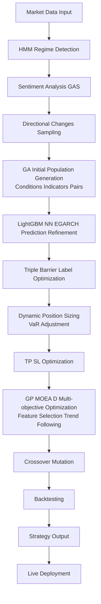

# オートストラテジーの強化計画

## 1. 現在のシステムの概要と潜在的な弱点

現在の Auto Strategy システムは、遺伝的アルゴリズム（GA）を用いて取引条件（エントリー/エグジット）、インジケーター、ポジションサイジング、TP/SL を自動生成します。DEAP ライブラリを基盤に、多目的最適化（Sharpe Ratio、Max Drawdown など）とフィットネス共有による多様性を確保しています。バックテスト統合により、生成された戦略を評価します。

**潜在的な弱点（特定済み）**:

- **市場レジーム適応不足**: トレンド/レンジ/ボラティリティ変化への対応が静的で、HMM などの動的モデルが不足。
- **多様性不足**: GA の交叉/突然変異が単純で、過剰適合（オーバーフィッティング）が発生しやすい。
- **リスク管理の限界**: ポジションサイジングが固定寄りで、リアルタイムの VaR（Value at Risk）やドローダウン制限が不十分。
- **スケーラビリティ**: 大規模データでの並列処理が最適化されていない。

これらを基に、ウェブ検索（Tavily/Exa）から得た知見（AI 統合、ハイブリッド最適化、リスクベース戦略）を活用して強化します。追加で、Triple Barrier Labeling、センチメント統合、Pairs Trading 最適化、Directional Changes、Multi-objective PSO などのアイデアを抽出・統合。

## 2. 具体的な強化案

以下の 3 つの主要案に加え、ウェブ検索に基づく追加案を提案します。各案は、仮想通貨市場のボラティリティを考慮し、ロバストで実践可能な戦略生成を目指します。

2. **GA + LightGBM のハイブリッドアプローチ**:

   - 目的: GA で生成した戦略を LightGBM で予測・洗練。特徴量としてインジケーター/市場データを用い、予測精度を向上。
   - 利点: GA の探索力と ML の予測力を組み合わせ、より強い戦略（例: 予測ベースのエントリー条件）を生成。
   - 関連: scikit-learn/LightGBM/Optuna を活用（既存）。

3. **ポジションサイジングとリスク管理の動的調整**:

   - 目的: ボラティリティ/オープンインタレストに基づく動的サイジング（Kelly Criterion 変種）と、VaR/Expected Shortfall の統合。
   - 利点: ドローダウンを抑制し、Sharpe Ratio を最大化。
   - 関連: 既存の position_sizing_gene を拡張。

追加案:

- 多目的最適化の強化（NSGA-II アルゴリズム導入で Pareto フロンティア拡大）。
- 並列/分散 GA（DEAP のマルチプロセス強化）で計算効率向上。

**追加強化案（ウェブ検索に基づく）**:

4. **GA + Neural Networks (NN) のハイブリッドアプローチ**:

   - 目的: GA で生成した戦略をニューラルネットワークでさらに洗練し、非線形パターンを捕捉。仮想通貨のボラティリティ予測に活用。
   - 利点: 複雑な市場ダイナミクスを扱い、予測精度を向上（例: EGARCH モデル統合でボラティリティ予測強化）。
   - 関連: PyTorch/ TensorFlow, DEAP。

5. **Triple Barrier Labeling の GA 最適化**:

   - 目的: Triple Barrier Method を GA で最適化し、High/Low Risk ラベルを作成。ペアトレーディング戦略のラベル生成に適用。
   - 利点: 利益最大化とドローダウン最小化を同時に達成（HRHP/LRLP ラベルで 51%利益向上、73% MDD 低減）。
   - 関連: scikit-learn, DEAP。

6. **センチメント分析の統合 (GAS: Genetic-Algorithm generated Alpha factors and Sentiments)**:

   - 目的: GA でセンチメントデータを Alpha ファクターとして生成・統合。Bitcoin などの仮想通貨取引に活用。
   - 利点: 市場センチメントを考慮した戦略生成で、予測精度向上。
   - 関連: NLTK/VADER (センチメント), Tavily API (データ取得), DEAP。

7. **Pairs Trading 戦略の GA 最適化**:

   - 目的: コイン tegrated ペアを GA で特定・最適化。仮想通貨市場のペアトレーディングを強化。
   - 利点: 統計的アービトラージ機会を自動検出、市場中立戦略でリスク低減。
   - 関連: statsmodels (コイン tegration テスト), DEAP。

8. **Directional Changes (DC) パラダイムの統合**:

   - 目的: 固定時間間隔ではなくイベント駆動（価格変化閾値）でデータをサンプリングし、GA を適用。
   - 利点: ノイズ低減と効率的な戦略生成、仮想通貨の急変動に対応。
   - 関連: pandas, DEAP。

9. **Genetic Programming (GP) の統合**:

   - 目的: GP を用いて取引ルール自体を進化させ、移動平均のウィンドウパラメータやクロスオーバーシグナルを最適化。
   - 利点: パラメータ最適化を超え、戦略の構造を自動生成し、市場適応性を向上（例: Bitcoinデータでのバックテストで利益最大化）。
   - 関連: DEAP (GP拡張), pandas。

10. **EGARCHモデルとのGA統合**:

    - 目的: GAでEGARCH（Exponential GARCH）のパラメータを最適化し、仮想通貨の極端なボラティリティを予測。
    - 利点: 非対称ボラティリティを捕捉し、リスク管理を強化（Quantum NNとのハイブリッドで精度向上）。
    - 関連: arch (EGARCH), PyTorch, DEAP。

11. **MOEA/Dによる多目的最適化**:

    - 目的: 分解ベースのMOEA/Dアルゴリズムで取引ルールの複数パラメータセットを最適化、偽シグナルを低減。
    - 利点: COVID-19のような予測不能市場で取引シグナルの精度を向上（Sharpe RatioとDrawdownのPareto最適化）。
    - 関連: pymoo (MOEA/D), DEAP。

12. **GAによる特徴量選択**:

    - 目的: GAでMLモデル向けの特徴量を選択し、Bitcoinや株価の方向予測を強化。
    - 利点: 過剰適合を防ぎ、予測精度を向上（MSE 0.0863, MPE 0.0084達成例）。
    - 関連: scikit-learn (特徴量選択), DEAP。

13. **トレンドフォロー戦略のGA最適化**:

    - 目的: GAで移動平均、MACD、RSI、Bollinger Bandsなどのトレンドフォロー指標のパラメータを最適化。
    - 利点: 仮想通貨のトレンドを捕捉し、利益を最大化（複数戦略の組み合わせでパフォーマンス向上）。
    - 関連: TA-Lib (指標), DEAP。

## 3. 各案の実施ステップ（TDD ベース）

TDD（Test-Driven Development）を厳守し、pytest でユニット/統合テストを作成。変更は backend/app/services/auto_strategy/を中心に。

**案 2: GA + LightGBM ハイブリッド**

- [ ] テスト: `test_hybrid_evaluator.py`作成（LightGBM 予測の精度テスト）。
- [ ] 実装: `ml_orchestrator.py`に LightGBM 予測モジュール追加。`individual_evaluator.py`で GA 個体を ML 特徴量に変換。
- [ ] リファクタ: `genetic_operators.py`で ML フィードバックを交叉に反映。
- [ ] 統合テスト: ハイブリッド戦略のバックテスト（既存戦略比 20%以上の改善目標）。

**案 3: 動的ポジションサイジング**

- [ ] テスト: `test_dynamic_position_sizing.py`作成（ボラティリティ入力時の出力検証）。
- [ ] 実装: `positions/calculators/volatility_based_calculator.py`拡張。VaR 計算を`risk_metrics.py`に追加。
- [ ] リファクタ: `position_sizing_gene.py`で動的パラメータを GA 遺伝子に組み込み。
- [ ] 統合テスト: 全体戦略のリスク指標（Max Drawdown < 15%）確認。

**追加案 4: GA + NN ハイブリッド**

- [ ] テスト: `test_nn_hybrid.py`作成（NN 予測の精度と GA 統合テスト）。
- [ ] 実装: `neural_orchestrator.py`に PyTorch NN モジュール追加。`strategy_generator.py`で GA 個体を NN 入力に変換。
- [ ] リファクタ: `genetic_operators.py`で NN フィードバックを突然変異に反映。
- [ ] 統合テスト: ハイブリッド戦略のバックテスト（ボラティリティ予測精度向上確認）。

**追加案 5: Triple Barrier Labeling 最適化**

- [ ] テスト: `test_triple_barrier.py`作成（GA 最適化ラベルの生成・分類テスト）。
- [ ] 実装: `labeling_optimizer.py`に Triple Barrier と GA 統合モジュール追加。
- [ ] リファクタ: `individual_evaluator.py`でラベルをフィットネス関数に組み込み。
- [ ] 統合テスト: ペアトレーディング戦略の利益/MDD 改善（目標: 50%利益向上）。

**追加案 6: センチメント統合 (GAS)**

- [ ] テスト: `test_sentiment_alpha.py`作成（センチメントデータの Alpha 生成テスト）。
- [ ] 実装: `sentiment_processor.py`に VADER/Tavily 統合。`alpha_generator.py`で GA による Alpha 最適化。
- [ ] リファクタ: `strategy_generator.py`でセンチメントを遺伝子に追加。
- [ ] 統合テスト: GAS 戦略のバックテスト（センチメント考慮時の Sharpe Ratio 向上）。

**追加案 7: Pairs Trading 最適化**

- [ ] テスト: `test_pairs_trading.py`作成（コイン tegration 検出と GA 最適化テスト）。
- [ ] 実装: `pairs_detector.py`に statsmodels と GA 統合。
- [ ] リファクタ: `genetic_operators.py`でペア選択を交叉対象に。
- [ ] 統合テスト: Pairs 戦略のバックテスト（市場中立性と利益確認）。

**追加案 8: Directional Changes 統合**

- [ ] テスト: `test_dc_paradigm.py`作成（イベント駆動サンプリングテスト）。
- [ ] 実装: `dc_sampler.py`に閾値ベースのデータ変換モジュール追加。
- [ ] リファクタ: `data_preprocessor.py`で DC を GA 入力に適用。
- [ ] 統合テスト: DC ベース戦略のバックテスト（ノイズ低減効果確認）。

**全体スケジュール**:

- フェーズ 1: テスト/実装（1-2 日）。
- フェーズ 2: 統合/最適化（Optuna でハイパーパラメータチューニング）。
- フェーズ 3: フロントエンド更新（GAConfigForm に新オプション追加）。

**追加案 9: Genetic Programming (GP) 統合**

- [ ] テスト: `test_gp_integration.py`作成（GP進化ルールのバックテスト検証）。
- [ ] 実装: `gp_orchestrator.py`にDEAP GPモジュール追加。`strategy_generator.py`でルール進化を統合。
- [ ] リファクタ: `genetic_operators.py`でGPをGAとハイブリッド化。
- [ ] 統合テスト: GP最適化戦略のバックテスト（パラメータ進化による利益向上確認）。

**追加案 10: EGARCHモデルとのGA統合**

- [ ] テスト: `test_egarch_ga.py`作成（ボラティリティ予測精度テスト）。
- [ ] 実装: `volatility_predictor.py`にarchとGA統合モジュール追加。
- [ ] リファクタ: `individual_evaluator.py`でEGARCH予測をフィットネスに反映。
- [ ] 統合テスト: EGARCH強化戦略のバックテスト（ボラティリティ捕捉効果確認）。

**追加案 11: MOEA/Dによる多目的最適化**

- [ ] テスト: `test_moead_optimization.py`作成（Paretoフロンティア生成テスト）。
- [ ] 実装: `moead_optimizer.py`にpymoo MOEA/Dモジュール追加。
- [ ] リファクタ: `optimization/base_optimizer.py`でMOEA/Dを拡張。
- [ ] 統合テスト: MOEA/D最適化戦略のバックテスト（シグナル精度向上確認）。

**追加案 12: GAによる特徴量選択**

- [ ] テスト: `test_feature_selection_ga.py`作成（特徴量選択のMSE/MPE検証）。
- [ ] 実装: `feature_selector.py`にGAベース選択モジュール追加。
- [ ] リファクタ: `ml_orchestrator.py`で選択特徴量をLightGBM入力に適用。
- [ ] 統合テスト: 特徴量選択戦略のバックテスト（予測精度向上確認）。

**追加案 13: トレンドフォロー戦略のGA最適化**

- [ ] テスト: `test_trend_following_ga.py`作成（指標パラメータ最適化テスト）。
- [ ] 実装: `trend_optimizer.py`にTA-LibとGA統合モジュール追加。
- [ ] リファクタ: `strategy_generator.py`でトレンド指標を遺伝子に組み込み。
- [ ] 統合テスト: トレンドフォロー戦略のバックテスト（Sharpe Ratio向上確認）。

## 4. 視覚化（Mermaid ダイアグラム: 強化後の GA フロー）

この計画で、よりロバストで強い戦略生成が可能になります。承認いただければ、code モードに切り替えて実装を開始します。
