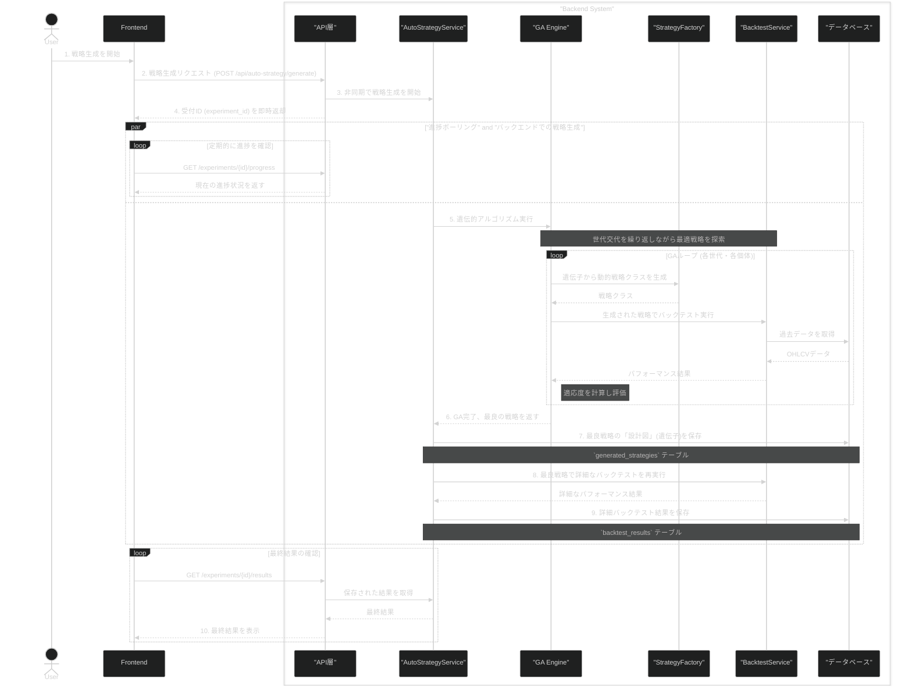
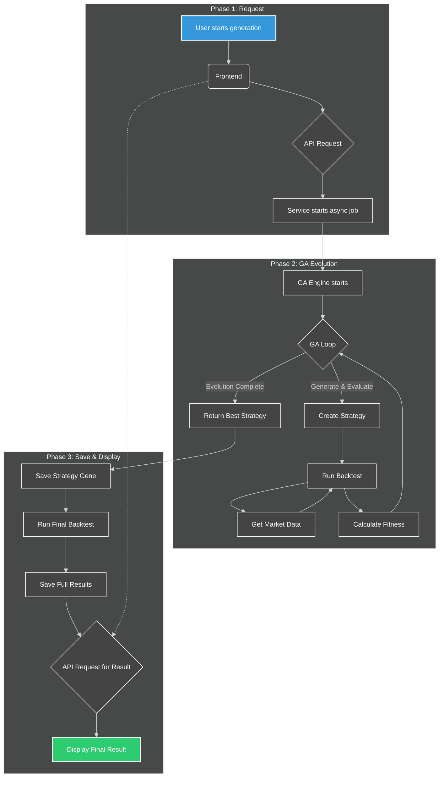

# オートストラテジー概要：AI による自動戦略生成の全貌

## 1. はじめに

「オートストラテジー」は、AI の一技術である遺伝的アルゴリズム（Genetic Algorithm, GA）を活用し、無数の可能性の中から最適な取引戦略を自動的に探索・生成するシステムです。本ドキュメントでは、ユーザーがリクエストを送信してから、システムがどのようにして最良の戦略を発見し、その結果を保存するのか、その技術的な仕組みと一連の流れを解説します。

## 2. エンドツーエンドのフロー

ユーザーが戦略生成を開始してから最終的な結果を受け取るまでの流れは、以下のシーケンス図で表されます。API、サービス層、GA エンジン、バックテストエンジンといった各コンポーネントが連携し、非同期で処理が進みます。

### フローチャートによる処理概要

## 3. 主要コンポーネントの役割

システムの裏側では、各コンポーネントが専門的な役割を担い、連携して動作します。

- **`AutoStrategyService` (サービス層)**: **司令塔**

  - 戦略生成プロセスの全体を統括する中心的なサービスです。
  - API からのリクエストを受け、バックグラウンドで `GeneticAlgorithmEngine` を起動します。
  - GA 完了後、**二段階の保存処理**を実行します。
    1.  まず、見つかった最良戦略の**遺伝子情報**（インジケーターやルールの組み合わせ）を `generated_strategies` テーブルに保存します。
    2.  次に、同じ最良戦略を用いて再度**詳細なバックテスト**を実行させ、その完全な結果（資産曲線、全取引履歴など）を `backtest_results` テーブルに保存します。

- **`GeneticAlgorithmEngine` (エンジン層)**: **進化の探求者**

  - 遺伝的アルゴリズムのコアロジックを実行するエンジンです。
  - 「評価 → 選択 → 交叉 → 突然変異」というサイクルを繰り返し、世代交代を通じて戦略を進化させ、有望な戦略を探索します。

- **`StrategyFactory` (ファクトリー)**: **動的戦略ビルダー**

  - GA ループの「評価」フェーズで重要な役割を担います。
  - 戦略の遺伝子情報（`StrategyGene`）を受け取り、それを基に `backtesting.py` ライブラリと互換性のある**動的な戦略クラス**をその場で生成します。これにより、遺伝子情報で定義された任意のロジックをバックテストで実行可能にします。

- **`BacktestService` (バックテスト)**: **戦略テスター**

  - `StrategyFactory` によって生成された動的戦略クラスを受け取り、過去の市場データを用いてバックテストを実行します。
  - 戦略のパフォーマンス（総リターン、シャープレシオ、最大ドローダウンなど）を算出します。

- **`FitnessCalculator` (適応度計算機)**: **評価者**

  - `BacktestService` から受け取った複数のパフォーマンス指標を基に、戦略の総合的な優劣を判断するための単一のスコア、すなわち**適応度（Fitness）**を計算します。この適応度が、GA における個体の評価基準となります。

- **データベース層 (Repositories)**: **記録保管庫**
  - `generated_strategies` や `backtest_results` をはじめとする各種テーブルを管理し、データの永続化を担当します。

## 4. 成果物

この一連のプロセスを経て、最終的に以下の 2 つの重要なデータがデータベースに保存され、ユーザーはいつでも参照・活用できます。

1.  **戦略の遺伝子情報 (`generated_strategies` テーブル)**
    - AI が発見した最良戦略の具体的な構成要素（使用インジケーター、パラメータ、売買ロジックなど）です。これは戦略の「設計図」に相当します。
2.  **詳細なバックテスト結果 (`backtest_results` テーブル)**
    - その最良戦略が過去の市場でどのようなパフォーマンスを発揮したかを示す、詳細なレポートです。これには、日々の資産推移、全取引の記録、各種パフォーマンス指標などが含まれます。

これにより、ユーザーは再現性の高い戦略設計と、その信頼性を裏付ける詳細な検証結果の両方を手に入れることができます。
