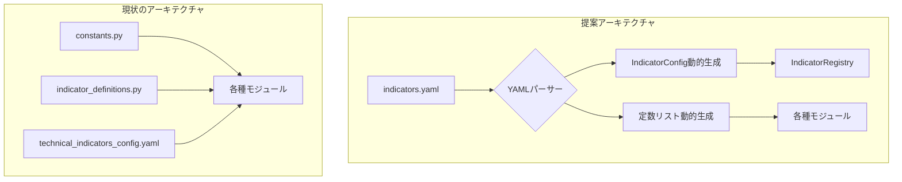

# テクニカル指標設定の管理改善提案

## 1. 現状の問題点

現在のテクニカル指標設定は、主に以下の 4 つのファイル群に情報が分散しており、メンテナンス性に課題があります。

- **`constants.py`**: カテゴリ別の指標名リストや、一部の指標特性がハードコードされています。
- **`indicator_definitions.py`**: 各指標の技術的な詳細設定（計算関数、パラメータ等）が Python コードで記述されています。
- **`indicator_config.py`**: 設定を管理するためのクラスが定義されています。
- **`technical_indicators_config.yaml`**: 指標の戦略的な設定（閾値、売買条件等）が記述されていますが、`constants.py`の定義と重複・分散しています。

この構造により、単一の指標を追加・修正する際に、複数のファイルを横断して変更する必要があり、ヒューマンエラーを誘発しやすく、開発効率を低下させる原因となっています。

## 2. 提案する解決策：設定の一元管理

指標に関するすべての設定情報を、**単一の YAML ファイル**に集約することを提案します。この YAML ファイルを「マスター設定ファイル」として扱い、アプリケーション起動時にこのファイルを読み込んで、必要な Python オブジェクト（定数リスト、`IndicatorConfig`オブジェクトなど）を動的に生成するアーキテクチャに変更します。

### 2.1. 新しいマスター YAML ファイルの構成案

指標ごとに必要な情報をすべて含んだ、以下のような構造を提案します。

```yaml
indicators:
  RSI:
    category: "momentum"
    adapter_function: "MomentumIndicators.rsi"
    required_data: ["close"]
    result_type: "single"
    scale_type: "oscillator_0_100"
    parameters:
      length:
        default_value: 14
        min_value: 2
        max_value: 100
        description: "RSI計算期間"
    strategy:
      thresholds:
        aggressive:
          long_gt: 75
          short_lt: 25
        normal:
          long_gt: 70
          short_lt: 30
      conditions:
        long: "{left_operand} > {threshold}"
        short: "{left_operand} < {threshold}"

  # ... 他の指標設定も同様に記述 ...
```

この構成により、以下の情報が一元管理されます。

- **基本情報**: カテゴリ、計算に使う関数名など
- **技術的定義**: 必要なデータソース、結果の型、スケール、パラメータの範囲とデフォルト値
- **戦略的定義**: 閾値や売買条件

### 2.2. アーキテクチャの変更点



1. **マスター YAML ファイルの導入**: `indicators.yaml`（仮称）のような、すべての指標設定を網羅した単一の YAML ファイルを作成します。
2. **動的読み込み処理の実装**: アプリケーション起動時に、この YAML ファイルをパースする処理を追加します。
3. **`IndicatorConfig`の動的生成**: パースした情報に基づき、`IndicatorConfig`オブジェクトを動的に生成し、`indicator_registry`に登録します。これにより、`indicator_definitions.py`での手動登録が不要になります。
4. **定数の動的生成**: YAML の`category`情報から、`VOLUME_INDICATORS`などの定数リストを動的に生成します。これにより、`constants.py`での手動更新が不要になります。

## 3. 期待される効果

- **メンテナンス性の向上**: 指標の追加・修正は、マスター YAML ファイルを変更するだけで完結します。複数ファイルにまたがる変更が不要になり、作業がシンプルになります。
- **一貫性の確保**: すべての設定が一箇所にまとまるため、情報の重複や不整合を防ぐことができます。
- **可読性の向上**: YAML 形式は人間が読み書きしやすいため、非開発者でも設定内容を理解しやすくなります。
- **拡張性の向上**: 新しい設定項目（例：バックテスト用の追加パラメータなど）が必要になった場合も、YAML ファイルに項目を追加し、読み込み処理を修正するだけで柔軟に対応できます。

## 4. 移行ステップ案

1. **マスター YAML ファイルの作成**: 現状の各ファイルから情報を集約し、新しいマスター YAML ファイルを作成します。
2. **YAML 読み込み・パース処理の実装**: 上記 YAML を読み込み、Python の辞書オブジェクトに変換するユーティリティを実装します。
3. **`IndicatorConfig`動的生成ロジックの実装**: パースした情報から`IndicatorConfig`を生成し、レジストリに登録する処理を実装します。
4. **定数動的生成ロジックの実装**: カテゴリ分類に基づき、指標名リストを動的に生成する処理を実装します。
5. **既存コードの置き換え**: `constants.py`および`indicator_definitions.py`の静的な定義を削除し、動的に生成されたオブジェクトを参照するように、関連するコードを修正します。
6. **テスト**: 既存のテストをパスすることを確認し、必要に応じて新しい設定体系に対応したテストを追加します。

以上のリファクタリングにより、テクニカル指標の管理が大幅に効率化され、将来的な拡張にも強いコードベースを構築できると考えます。
