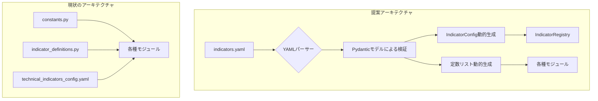

# テクニカル指標設定の一元管理改善提案

## 1. 現状の問題点

現在のテクニカル指標設定は、以下の4つのファイルに分散しているため、メンテナンスに課題がある。

- **constants.py**: カテゴリ別の指標名リストや一部の指標特性がハードコード。
- **indicator_definitions.py**: 各指標の技術的詳細設定（計算関数、パラメータ）がPythonコードで記述。
- **indicator_config.py**: 設定管理クラスが定義。
- **technical_indicators_config.yaml**: 戦略的設定（閾値、売買条件）が記述。ただし、constants.pyと重複・分散。

この分散により、指標の追加・修正時に複数ファイルを変更する必要があり、ヒューマンエラーが発生しやすく、開発効率が低下する。

## 2. 提案する解決策

すべての設定情報を単一のYAMLファイルに集約し、アプリケーション起動時にPydanticモデルでバリデーションを行いながら動的に読み込むアーキテクチャを提案する。

### 2.1. 新しいマスターYAMLファイル構成 (`indicators.yaml`)

```yaml
indicators:
  RSI:
    category: "momentum"
    adapter_function: "MomentumIndicators.rsi"
    required_data: ["close"]
    result_type: "single"
    scale_type: "oscillator_0_100"
    parameters:
      length:
        default_value: 14
        min_value: 2
        max_value: 100
        description: "RSI計算期間"
    strategy:
      thresholds:
        aggressive:
          long_gt: 75
          short_lt: 25
        normal:
          long_gt: 70
          short_lt: 30
      conditions:
        long: "{left_operand} > {threshold}"
        short: "{left_operand} < {threshold}"

  # ... 他の指標設定も同様に記述 ...
```

この構成により以下の情報が一元管理される。
- **基本情報**: カテゴリ、計算関数名。
- **技術的定義**: 必要なデータソース、結果型、スケール、パラメータ範囲・デフォルト。
- **戦略的定義**: 閾値、売買条件。

### 2.2. アーキテクチャ変更



- **マスターYAMLファイル導入**: `indicators.yaml`に全指標設定を網羅。
- **スキーマ定義と動的読み込み**:
    - Pydanticモデルを使い、`indicators.yaml`の構造を厳密に定義。
    - 起動時にYAMLをパースし、Pydanticモデルでバリデーションを実施。これにより設定ミスを即座に検知。
- **IndicatorConfig動的生成**: バリデーション済みのデータから`IndicatorConfig`オブジェクトを生成し、レジストリに登録。`indicator_definitions.py`での手動登録が不要になる。
- **定数動的生成**: YAMLの`category`情報から`VOLUME_INDICATORS`などの定数リストを動的生成。`constants.py`の手動更新が不要になる。

## 3. 期待される効果

- **メンテナンス性向上**: 指標の追加・修正がマスターYAMLの変更だけで完結。
- **信頼性・一貫性向上**: Pydanticによるスキーマ検証で設定ミスを防止し、単一の情報源によりデータの不整合をなくす。
- **可読性向上**: YAML形式により、非開発者でも設定内容を理解しやすくなる。
- **拡張性向上**: 新しい設定項目（例: バックテスト用パラメータ）が必要になった場合、PydanticモデルとYAMLに項目を追加するだけで柔軟に対応可能。

## 4. 潜在的なリスクと対策

- **YAMLファイルの肥大化**:
    - **リスク**: 指標が増えると単一ファイルが長大になり、可読性が低下する可能性がある。
    - **対策**: 将来的に、`indicators/`ディレクトリを作成し、カテゴリごと（`momentum.yaml`, `volatility.yaml`など）にファイルを分割するアーキテクチャへの拡張を検討する。初期段階では単一ファイルで進める。
- **実行時エラー**:
    - **リスク**: YAMLのタイポや構造の間違いが、実行時まで検知されない。
    - **対策**: Pydanticによる厳格なバリデーションを導入。アプリケーション起動時に設定を検証し、問題があれば即座にエラーを発生させることで、デバッグを容易にする。

## 5. 影響範囲（再評価済み）

コードベース全体を詳細に調査した結果、このリファクタリングによる影響は**バックエンドに限定される**ことが判明しました。

- **フロントエンド**: 影響はありません。フロントエンドは特定の指標リストに依存しておらず、バックエンドから提供される抽象化された「特徴量（Feature）」の分析結果を表示する役割を担っています。UI上でユーザーが指標を選択する機能は存在しません。

- **バックエンド**: 影響は以下のモジュールに集中します。
    - **`backend/app/services/indicators/`**: このパッケージ全体が新しい設定読み込みメカニズムに依存するように変更されます。
        - `indicator_definitions.py` は削除されます。
        - `indicator_config.py` の `IndicatorConfigRegistry` は、動的に生成された設定を扱うように修正されます。
        - `indicator_orchestrator.py` と `parameter_manager.py` は、新しいレジストリから設定を取得するように修正されます。
    - **`backend/app/services/auto_strategy/`**: このパッケージ内の複数モジュールが影響を受けます。
        - `constants.py` から指標関連の定数定義が削除され、動的に生成されたリストを参照するように変更が必要です。ただし、指標以外の定数（GA設定など）も同居しているため、ファイルの変更は慎重に行う必要があります。
        - `utils/common_utils.py` にある `technical_indicators_config.yaml` の読み込み処理は、新しいマスターYAMLから戦略情報を取得するように変更されます。

## 6. 移行ステップ案

1. **Pydanticモデル定義**: `indicators.yaml`の構造に対応するPydanticモデルを`backend/app/config/`などに作成する。
2. **マスターYAMLファイル作成**: 既存の各ファイルから情報を集約し、`indicators.yaml`を作成する。
3. **YAML読み込み処理実装**: YAMLを読み込み、Pydanticモデルでパース・検証するユーティリティを実装する。
4. **動的生成ロジック実装**:
    - 検証済みデータから`IndicatorConfig`を生成し、レジストリに登録する処理を実装。
    - カテゴリ分類に基づき、指標名リストを動的に生成する処理を実装。
5. **既存コード置き換え**: `constants.py`および`indicator_definitions.py`の静的定義を削除し、動的生成された設定オブジェクトや定数を参照するよう、影響範囲のコードを修正する。
6. **テスト**:
    - 既存の単体・結合テストがすべてパスすることを確認。
    - 新しい設定読み込みとバリデーションに関するテストを追加（不正な形式のYAMLを読み込んだ際にエラーが発生することなど）。
7. **クリーンアップ**: 不要になった`indicator_definitions.py`, `technical_indicators_config.yaml`を削除し、`constants.py`から関連定義を削除する。

このリファクタリングにより、テクニカル指標管理が効率化され、将来の拡張に対して堅牢なコードベースを構築できる。