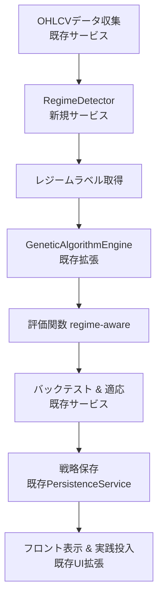

# 市場レジーム適応の統合計画 - 既存コードベース統合版

## 目的

オートストラテジーのロバスト性を高めるため、市場の異なるレジーム（例: トレンド相場、レンジ相場、高ボラティリティ相場）を検知し、遺伝的アルゴリズム（GA）で生成された戦略を適応させる。最大目標である実践投入可能な戦略構築を実現し、過学習を防ぎ、多様な市場環境で安定したパフォーマンスを発揮する。

## 背景と重要性（既存システム分析）

- **市場レジームとは**: 市場の状態変化（例: 強気/弱気、ボラティリティ変動）。仮想通貨市場は特に変動が激しく、固定戦略では性能低下が発生。
- **現在のシステムの限界**:
  - GA による戦略生成はバックテストベースだが、レジーム変化を考慮せず、単一環境最適化になりやすい
  - GeneticAlgorithmEngine は単一の評価関数を使用（regime 適応なし）
  - 既存の DEAPSetup は多目的最適化をサポートしているが、レジーム連携なし
- **利点**: レジーム検知により、戦略スイッチングやパラメータ調整が可能。既存の GA 基盤と統合可能。

## 提案アーキテクチャ（既存コード統合）

1. **レジーム検知モジュール**:

   - **ツール**: HMM (hmmlearn ライブラリ) - 既存の ML インフラと互換性あり
   - **入力**: OHLCV データ（既存のデータ収集サービスから取得）、ボラティリティ（ATR）、ボリューム、ファンディングレート
   - **出力**: レジームラベル（例: 0=トレンド、1=レンジ、2=ボラティリティ高）
   - **統合**: backend/app/services/auto_strategy/services/regime_detector.py に新規作成

2. **適応メカニズム（既存 GA 統合）**:

   - **GA 拡張**: GeneticAlgorithmEngine の評価関数を regime-aware に拡張
   - **戦略選択**: レジームに応じた戦略選択（既存の StrategyFactory を活用）
   - **統合ポイント**: backend/app/services/auto_strategy/core/ga_engine.py の評価処理

3. **統合フロー**:
   - データ収集（既存）→ レジーム検知（新規）→ GA 進化（既存拡張）→ バックテスト（既存）→ 戦略保存（既存）
   - フロントエンド: GAConfigForm.tsx にレジームオプション追加（既存 UI 拡張）

## 実装ステップと既存コード統合 (TDD 準拠)

1. **[ ] レジーム検知テスト作成**: pytest で HMM 状態遷移検証。既存の test_indicator_generator.py を参考に
2. **[ ] RegimeDetector サービス実装**: backend/app/services/auto_strategy/services/regime_detector.py 新規作成。Pydantic バリデーション（既存パターン準拠）
3. **[ ] GA 評価関数拡張**: GeneticAlgorithmEngine の individual_evaluator を regime-aware に拡張。既存の evaluate_individual メソッド修正
4. **[ ] 設定管理統合**: GAConfig に regime_adaptation_enabled フラグ追加。既存の Pydantic モデル拡張
5. **[ ] フロントエンド統合**: useAutoStrategy.ts フック拡張、GAConfigForm.tsx にレジームオプション追加
6. **[ ] 総合テスト拡張**: backend/scripts/comprehensive_test.py に多レジームシナリオ追加
7. **[ ] 評価**: 複数レジームのバックテスト比較（Sharpe 比率、ドローダウン）。既存の performance_comparison.py 活用

## 統合上の考慮点と課題解決

- **既存コード互換性**: 後方互換性を維持（regime_adaptation_enabled=False がデフォルト）
- **過学習防止**: 既存の Walk-forward 計画（auto_strategy_enhancement_plan.md）と連携
- **計算負荷**: 既存の並列処理（DEAP multiprocessing）を活用
- **依存関係**: 新ライブラリなし（既存: hmmlearn, scikit-learn 使用）
- **設定管理**: GAConfig 拡張で段階的導入を可能に

## 既存コードベース統合の利点

- **段階的導入**: regime_adaptation_enabled フラグで制御可能
- **コード再利用**: 既存の GA 基盤、データサービス、バックテストを活用
- **テスト容易性**: 既存のテストインフラを流用
- **メンテナンス性**: 既存のアーキテクチャパターンに準拠

この計画はプロジェクトのスタイル（Black, mypy, TDD）に準拠し、既存コードベースとシームレスに統合できます。
