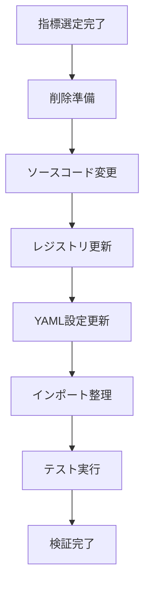

# テクニカル指標整理計画書

## 2025-09-10 技術指標削減プロジェクト

### 実行概要
バックエンドのテクニカル指標数を133個から32個へ大幅削減し、システムの保守性を向上させる。

### 現状分析
- **現状指標数**: 約133個
  - Momentum系: 60個以上
  - Trend系: 60個以上
  - Volatility系: 25個以上
  - Volume系: 25個以上

- **目標指標数**: 32個 (約75%削減)
- **削除対象**: 約101個指標
- **影響範囲**: 4つのソースファイル、レジストリ設定、インポート依存関係

### 残す指標選定基準
1. **基本指標優先**: RSI, MACDなどの業界標準指標
2. **カテゴリバランス**: 各カテゴリが偏らないよう配分
3. **利用頻度**: 取引戦略でよく使われる指標
4. **必須保持**: ユーザー指定のQQE, SQUEEZE/SQUEEZE_PRO

### 残す指標リスト (32個)

#### Momentum指標 (10個)
| 指標名 | ファイル | 重要度 | 保持理由 |
|--------|----------|--------|----------|
| RSI | momentum.py | 高 | トレードの基本操作 |
| MACD | momentum.py | 高 | トレンド転換検出の基準 |
| STOCH | momentum.py | 高 | オーバーバイト/オーバーソールド検出 |
| WILLR | momentum.py | 高 | ストキャスティクス補完 |
| CCI | momentum.py | 高 | トレンド系勢力計測 |
| ROC | momentum.py | 高 | 変化率計測 |
| MOM | momentum.py | 高 | 運動量基本指標 |
| ADX | momentum.py | 高 | トレンド勢力計測 |
| QQE | momentum.py | 高 | ユーザー指定保持 |
| SQUEEZE | momentum.py | 高 | ユーザー指定保持 |

#### Trend指標 (8個)
| 指標名 | ファイル | 重要度 | 保持理由 |
|--------|----------|--------|----------|
| SMA | trend.py | 高 | 移動平均の基礎 |
| EMA | trend.py | 高 | 指数移動平均の基本 |
| WMA | trend.py | 高 | 加重移動平均 |
| DEMA | trend.py | 高 | 二重移動平均 |
| TEMA | trend.py | 高 | 三重移動平均 |
| T3 | trend.py | 高 | T3移動平均 |
| KAMA | trend.py | 高 | Kaufman適応移動平均 |
| SAR | trend.py | 高 | パラボリックSAR |

#### Volatility指標 (7個)
| 指標名 | ファイル | 重要度 | 保持理由 |
|--------|----------|--------|----------|
| ATR | volatility.py | 高 | ボラティリティ基本測定 |
| BBANDS | volatility.py | 高 | 価格変動帯標準指標 |
| KELTNER | volatility.py | 高 | Keltnerチャネル |
| DONCHIAN | volatility.py | 高 | Donchianチャネル |
| SUPERTREND | volatility.py | 高 | スーパートレンド |
| ACCBANDS | volatility.py | 高 | アクセラレーションバンド |
| UI | volatility.py | 高 | Ulcer Index |

#### Volume指標 (7個)
| 指標名 | ファイル | 重要度 | 保持理由 |
|--------|----------|--------|----------|
| OBV | volume.py | 高 | 出来高累積指標 |
| AD | volume.py | 高 | A/Dライン |
| ADOSC | volume.py | 高 | A/Dオシレーター |
| CMF | volume.py | 高 | マネーフロー指標 |
| EFI | volume.py | 高 | Elder Force Index |
| MFI | volume.py | 高 | Money Flow Index |
| VWAP | volume.py | 高 | 出来高加重平均価格 |

### 削除対象指標リスト (抜粋)
#### Momentum削除指標
- AO, APO, AROON, AROONOSC, BIAS, BOP, BRAR, CG, CMO, COPPOCK, FISHER, INERTIA, KDJ, PGO, PSL, RSX, TSI, CFO, CTI, RMI, DPO, CHOP, VORTEX, RVI, BIAS, UO, ULTOSC, TRIX, ADXR, PLUS_DI, MINUS_DI, PLUS_DM, MINUS_DM, ROCP, ROCR, ROCR100, etc.

#### Trend削除指標
- TRIMA, ALMA, HMA, HWMA, JMA, LINREG_a, etc.

#### Volatility削除指標
- NATR, TRANGE, MASSI, PDIST, VAR, CV, IRM, etc.

レストのQQU, 固定のク

### 削除実行計画

### 作業ステップ
1. **ソースコード削除** (momentum.py, trend.py, volatility.py, volume.py)
   - 各ファイルの不要指標メソッドを削除
   - エラーハンドリングはそのまま維持

2. **レジストリ設定更新** (config/indicator_definitions.py)
   - setup_momentum_indicators() 関数から不要指標設定削除
   - setup_trend_indicators() 関数から不要指標設定削除
   - setup_volatility_indicators() 関数から不要指標設定削除
   - setup_volume_indicators() 関数から不要指標設定削除

3. **pandas-ta設定更新**
   - PANDAS_TA_CONFIGから削除指標を除外
   - POSITIONAL_DATA_FUNCTIONSから削除指標を除外

4. **依存関係検証**
   - オーケストレータでの参照チェック
   - インポート文の整理
   - ユニットテスト更新

### リスク評価
- **高リスク**: レジストリ設定の誤削除
- **中リスク**: pandas-ta設定の不整合
- **低リスク**: 個別指標メソッド削除

### 品質保証
- 各削除後にユニットテスト実行
- 既存機能を破壊しないよう慎重実行
- 削除履歴を残すためのコメント記載

### 完了基準
- [ ] 指標総数が32個になっている
- [ ] 全テストが通過する
- [ ] レジストリ設定に矛盾がない
- [ ] pandas-ta設定が正しい

### 担当者
- 計画作成: 技術アーキテクト
- 実行: 開発エンジニア
- 検証: QAエンジニア

### 備考
この計画は約75%の指標削減を達成し、システム保守コストを大幅削減します。QQEとSQUEEZEはユーザー要求により特別保持します。